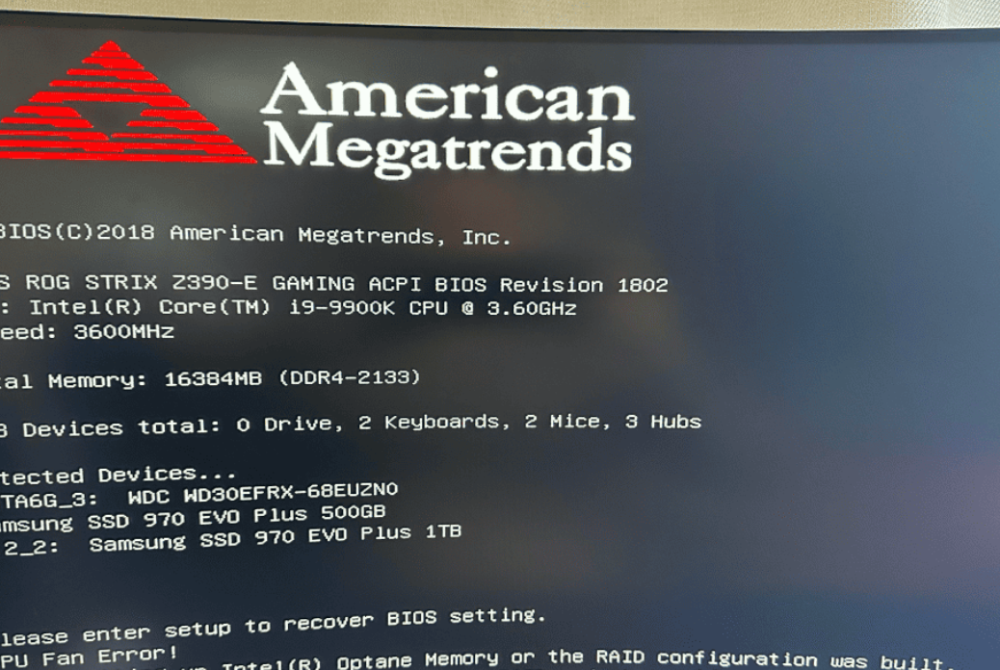
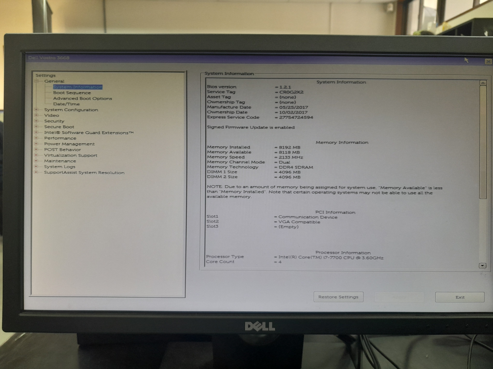

  <h1 style="text-align: center;font-weight: bold">Praktikum 1 Sistem Operasi</h1>
  <h4 style="text-align: center;">Dosen Pengampu : Dr. Ferry Astika Saputra, S.T., M.Sc.</h4>

 

  
  <h3 style="text-align: center;">Disusun Oleh :  Kelompok 4</h3>
  

    <strong>Muhammad Yafi Rifdah Zayyan (3123500001)</strong> 
    <strong>Muhammad Daffa Erfiansyah (3123500006)</strong> 
    <strong>Maula Shahihah Nur Sa'adah (3123500008)</strong>
  

<h3 style="text-align: center;line-height: 1.5">Politeknik Elektronika Negeri Surabaya Departemen Teknik Informatika Dan Komputer Program Studi Teknik Informatika 2023/2024</h3>
  

## Daftar Isi

1. [Pendahuluan](#sistem-operasi-)
2. [Soal 1](#1-jelaskan-langkah-langkah-proses-booting-)
3. [Soal 2](#2-bagaimana-cara-install-debian-di-virtual-box-)
4. [Referensi](#referensi)

## Sistem Operasi Debian 12

Sistem operasi (Inggris: operating system; disingkat OS) adalah perangkat lunak sistem yang mengatur sumber daya dari perangkat keras dan perangkat lunak, serta sebagai daemon untuk program komputer. Tanpa sistem operasi, pengguna tidak dapat menjalankan program aplikasi pada komputer mereka, kecuali program booting.
Sistem operasi mempunyai penjadwalan yang sistematis mencakup perhitungan penggunaan memori, pemrosesan data, penyimpanan data, dan sumber daya lainnya.

Contoh sistem operasi modern adalah Linux, Android, iOS, Mac OS X, dan Microsoft Windows.

Debian adalah sistem operasi komputer yang tersusun dari paket-paket perangkat lunak yang dirilis sebagai perangkat lunak bebas dan terbuka dengan lisensi mayoritas GNU General Public License dan lisensi perangkat lunak bebas lainnya. Debian GNU/Linux memuat perkakas sistem operasi GNU dan kernel Linux merupakan distribusi Linux yang populer dan berpengaruh. Debian didistribusikan dengan akses ke repositori dengan ribuan paket perangkat lunak yang siap untuk instalasi dan digunakan. 

## Soal

### 1. Jelaskan langkah-langkah proses booting!

Proses booting pada komputer, termasuk laptop, terdiri dari beberapa tahapan yang menyusun dari saat tombol power ditekan hingga sistem operasi siap untuk digunakan. Berikut adalah tahapan-tahapan proses booting :

1. <b>Power ON</b>

Saat tombol power atau tombol reset dihidupkan, sumber daya listrik akan mengalir ke komputer.
Kemudian, perangkat keras akan menerima daya untuk dinyalakan.

2. <b>Power-On Self-Test (POST)</b>

Setelah dinyalakan, komputer akan melakukan Power-On Self-Test atau POST, yang merupakan serangkaian tes perangkat keras untuk memastikan bahwa semuanya berfungsi dengan baik. 
POST akan memeriksa RAM, prosesor, kartu grafis, dan perangkat keras lainnya. 
Jika ada masalah dengan perangkat keras, komputer akan memberikan pesan kesalahan yang sesuai.

3. <b>Inisialisasi Perangkat Keras</b>

Setelah POST selesai, komputer akan menginisialisasi perangkat keras seperti hard drive, keyboard, mouse, dan perangkat lainnya. 

4. <b>Membaca Sektor Boot</b>

Selanjutnya, komputer akan mencari sektor boot di hard drive atau perangkat penyimpanan lainnya. 
Sektor boot sendiri adalah area khusus yang berisi instruksi awal untuk memuat sistem operasi.

5. <b>Memuat Sistem Operasi</b>

Setelah sektor boot ditemukan, komputer akan memuat sistem operasi ke dalam memori utama (RAM). 
Kemudian, sistem operasi akan mengambil alih kendali dan mulai menjalankan program-program yang diperlukan untuk mengoperasikan komputer.

### 2. Bagaimana cara install Debian 12 di VirtualBox?

## Installation

### Langkah 1

Download dan Install Software Virtualbox

Download VirtualBox sesuai dengan Sistem Operasi dan spesifikasi yang digunakan

### Langkah 2

Buka VirtualBox, kemudian klik "Next"

### Langkah 3

Lanjut klik "Next"

### Langkah 4

Klik "Yes" untuk melanjutkan install software VirtualBox

### Langkah 5

Klik "Install"

### Langkah 6

Tunggu hingga proses instalasi selesai

### Langkah 7

Klik "Finish" 

### Langkah 8

Ini adalah tampilan awal pada software VirtualBox yang sudah terinstall kemudian klik "New"

### Langkah 9

Masukkan nama dan file .iso debian 12 yang sudah di download lalu klik "Next"

### Langkah 10

Isikan Base Memory sebesar 4096 MB dan prosesor CPU sebesar 2 Core

### Langkah 11

Isikan ukuran Disk Size pada 26.50 GB 

### Langkah 12

Klik tombol "Finish" jika merasa sudah benar

### Langkah 13

Klik "Start" pada virtual machine yang dibuat

### Langkah 14

Pilih "Graphic Install" kemudian enter

### Langkah 15

Pilih bahasa yang ingin digunakan, kemudian klik "Continue"

### Langkah 16

Pilih lokasi yang ingin digunakan, kemudian klik "Continue"

### Langkah 17

Masukkan Hostname, kemudian klik "Continue"

### Langkah 18

Kosongi domain, kemudian klik "Continue"

### Langkah 19

Masukkan password pertama untuk root user, kemudian klik "Continue"

### Langkah 20

Masukkan full name untuk pengguna baru, kemudian klik "Continue"

### Langkah 21

Masukkan username untuk akun anda, kemudian klik "Continue"

### Langkah 22

Masukkan password kedua untuk root user, kemudian klik "Continue"

### Langkah 23

Pilih waktu sesuai lokasi yang dipilih tadi, kemudian klik "Continue"

### Langkah 24

Pilih Manual, kemudian klik "Continue"

### Langkah 25

Pilih "SCSI3 (0,0,0) (sda) - 28.5 GB AT VBOX HARDDISK", kemudian klik "Continue"

### Langkah 26

Klik "Yes", kemudian klik "Continue"

### Langkah 27

Pilih "pri/log 28.5 GB FREE SPACE", kemudian klik "Continue"

### Langkah 28

Klik "Create a new partition" 

### Langkah 29

Masukkan size untuk partisi pertama sebesar 20GB

### Langkah 30

Pilih "Primary"

### Langkah 31

Pilih "Beginning" dan Continue

### Langkah 32

Klik "Done setting up the partition", kemudian klik "Continue" untuk kembali ke menu partisi selanjutnya

### Langkah 33

Kemudian klik "pri/log 8.5 GB FREE SPACE" untuk membuat partisi kedua lalu klik "Continue"

### Langkah 34

Masukkan size untuk /storage sebesar 5GB

### Langkah 35

Pilih "Primary" sama seperti partisi pertama

### Langkah 36

Pilih "Beginning" sama seperti partisi pertama

### Langkah 37

Pada Mount point pilih Enter manually dan isikan /storage, kemudian klik "Continue"

### Langkah 38

Pilih "pri/log 3.5 GB FREE SPACE" untuk membuat partisi ketiga

### Langkah 39

Masukkan size untuk swap area sebesar 1,5GB

### Langkah 40

Pilih opsi swap area

### Langkah 41

Klik "Done setting up the partition"

### Langkah 42

Klik "Finish"

### Langkah 43

Tunggu proses install hingga selesai

### Langkah 44

Pilih "No" dan klik "Continue"

### Langkah 45

Pilih lokasi "Indonesia" untuk konfigurasi package

### Langkah 46

Pilih "kebo.pens.ac.id"

### Langkah 47

Kosongi HTTP proxy dan klik "Continue"

### Langkah 48

Tunggu hingga proses selesai 

### Langkah 49

Pilih "Yes" dan klik "Continue"

### Langkah 50

Klik "Continue"

### Langkah 51

Tunggu hingga proses selesai 

### Langkah 52

Pilih /dev/sda dan klik "Continue"

### Langkah 53

Tunggu proses akhir instalasi hingga selesai

### Langkah 54

Pada tampilan ini Debian siap digunakan, kemudian klik "Continue"

### Langkah 55

Jika sudah, maka tampilan berubah seperti gambar diatas

### Langkah 56

Debian GNU/Linux is ready to be used

## Referensi

- [VirtualBox Download](https://www.virtualbox.org/wiki/Downloads)
- [Debian 12 Download](https://www.debian.org/download)
- [Sistem Operasi](https://id.wikipedia.org/wiki/Sistem_operasi)
- [Debian](https://id.wikipedia.org/wiki/Debian)