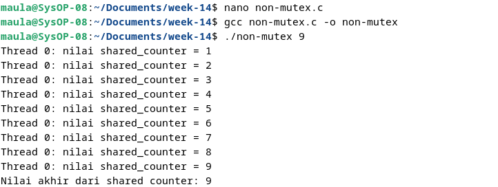
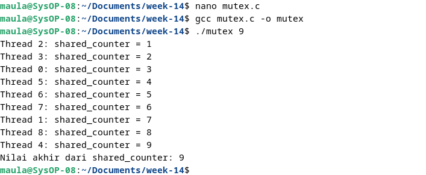

<div align="center">
  <h1 class="text-align: center;font-weight: bold">Praktikum 12<br>Sistem Operasi</h1>
  <h3 class="text-align: center;">Dosen Pengampu : Dr. Ferry Astika Saputra, S.T., M.Sc.</h3>
</div>
<br />
<div align="center">
  
  <h3 style="text-align: center;">Disusun Oleh : <br>Kelompok 4</h3>
  <p style="text-align: center;">
    <strong>Muhammad Yafi Rifdah Zayyan (3123500001)</strong><br>
    <strong>Muhammad Daffa Erfiansyah (3123500006)</strong><br>
    <strong>Maula Shahihah Nur Sa'adah (3123500008)</strong>
  </p>

<h3 style="text-align: center;line-height: 1.5">Politeknik Elektronika Negeri Surabaya<br>Departemen Teknik Informatika Dan Komputer<br>Program Studi Teknik Informatika<br>2023/2024</h3>
  <hr><hr>
</div>

## Penggunaan Mutex

### Soal 2

Buat analisa dari kedua program terlampir. Jelaskan penggunaan mutex pada program kedua!

#### Source code

```
#include <pthread.h>
#include <stdio.h>
#include <stdlib.h>
    
int shared_counter = 0;

void *thread_function(void *thread_id)
{         
    pthread_t tid = (pthread_t)thread_id;

    shared_counter++;         
                
    printf("Thread %ld: nilai shared_counter = %d\n", 
    (long)tid, shared_counter);

    return NULL;
}              

int main(int argc, char *argv[])
{
               
    if (argc != 2)
    {
        printf("Gunakan: %s <number_of_threads>\n", 
        argv[0]);
        exit(EXIT_FAILURE);
    }
                
    int num_threads = atoi(argv[1]);

    pthread_t *threads = (pthread_t *)malloc(
    num_threads * sizeof(pthread_t));         
               
    for (int i = 0; i < num_threads; i++)
    {
              
        int status = pthread_create(&threads[i], NULL,
        thread_function, (void *)threads[i]);
                                                
        if (status != 0)
        {
            printf("Error: pthread_create() returned error"
            "code %d\n", status);
                                        
            exit(EXIT_FAILURE);           
        }
    }

    for (int i = 0; i < num_threads; i++)
    {
        int status = pthread_join(threads[i], NULL);
        if (status != 0)
        {
            printf("Error: pthread_join() returned error "
            "code %d\n", status);
            exit(EXIT_FAILURE);                     
        }
    }

    free(threads);
                
    printf("Nilai akhir dari shared counter: %d\n",
    shared_counter);

    return 0;
}

-----------------------------------------------------------

#include <pthread.h>
#include <stdio.h>
#include <stdlib.h>

int shared_counter = 0;
pthread_mutex_t shared_counter_mutex = PTHREAD_MUTEX_INITIALIZER;

void *thread_function(void *thread_id) 
{
    long tid = (long)thread_id;

    pthread_mutex_lock(&shared_counter_mutex);

    shared_counter++;

    printf("Thread %ld: shared_counter = %d\n", tid, shared_counter);

    pthread_mutex_unlock(&shared_counter_mutex);

    return NULL;
}

int main(int argc, char *argv[]) 
{
    if (argc != 2) {
        printf("Penggunaan %s <number_of_threads>\n", argv[0]);
        exit(EXIT_FAILURE);
    }

    int num_threads = atoi(argv[1]);

    pthread_t *threads = (pthread_t *)malloc(num_threads * sizeof(pthread_t));

    if (threads == NULL) {
    printf("Error: Failed to allocate memory for 
    threads\n");
    exit(EXIT_FAILURE);
    }

    for (long i = 0; i < num_threads; i++) 
    {
      int status = pthread_create(&threads[i], NULL, 
      thread_function, (void *)i);
          if (status != 0) 
          {
              printf("Error: pthread_create() returned error code %d\n", status);
              exit(EXIT_FAILURE);
          }
    }

    for (int i = 0; i < num_threads; i++) {
        int status = pthread_join(threads[i], NULL);
          if (status != 0) 
          {
              printf("Error: pthread_join() returned error code %d\n", status);
              exit(EXIT_FAILURE);
          }
    }

    free(threads);

    printf("Nilai akhir dari shared_counter: %d\n", shared_counter);

    return 0;
}
```

#### Output

<strong>Non-mutex</strong>



Analisis

Pada program pertama tidak menggunakan mutex, sehingga tidak terjadi adanya sinkronisasi 
akses terhadap variabel global shared_counter. Pada program ini dapat menyebabkan race condition, 
yang dimana beberapa dari thread bersaing agar bisa mengakses dan memodifikasi nilai dari 
shared_counter secara bersamaan, sehingga dapat menghasilkan nilai yang tidak konsisten.

<strong>Mutex</strong> 



Analisis

Pada program kedua menggunakan mutex. Untuk terjadinya sinkronisasi akses ke variabel 
shared_counter. Dimana ketika sebuah thread mau mengakses atau memodifikasi shared_counter, 
program tersebut harus mengunci mutex terlebih dahulu dengan menggunakan pthread_mutex_lock(). 
Setelah selesai, thread tersebut akan melepaskan kunci mutex dari pthread_mutex_unlock(). Dengan 
menggunakan mutex, hanya ada satu thread yang biasa mengakses atau memodifikasi shared_counter 
pada satu waktu, sehingga bisa memastikan konsistensi nilai tersebut.

### Kesimpulan

Jadi, penggunaan mutex pada program yang kedua dapat memberikan perlindungan terhadap race 
condition dan juga memastikan bahwa operasi penambahan shared_counter tersebut bisa dilakukan 
secara atomik, sehingga hasilnya akan menjaga konsistensi nya.