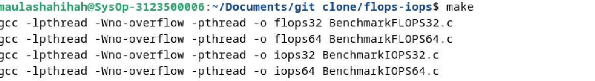
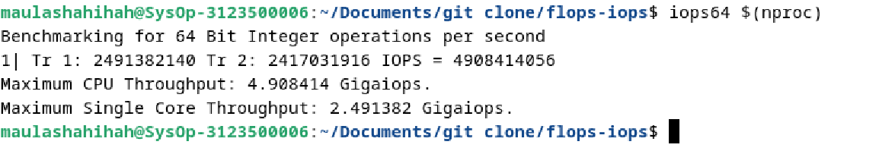
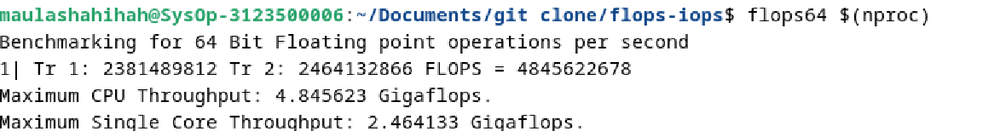

  <h1 style="text-align: center;font-weight: bold">Pratikum 3 Sistem Operasi</h1>
  <h4 style="text-align: center;">Dosen Pengampu : Dr. Ferry Astika Saputra, S.T., M.Sc.</h4>

 

  
  <h3 style="text-align: center;">Disusun Oleh :  Kelompok 4</h3>
  

    <strong>Muhammad Yafi Rifdah Zayyan (3123500001)</strong> 
    <strong>Muhammad Daffa Erfiansyah (3123500006)</strong> 
    <strong>Maula Shahihah Nur Sa'adah (3123500008)</strong>
  

<h3 style="text-align: center;line-height: 1.5">Politeknik Elektronika Negeri Surabaya Departemen Teknik Informatika Dan Komputer Program Studi Teknik Informatika 2023/2024</h3>
  

<h2 align="center">Iops Dan Flops</h2>
<h2>Definisi</h2>
<h3>IOPS</h3>

Input/output operations per second(IOPS) adalah pengukuran kinerja input/output yang digunakan untuk mengkarakterisasi perangkat penyimpanan komputer seperti hard disk drive (HDD), solid state drive (SSD), dan jaringan area penyimpanan (SAN). Seperti tolak ukur, angka IOPS yang diterbitkan oleh produsen perangkat penyimpanan tidak secara langsung berhubungan dengan kinerja aplikasi dunia nyata.

<h3>FLOPS</h3>

Dalam komputasi, floating point operations per second (FLOPS, flops or flop/s) adalah ukuran kinerja komputer, berguna dalam bidang perhitungan ilmiah yang memerlukan perhitungan floating-point. Untuk kasus seperti itu, ini adalah ukuran yang lebih akurat daripada mengukur instruksi per detik.

 
<h2 align="center">Melakukan Benchmarking pada PC</h2>

1. Melakukan Instalasi Package GCC,Make dan Git pada Debian 12 yang sudah terinstall

Lakukan perintah "$ sudo apt update" pada terminal kemudian ketik "$ sudo apt install gcc" untuk menginstall compile dan "$ sudo apt install git" untuk menginstall git pada debian

2. Melakukan Git clone pada Debian 12

Arahkan direktori pada terminal yang ingin dituju lalu ketik "$ git init" kemudian "$ git clone (paste link github) lalu tekan enter

3. Melakukan Build Binaries,Cleaning, dan Install Binaries

Arahkan direktori pada folder flops/iops yang telah dilakukan git clone pada langkah sebelumnya kemudian buka terminal dan ketik "$ make"

Kemudian lakukan perintah "$ make clean" lalu ketik "$ sudo make install" untuk menginstall binaries pada debian.

4. Melakukan Proses Benchmarking menggunakan Iops dan Flops

Untuk benchmarking menggunakan iops ketik pada terminal "$ iops32 $(nproc)" atau iops64 sesuaikan dengan spesifikasi laptop yang dipakai

Untuk benchmarking pada flops sama seperti iops hanya saja mengganti dari iops menjadi flops "$ flops32 $(nproc)" atau $ flops64 $(nproc)

 
<h2 align="center">Analisa Hasil Benchmarking</h2>

|                      | IOPS (Integer)         | FLOPS (Floating Point)    |
|                      | IOPS64 (Integer)         | FLOPS64 (Floating Point)    |
|----------------------|------------------------|---------------------------|
| Total Throughput     | 6.339286 Gigaiops     | 5.637343 Gigaflops       |
| Single Core Throughput | 3.185454 Gigaiops   | 2.821573 Gigaflops       |

Dengan melihat tabel di atas, dapat dilihat bahwa IOPS memiliki total throughput dan throughput single core yang lebih tinggi dibandingkan dengan FLOPS. Namun demikian, perbedaan antara total throughput dan throughput single core juga penting untuk diperhatikan karena menunjukkan seberapa baik CPU dapat mengalokasikan dan memanfaatkan sumber daya secara efisien antara inti tunggal dan total throughput.

 

## Referensi

[IOPS](https://en.wikipedia.org/wiki/IOPS)
[FLOPS](https://en.wikipedia.org/wiki/FLOPS)