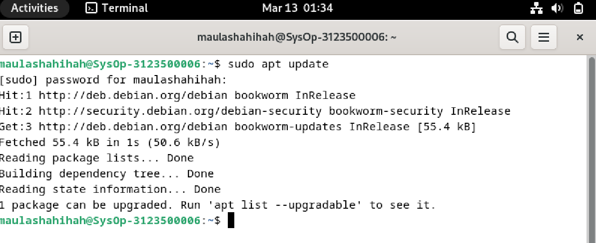
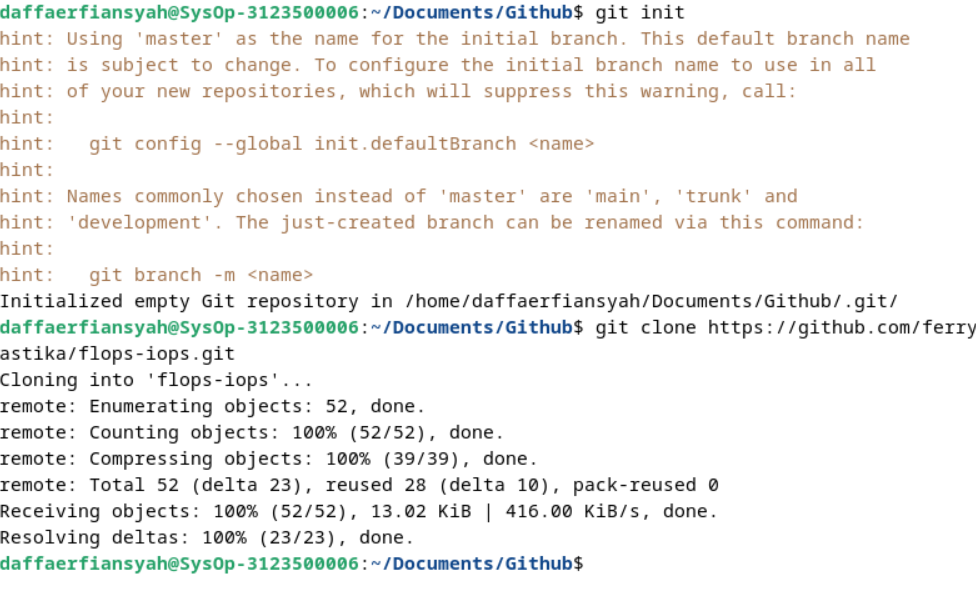
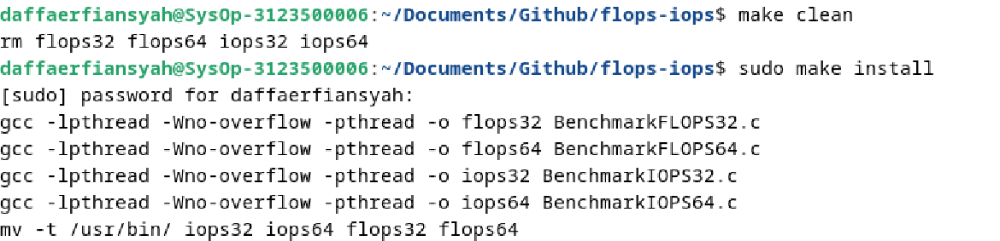
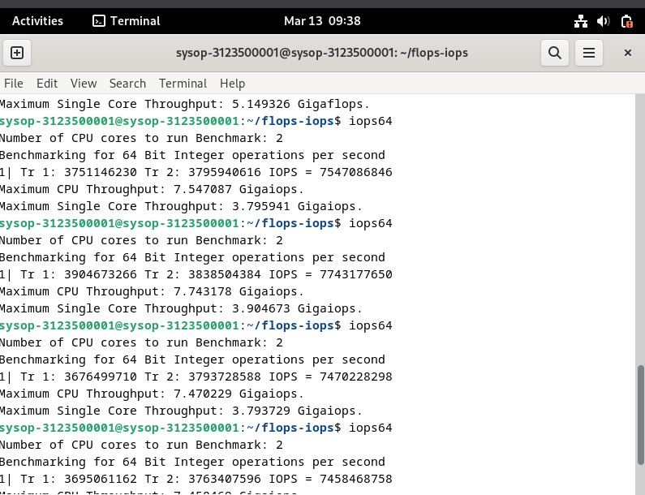
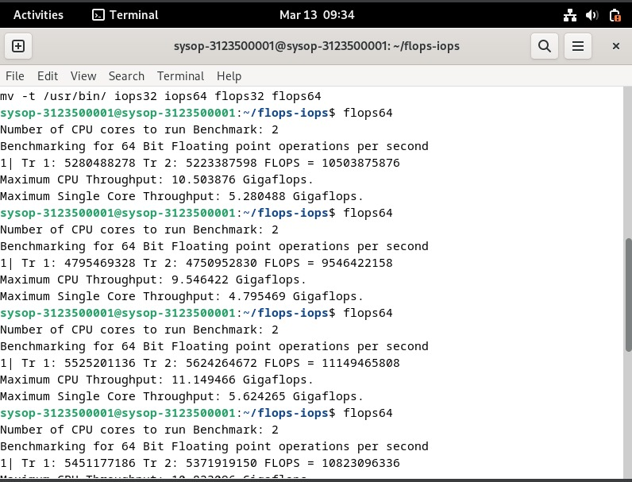
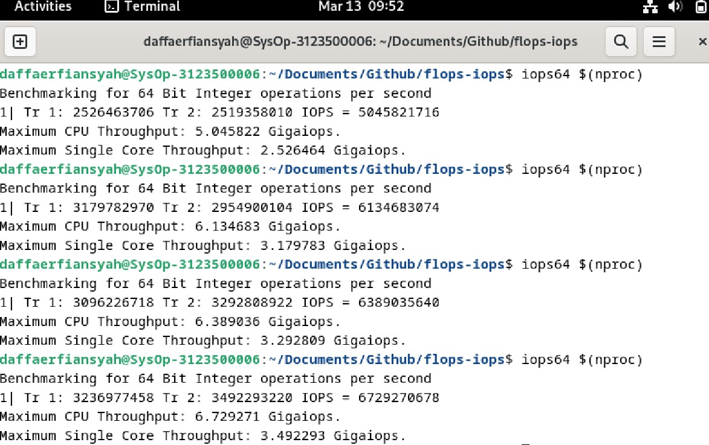
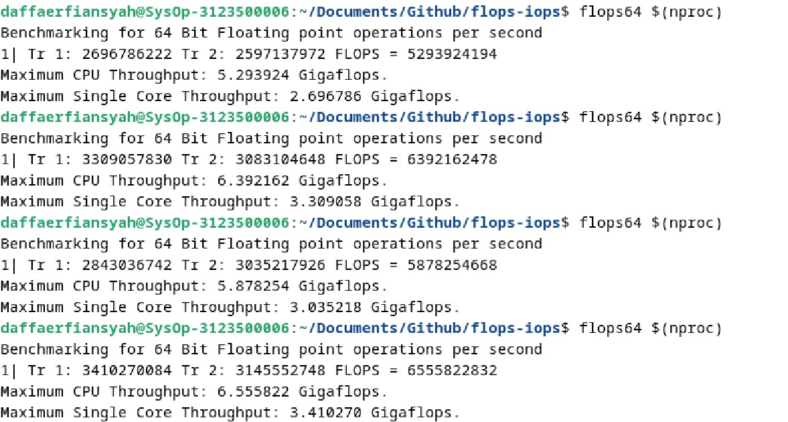
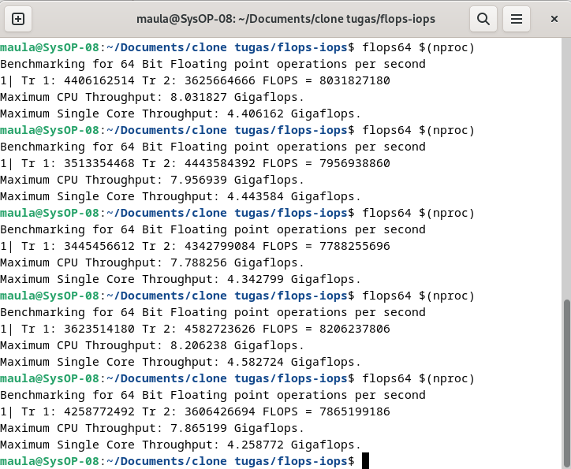

  <h1 style="text-align: center;font-weight: bold">Pratikum 3 Sistem Operasi</h1>
  <h4 style="text-align: center;">Dosen Pengampu : Dr. Ferry Astika Saputra, S.T., M.Sc.</h4>

 

  
  <h3 style="text-align: center;">Disusun Oleh :  Kelompok 4</h3>
  

    <strong>Muhammad Yafi Rifdah Zayyan (3123500001)</strong> 
    <strong>Muhammad Daffa Erfiansyah (3123500006)</strong> 
    <strong>Maula Shahihah Nur Sa'adah (3123500008)</strong>
  

<h3 style="text-align: center;line-height: 1.5">Politeknik Elektronika Negeri Surabaya Departemen Teknik Informatika Dan Komputer Program Studi Teknik Informatika 2023/2024</h3>
  

## Daftar Isi

1. [PPT](#ppt)
2. [IOPS dan FLOPS](#iops-flops)
   - [Benchmarking](#benchmarking)
   - [Pengujian IOPS dan FLOPS](#pengujian-iops-flops)
   - [Tabel Perbandingan Pengujian](#tabel-perbandingan-pengujian)
     - [Analisa](#analisa-pengujian)
     - [Kesimpulan](#kesimpulan)
3. [Referensi](#referensi)

## PPT
[Link PPT Siklus CPU](https://www.canva.com/design/DAF_RTHy4wk/7QWlAIIeue3ksGOfXBmg9Q/edit?utm_content=DAF_RTHy4wk&utm_campaign=designshare&utm_medium=link2&utm_source=sharebutton)
 

## IOPS dan FLOPS

<h3>IOPS</h3>

Input/output operations per second(IOPS) adalah pengukuran kinerja input/output yang digunakan untuk mengkarakterisasi perangkat penyimpanan komputer seperti hard disk drive (HDD), solid state drive (SSD), dan jaringan area penyimpanan (SAN). Seperti tolak ukur, angka IOPS yang diterbitkan oleh produsen perangkat penyimpanan tidak secara langsung berhubungan dengan kinerja aplikasi dunia nyata.

<h3>FLOPS</h3>

Dalam komputasi, floating point operations per second (FLOPS, flops or flop/s) adalah ukuran kinerja komputer, berguna dalam bidang perhitungan ilmiah yang memerlukan perhitungan floating-point. Untuk kasus seperti itu, ini adalah ukuran yang lebih akurat daripada mengukur instruksi per detik.

 

## Melakukan Benchmarking pada PC

1.  <strong>Melakukan Instalasi Package GCC,Make dan Git pada Debian 12</strong>

Lakukan perintah "$ sudo apt update" pada terminal kemudian ketik "$ sudo apt install gcc" untuk menginstall compile dan "$ sudo apt install git" untuk menginstall git pada debian

2. <strong>Melakukan Git clone pada Debian 12</strong>

Arahkan direktori pada terminal yang ingin dituju lalu ketik "$ git init" kemudian "$ git clone (paste link github) lalu tekan enter

3. <strong>Melakukan Build Binaries, Cleaning dan Install Binaries</strong>

Arahkan direktori pada folder flops/iops yang telah dilakukan git clone pada langkah sebelumnya kemudian buka terminal dan ketik "$ make"

Kemudian lakukan perintah "$ make clean" lalu ketik "$ sudo make install" untuk menginstall binaries pada debian.

4. <strong>Melakukan Proses Benchmarking menggunakan Iops dan Flops</strong>

Untuk benchmarking menggunakan iops ketik pada terminal "$ iops32 $(nproc)" atau iops64 sesuaikan dengan spesifikasi laptop yang dipakai

Untuk benchmarking pada flops sama seperti iops hanya saja mengganti dari iops menjadi flops "$ flops32 $(nproc)" atau $ flops64 $(nproc)

 

## Pengujian IOPS dan FLOPS

1.  <strong>Muhammad Yaffi Rifdah Zayyan</strong>

Iops64 sebanyak 5 kali

Flops64 sebanyak 5 kali

2.  <strong>Muhammad Daffa Erfiansyah</strong>

Iops64 sebanyak 5 kali

Flops64 sebanyak 5 kali

3.  <strong>Maula Shahihah Nur Sa'adah</strong>

Iops64 sebanyak 5 kali

Flops64 sebanyak 5 kali

## Tabel Perbandingan Pengujian

| Nama  | Max Single Core FLOPS | Max Single Core IOPS | Max CPU FLOPS | Max CPU IOPS |
| ----- | --------------------- | -------------------- | ------------- | ------------ |
| Yaffi | 5.6                   | 3.9                  | 11.1          | 7.7          |
| Daffa | 3.4                   | 3.5                  | 6.5           | 6.7          |
| Maula | 4.5                   | 4.1                  | 8.2           | 7.5          |

## Analisa

Program yang dijalankan merupakan program benchmark untuk mengukur IOPS (Input Output Operations per Second) dan FLOPS (Floating-point Operations Per Second) pada CPU. Program dijalankan lima kali. Hasilnya menunjukkan bahwa CPU memiliki peringkat IOPS FLOPS yang lebih tinggi.

Secara keseluruhan, program benchmark menunjukkan bahwa peringkat IOPS FLOPS CPU meningkat seiring dengan meningkatnya jumlah inti CPU yang digunakan. Hal ini karena program ini mampu mendistribusikan beban kerja ke beberapa inti, sehingga memungkinkannya melakukan lebih banyak operasi secara bersamaan.

## Kesimpulan

Kesimpulannya, IOPS dan FLOPS adalah dua metrik yang berbeda untuk mengukur kinerja komputer dalam konteks yang berbeda pula. IOPS penting untuk memahami seberapa cepat sistem dapat mengakses dan memanipulasi data, sementara FLOPS penting untuk memahami kemampuan komputer dalam menyelesaikan tugas komputasi numerik. Kedua metrik ini memiliki peran yang penting dalam menilai kinerja dan efisiensi sistem komputer sesuai dengan kebutuhan aplikasi yang beragam.

## Referensi

- [Siklus CPU](https://arifchairulanam.blogspot.com/2018/01/pengertian-dari-fetchingdecoding-dan.html)
- [Video Siklus CPU](https://www.youtube.com/watch?v=jFDMZpkUWCw)
- [Siklus Instruksi](https://saddamzakkir25.blogspot.com/2016/04/siklus-intruksi-fetch-cycle-dan-execute.html)
- [IOPS](https://en.wikipedia.org/wiki/IOPS)
- [FLOPS](https://en.wikipedia.org/wiki/FLOPS)