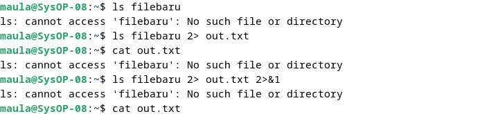
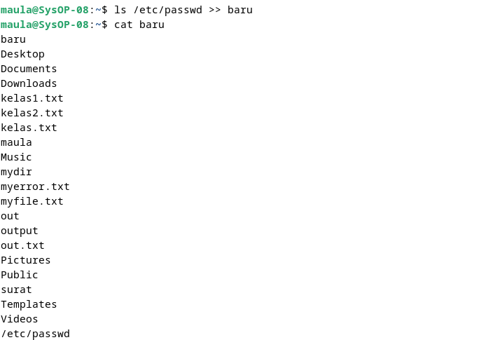

<div align="center">
  <h1 style="text-align: center;font-weight: bold">Pratikum 4<br>Sistem Operasi</h1>
  <h4 style="text-align: center;">Dosen Pengampu : Dr. Ferry Astika Saputra, S.T., M.Sc.</h4>
</div>
<br/>
<div align="center">
  
  <h3 style="text-align: center;">Disusun Oleh : <br>Kelompok 4</h3>
  <p style="text-align: center;">
    <strong>Muhammad Yafi Rifdah Zayyan (3123500001)</strong><br>
    <strong>Muhammad Daffa Erfiansyah (3123500006)</strong><br>
    <strong>Maula Shahihah Nur Sa'adah (3123500008)</strong>
  </p>

<h3 style="text-align: center;line-height: 1.5">Politeknik Elektronika Negeri Surabaya<br>Departemen Teknik Informatika Dan Komputer<br>Program Studi Teknik Informatika<br>2023/2024</h3>
  <hr><hr>
</div>

## POKOK BAHASAN:
```
* Pipeline
* Redirection
```
## TUJUAN PEMBELAJARAN:
Setelah mempelajari materi dalam bab ini, mahasiswa diharapkan mampu:
* Memahami konsep proses I/O dan redirection
* Memahami standar input, output dan error
* Menggunakan notasi output, append dan here document
* Memahami konsep *PIPE* dan filter
  
## DASAR TEORI:

### 1. PROSES I/O
Sebuah proses memerlukan Input dan Output. Instruksi (command) yang diberikan pada Linux melalui Shell disebut sebagai eksekusi program yang selanjutnya disebut proses. Setiap kali instruksi diberikan, maka Linux kernel akan menciptakan sebuah proses dengan memberikan nomor PID (Process Identity). Proses dalam Linux selalu membutuhkan Input dan menghasilkan suatu Output.


Dalam konteks Linux input/output adalah :
* Keyboard (input)
* Layar (output)
* Files
* Struktur data kernel
* Peralatan I/O lainnya (misalnya Network)

## 2. FILE DESCRIPTOR

Linux berkomunikasi dengan file melalui file descriptor yang direpresentasikan melalui angka yang dimulai dari 0, 1, 2 dan seterusnya. Tiga buah file descriptor standar yang lalu diciptakan oleh proses adalah :
* 0 = keyboard (standar input)
* 1 = layar (standar output)
* 2 = layar (standar error)

Linux tidak membedakan antara peralatan hardware dan file. Linux memanipulasi peralatan hardware dengan memperlakukannya sama dengan ketika memperlakukan sebuah file.

## 3.PEMBELOKAN (REDIRECTION)

Pembelokan dilakukan untuk standard input, output dan error, yaitu untuk mengalihkan file descriptor dari 0, 1 dan 2. Simbol untuk pembelokan adalah :
```mermaid
flowchart LR
    A(Standart Input) -->|Keyboard| B{Process}
    B -->|Monitor| C[Standart Output]
    B -->|Monitor| D[Standart Error]
 ```

## 4. PIPA (PIPELINE)
Mekanisme pipa digunakan sebagai alat komunikasi antar proses.

```mermaid
graph LR
  A(Input) --> B(Proses-1) --> C(Output) --> D(Input) --> E(Proses-2) --> F(Output)
```
Proses-1 menghasilkan output yang selanjutnya digunakan sebagai input oleh Proses-2. Hubungan output input ini dinamakan ``pipa ataiupipelining``, yang menghubungkan Proses-1 dengan Proses-2 dan dinyatakan dengan symbol “|”.
```
    Proses1 | Proses
```

## 5. FILTER
Filter adalah utilitas Linux yang dapat memproses standard input (dari keyboard) dan menampilkan hasilnya pada standard output (layar). Contoh filter adalah cat, sort, grep, pr, head, tail, paste dan lainnya.
Pada sebuah rangkaian pipa : 

        P<sub>1</sub> | P<sub>2</sub> | P<sub>3</sub> ... | P<sub>n-1</sub> | P<sub>n</sub>

Maka P2 sampai dengan P<sub>n-1</sub> berfungsi sebagai filter. P1 (awal) dan Pn (terakhir) boleh tidak filter. Utilitas yang bukan filter misalnya who, ls, ps, lp, lpr, mail dan lainnya.
Beberapa perintah Linux yang digunakan untuk proses penyaringan antara lain :
* Perintah ``grep``
  Digunakan untuk menyaring masukannya dan menampilkan baris-baris yang hanya mengandung pola yang ditentukan. Pola ini disebut regular expression.
* Perintah ``wc``
  Digunakan untuk menghitung jumlah baris, kata dan karakter dari baris-baris masukan yang diberikan kepadanya. Untuk mengetahui berapa baris gunakan option –l, untuk mengetahui berapa kata, gunakan option –w dan untuk mengetahui berapa karakter, gunakan option –c. 
  Jika salah satu option tidak digunakan, maka tampilannya adalah jumlah baris, jumlah kata dan jumlah karakter.
* Perintah ``sort``
  Digunakan untuk mengurutkan masukannya berdasarkan urutan nomor ASCII dari karakter.
* Perintah ``cut``
  Digunakan untuk mengambil kolom tertentu dari baris-baris masukannya, yang ditentukan pada option –c.
* Perintah ``uniq``
  Digunakan untuk menghilangkan baris-baris berurutan yang mengalami duplikasi, biasanya digabungkan dalam pipeline dengan ``sort``.

## TUGAS PENDAHULUAN:

## Jawablah pertanyaan-pertanyaan di bawah ini :

1. Apa yang dimaksud redirection?
2. Apa yang dimaksud pipeline?
3. Apa yang dimaksud perintah di bawah ini : echo, cat, more, sort, grep, wc, cut, uniq

## Jawaban :

1. <b>Redirection (Pembelokan) :</b> 
Membelokkan strandar output suatu program ke file atau membelokkan standar input suatu program dari suatu file.
2. <b>Pipeline (Pipa):</b>
 Mekanisme pipa digunakan sebagai alat komunikasi antar proses.
 Input => Proses 1 => Output = Input => Proses 2 => Output
Proses 1 menghasilkan output yang selanjutnya digunakan sebagai input oleh Proses 2. Hubungan output input ini dinamakan pipa, yang menghubungkan Proses 1 dengan Proses 2 dan dinyatakan dengan symbol "|".
   ```
   Proses1 | Proses
   ```
3. Yang dimaksud perintah di bawah ini adalah :
<br><b>echo :</b> Menampilkan text 
<br><b>cat :</b> Membaca file dan menampilkan isinya
<br><b>more :</b> Melihat isi suatu file dengan fasilitas melihat isi file dari atas dan untuk kebawah menggunakan tombol Enter untuk perbaris dan tombol Spasi untuk perlayar 
<br><b>sort :</b> Digunakan untuk mengurutkan masukannya berdasarkan urutan nomor ASCII dari karakter 
<br><b>grep :</b> Digunakan untuk menyaring masukannya dan menampilkan baris-baris yang hanya mengandung pola yang ditentukan
<br><b>wc :</b> Digunakan untuk menghitung jumlah baris, kata dan karakter dari baris-baris masukan yang diberikan kepadanya. Untuk mengetahui berapa baris gunakan option -l. Untuk mengetahui berapa kata, gunakan option -w dan untuk mengetahui berapa karakter, gunakan option -c. Jika salah satu option tidak digunakan, maka tampilannya adalah jumlah baris, jumlah kata dan jumlah karakter
<br><b>cut :</b> Digunakan untuk mengambil  kolom tertentu dan baris-baris masukannya, yang ditentukan pada opinion -c 
<br><b>uniq :</b> Digunakan untuk menghilangkan baris-baris berurutan yang mengalami duplikasi, biasanya digabungkan dalam pipeline dengan sort

## PERCOBAAN:

1. Login sebagai user.
2. Bukalah Console Terminal dan lakukan percobaan-percobaan di bawah ini. Perhatikan hasil setiap percobaan.
3. Selesaikan soal-soal latihan.


## Percobaan 1 : File descriptor

1. Output ke layar (standar output), input dari system (kernel)
    ```
    $ ps
    ```

   

   Analisis 
   <p>Perintah $ ps digunakan untuk untuk menampilkan informasi tentang proses yang sedang aktif di dalam sistem.</p>

2. Output ke layar (standar output), input dari keyboard (standard input)
   ```
    $ cat
    hallo, apa khabar
    hallo, apa khabar
    exit dengan ^d
    exit dengan ^d
    [Ctrl-d]
   ```

   

   Analisis 
   <p>Perintah cat digunakan untuk untuk menampilkan informasi tentang proses yang sedang aktif di dalam sistem.</p>

3. Input nama direktori, output tidak ada (membuat direktori baru), bila terjadi error maka tampilan error pada layar (standard error)
   ```
   $ mkdir mydir
   $ mkdir mydir **(Terdapat pesan error)**
   ```

   

   Analisis 
   <p>Perintah mkdir perintah yang digunakan untuk membuat direktori baru di dalam filesystem. </p>

## Percobaan 2 : Pembelokan (redirection)
1. Pembelokan standar output
   ```
    $ cat 1> myfile.txt
    Ini adalah teks yang saya simpan ke file myfile.txt
   ```

   

   Analisis 
   <p>Perintah “cat 1> myfile.txt” digunakan untuk meng-input‐kan dengan keyboard dan tanda "1>" merupakan pengganti dari standard output.</p>

2. Pembelokan standar input, yaitu input dibelokkan dari keyboard menjadi dari file
   ```
    $ cat 0< myfile.txt
    $ cat myfile.txt
   ```

   

   Analisis 
   <p>Perintah “cat 0< myfile.txt” ini digunakan untuk file input dibelokkan dari keyboard dari file sehingga antara “cat 0< myfile.txt” dan “cat myfile.txt” memiliki keterkaitan.</p>


3. Pembelokan standar error untuk disimpan di file
   ```
    $ mkdir mydir (Terdapat pesan error)
    $ mkdir mydir 2> myerror.txt
    $ cat myerror.txt
   ```

   

   Analisis 
   <p>Perintah “mkdir mydir” digunakan untuk membuat folder dengan nama mydir tetapi muncul pesan error, karena sudah dibuat sebelumnya. Selanjutnya, pada perintah “mkdir mydir 2> myerror.txt” digunakan untuk membelokkan (memindahkan) pesan error sebelumnya ke dalam file myerror.txt. Tanda "2>" menandakan bahwa output standard error. Selanjutnya, pada perintah “cat myerror.txt” digunakan untuk memunculkan teks yang terdapat dalam file myerror.txt berupa pesan error yang telah dibelokkan sebelumnya.</p>

4. Notasi 2>&1 : pembelokan standar error (2>) adalah identik dengan file descriptor 1.
   ```
    $ ls filebaru (Terdapat pesan error)
    $ ls filebaru 2> out.txt
    $ cat out.txt
    $ ls filebaru 2> out.txt 2>&
    $ cat out.txt
   ```

   

   Analisis 
   <p>Pembelokan standard error (2>) adalah identik dengan file descriptor 1. Perintah “ls filebaru” digunakan untuk menampilkan isi dari folder atau direktori dari filebaru. Tetapi, muncul pesan error karena direktori filebaru tidak ada. Kemudian, perintah “ls filebaru 2> out.txt” digunakan untuk memindahkan pesan error tersebut ke dalam file out.txt melalui standard error yang ditandai dengan "2>". Kemudian, perintah “ls filebaru 2 > out.txt 2>&1” mempunyai fungsi yang sama dengan perintah “cat out.txt.”.</p>

5. Notasi 1>&2 (atau >&2) : pembelokan standar output adalah sama dengan file descriptor 2 yaitu standar error
   ```
   $ echo “mencoba menulis file” 1> baru
   $ cat filebaru 2> baru 1>&
   $ cat baru
   ```

   

   Analisis 
   <p>Perintah echo "mencoba menulis file" >1 baru digunakan untuk menulis kata "mencoba menulis file" yang kemudian dibelokkan ke filebaru yang ditandai dengan tanda "1>". Selanjutnya, pada perintah “cat filebaru 2> baru 1>&2” digunakan untuk membelokkan tampilan filebaru ke standard output yang ditandai dengan tanda "1>&2" yang berarti sama dengan descriptor 2 yaitu standard error.</p>

6. Notasi >> (append)
   ```
   $ echo “kata pertama” > surat
   $ echo “kata kedua” >> surat
   $ echo “kata ketiga” >> surat
   $ cat surat
   $ echo “kata keempat” > surat
   $ cat surat
   ```

   

   Analisis 
   <p>Perintah echo "kata pertama" > surat digunakan untuk menulis kalimat "kata pertama" ke dalam file surat. Selanjutnya, pada perintah echo "kata kedua" >> surat digunakan untuk menulis "kata kedua" ke dalam file surat tanpa menghapus teks sebelumnya yang ditandai dengan ">>". Selanjutnya, pada perintah echo "kata ketiga" >> surat digunakan untuk menulis kalimat "kata ketiga" ke dalam file surat tanpa menghapus teks sebelumnya. Kemudian, teks tersebut ditampilkan dengan perintah cat surat. Selanjutnya, perintah echo "kata keempat" > surat digunakan untuk menulis "kata keempat" dengan menghapus teks sebelumnya yang ditandai dengan tanda ">". Kemudian perintah cat surat digunakan untuk menampilkan isi file surat.</p>

7. Notasi here document (<<++ .... ++) digunakan sebagai pembatas input dari keyboard. Perhatikan bahwa tanda pembatas dapat digantikan dengan tanda apa saja, namun harus sama dan tanda penutup harus diberikan pada awal baris
   ```
   $ cat <<++
   Hallo, apa kabar?
   Baik-baik saja?
   Ok!
   ++
   $ cat <<%%%
   Hallo, apa kabar?
   Baik-baik saja?
   Ok!
   %%%
   ```

   

   Analisis 
   <p>Tanda ++ ... ++ digunakan sebagai pembatas input dari keyboard. Tanda tersebut bisa diganti oleh tanda apa saja asalkan pada awal dan akhirnya sama. Pada saat mengetikkan perintah “cat << ++” kemudian mengetikkan kalimat, setelah enter ternyata bisa memasukkan beberapa kalimat lagi. Tetapi, saat menuliskan kalimat ++, sistem menghentikan proses kemudian menampilkannya.</p>

8. Notasi – (input keyboard) adalah representan input dari keyboard. Artinya menampilkan file 1, kemudian menampilkan input dari keyboard dan menampilkan file 2. Perhatikan bahwa notasi “-“ berarti menyelipkan input dari keyboard
   ```
   $ cat myfile.txt – surat
   ```

   

   Analisis 
   <p>Tanda "‐" (input dari keyboard) adalah representan input dari keyboard. Artinya, menampilkan file 1, kemudian menampilkan input dari keyboard dan menampilkan file 2. Tanda "‐" menyatakan bahwa menyelipkan input dari keyboard. Pada terminal ini, akan menampilkan isi file dari "myfile.txt" sekaligus menampilkan file "surat".</p>

## Percobaan 3 : Pipa (pipeline)

1. Operator pipa (|) digunakan untuk membuat eksekusi proses dengan melewati data langsung ke data lainnya.
   ```
   $ who
   $ who | sort
   $ who | sort –r
   $ who > tmp
   $ sort tmp
   $ rm tmp
   $ ls –l /etc | more
   $ ls –l /etc | sort | more
   ```

   .png)
   .png)

   Analisis 
   <p>Pipeline memungkinkan user untuk menggabungkan beberapa perintah secara efisien, dengan output dari satu perintah menjadi input untuk perintah berikutnya. Hal ini sangat berguna untuk memproses dan menganalisis data secara langsung tanpa perlu menyimpannya dalam file sementara</p>

2. Untuk membelokkan standart output ke file, digunakan operator ">"
   ```
   $ echo hello
   $ echo hello > output
   $ cat output
   ```

   

   Analisis 
   <p>Perintah “echo hello” digunakan untuk menampilkan teks "hello" seketika itu juga. Selanjutnya, perintah “echo hello > output” digunakan untuk membelokkan kata "hello" ke file output. Selanjutnya, perintah “cat output” digunakan untuk menampilkan isi dari file output.</p>

3. Untuk menambahkan output ke file digunakan operator ">>"
   ```
   $ echo bye >> output
   $ cat output
   ```

   

   Analisis 
   <p>Perintah “echo bye >> output” digunakan untuk menambahkan teks "bye" ke dalam file output yang ditandai dengan ">>". Setelah itu, perimtah “cat output” digunakan untuk menampilkan isi dari file output.</p>

4. Untuk membelokkan standart input digunakan operator "<"
   ```
   $ cat < output
   ```

   

   Analisis 
   <p>Perintah “cat < output” digunakan untuk membelokkan standard input dari file output. Ternyata, perintah tersebut mempunyai fungsi yang sama dengan perintah “cat output” pada nomor sebelumnya.</p>

5. Pembelokan standart input dan standart output dapat dikombinasikan tetapi tidak boleh menggunakan nama file yang sama sebagai standart input dan output.
   ```
   $ cat < output > out
   $ cat out
   $ cat < output >> out
   $ cat out
   $ cat < output > output
   $ cat output
   $ cat < out >> out (Proses tidak berhenti)
   [Ctrl-c]
   $ cat out
   ```

   

   Analisis 
   <p>Perintah “cat < output > out” dan “cat out” merupakan perintah yang dikombinasikan untuk membelokkan standard output dari file output menjadi standard input untuk file out sehingga hasil standard output‐nya sama. Selanjutnya, perintah “cat < output >> out” digunakan untuk membelokkan standard output dari file output menjadi penambahan output ke file yang bernama out. Sehingga, output dari file out akan ditambahkan dengan output dari file output. Selanjutnya, perintah “cat output >> out”, “cat out”, “cat < output > output”, “cat output”, “cat < out >> out” tidak diperkenankan karena menggunakan nama file yang sama. Maka, akan muncul tulisan terus menerus hingga menekan tombol CTRL+c.</p>

## Percobaan 4 : Filter
1. Pipa juga digunakan untuk mengkombinasikan utilitas sistem untuk membentuk fungsi yang lebih kompleks
   ```
    $ w –h | grep <user>
    $ grep <user> /etc/passwd
    $ ls /etc | wc
    $ ls /etc | wc –l
    $ cat > kelas1.txt
    Badu
    Zulkifli
    Yulizir
    Yudi
    Ade
    [Ctrl-d]
    $ cat > kelas2.txt
    Budi
    Gama
    Asep
    Muchlis
    [Ctrl-d]
    $ cat kelas1.txt kelas2.txt | sort
    $ cat kelas1.txt kelas2.txt > kelas.txt
    $ cat kelas.txt | sort | uniq
   ```

   .png)
   .png)

## LATIHAN:

1. Lihat daftar secara lengkap pada direktori aktif, belokkan tampilan standard output ke file baru.

   

   Analisis 
   <p>Perintah $ ls adalah perintah yang digunakan untuk melihat direktori pada linux. Perintah ini digunakan untuk melihat atau menampilkan/list isi dari folder/direktori di linux. Jika diketikan langsung maka akan menampilkan isi dari direktori Anda berada saat ini. Sedangkan untuk membelokkan tampilan standard output ke file baru, menggunakan ‘>’.</p>   

2. Lihat daftar secara lengkap pada direktori /etc/passwd, belokkan tampilan standard output ke file baru tanpa menghapus file baru sebelumnya.

   

   Analisis 
   <p>Untuk melihat daftar lengkap dari direktori /etc/passwd menggunakan perintah $ ls, sedangkan
   untuk membelokkan tampilan standard output ke file baru tanpa menghapus file baru
   sebelumnya, menggunakan ‘>>’.</p>

3. Urutkan file baru dengan cara membelokkan standard input.

   

   Analisis
   <p>Perintah $ sort digunakan untuk mengurutkan file, sedangkan untuk membelokkan
   standard input menggunakan ‘<’.</p>


4. Urutkan file baru dengan cara membelokkan standard input dan standard output ke file baru.urut.

   

   Analisis
   <p>Untuk mengurutkan file menggunakan perintah $ sort, membelokkan standard input menggunakan ‘<’, sedangkan untuk membelokkan standard output ke file menggunakan ‘>’. Pembelokan standart input dan standart output dapat dikombinasikan, asalkan tidak boleh menggunakan nama file yang sama sebagai standart input dan standart output.</p>

5. Buatlah direktori latihan 2 sebanyak 2 kali dan belokkan standard error ke file rmdirerror.txt.

   

   Analisis
   <p>Perintah $ mkdir digunakan untuk membuat direktori baru, Saat membuat direktori yang
   sama sebanyak dua kali, akan muncul pesan error. Pesan error itu kemudian dibelokkan
   ke file rmdierror.txt dengan menggunakan ‘2>’.</p>

6. Urutkan kalimat berikut :
   ```
   Jakarta
   Bandung
   Surabaya
   Padang
   Palembang
   Lampung
   ```
   Dengan menggunakan notasi **here document (<@@@ ...@@@)** . [HINT](https://www.geeksforgeeks.org/how-to-use-here-document-in-bash-programming/)

   

   Analisis
   <p>Pertama, buat notasi here document yang akan dibelokkan ke sebuah file kemudian isi
   document tersebut. Setelah diisi dan diakhiri, isi dokumen akan tersimpan ke file yang
   dibelokkan. File tersebut kemudian diurutkan menggunakan perintah $ sort.</p>

7. Hitung jumlah baris, kata dan karakter dari file baru.urut dengan menggunakan filter dan tambahkan data tersebut ke file baru.

   

   Analisis
   <p>Untuk mendapatkan jumlah baris, kata, dan karakter (secara berurutan) dari sebuah file,
   menggunakan perintah wc yang dipipakan dengan perintah cat. Hasilnya kemudian ditambahkan ke file menggunakan ‘>>’.</p>

8. Gunakan perintah di bawah ini dan perhatikan hasilnya.
   ```
    $ cat > hello.txt
    dog cat
    cat duck
    dog chicken
    chicken duck
    chicken cat
    dog duck
    [Ctrl-d]
    $ cat hello.txt | sort | uniq
    $ cat hello.txt | grep “dog” | grep –v “cat”
   ```

   

   Analisis
   <p>Uniq digunakan untuk menghilangkan baris-baris berurutan yang mengalami duplikat,
   grep digunakan untuk menyaring masukannya dan menampilkan baris-baris yang hanya
   mengandung pola yang ditentukan. Sementara itu, perintah `$ cat hello.txt | grep "dog" | grep -v "cat"` membaca isi "hello.txt", menyaring baris yang mengandung kata "dog" dengan `grep`, dan kemudian menghilangkan baris yang juga mengandung kata "cat" dengan menggunakan opsi `-v` di `grep`, sehingga hanya menampilkan baris yang mengandung kata "dog" namun tidak mengandung kata "cat".
   </p>

## KESIMPULAN
   <p>Proses I/O, file descriptor, redirection, dan pipeline adalah konsep-konsep fundamental dalam sistem operasi dan pengelolaan aliran data di dalamnya.<br>
   <strong>Proses I/O (Input/Output): </strong>
   <br>
   Sebuah proses memerlukan Input dan Output. Instruksi (command) yang diberikan pada Linux melalui Shell disebut sebagai eksekusi program yang selanjutnya disebut proses. Setiap kali instruksi diberikan, maka Linux kernel akan menciptakan sebuah proses dengan memberikan nomor PID (Process Identity). Proses dalam Linux selalu membutuhkan Input dan menghasilkan suatu Output.
   <br>
   <strong>File Descriptor : </strong>
   <br>
   - File descriptor adalah angka yang digunakan oleh sistem operasi untuk mengidentifikasi dan merujuk ke file atau aliran data yang terbuka oleh proses. <br>
   - File descriptor ini sering kali diasosiasikan dengan tiga deskriptor standar: 0 = keyboard (standar input), 1 = layar(standar output), dan 2 = layar (standar error).
   </br>
   <strong>Redirection : </strong>
   <br>
   - Redirection adalah proses mengubah aliran data standar masukan (stdin), keluaran (stdout), dan keluaran kesalahan (stderr) dari dan ke file lain. <br>
   - Dalam sistem UNIX/Linux, operator seperti '<', '>', dan '>>' digunakan untuk mengalihkan aliran data dari dan ke file.
   </br>
   <strong>Pipeline : </strong>
   <br>
   - Pipa adalah mekanisme di sistem operasi UNIX/Linux yang memungkinkan keluaran dari satu program digunakan sebagai masukan untuk program lainnya secara berurutan. <br>
   - Pipa menggunakan operator '|' untuk menghubungkan beberapa perintah bersama-sama, sehingga keluaran dari perintah pertama menjadi masukan bagi perintah kedua, dan seterusnya.
   </br></p>