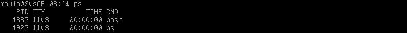
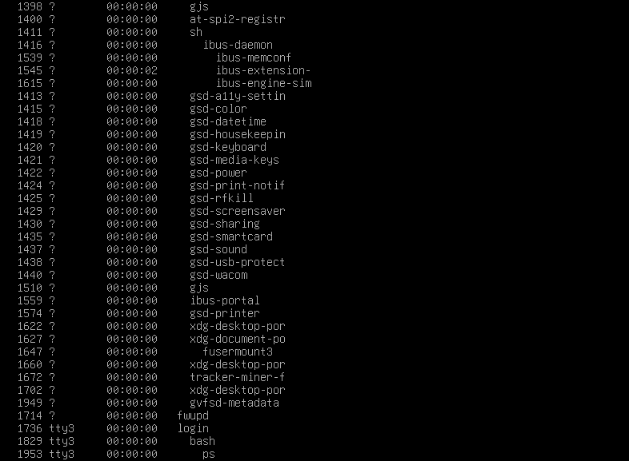
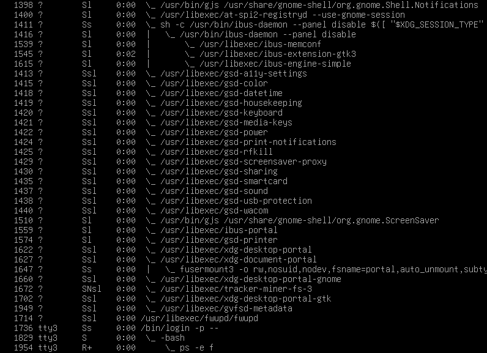
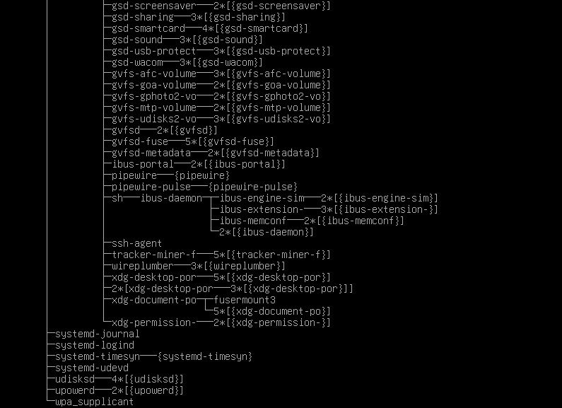
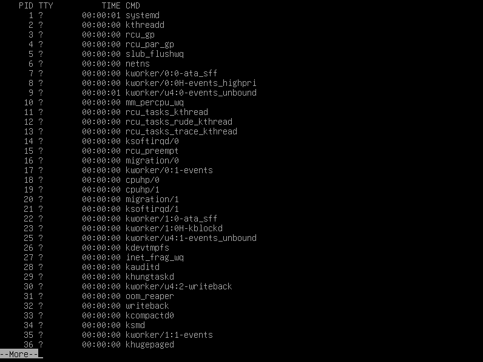
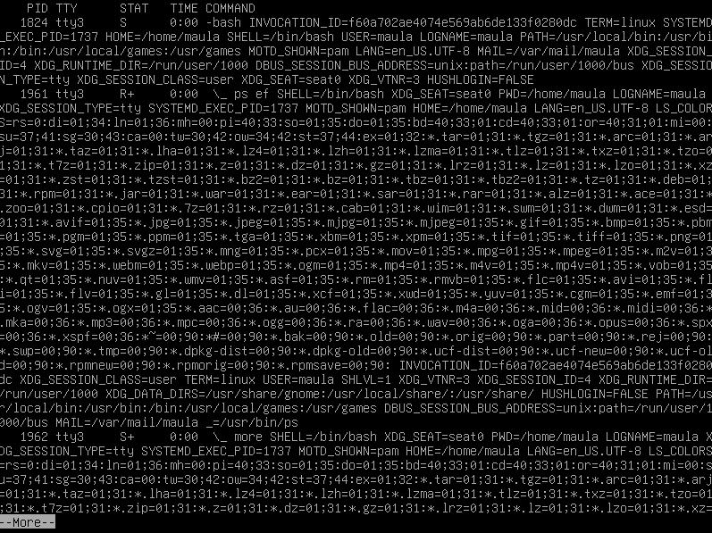
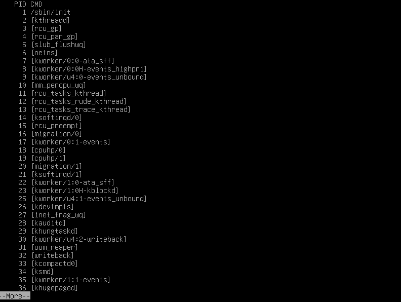
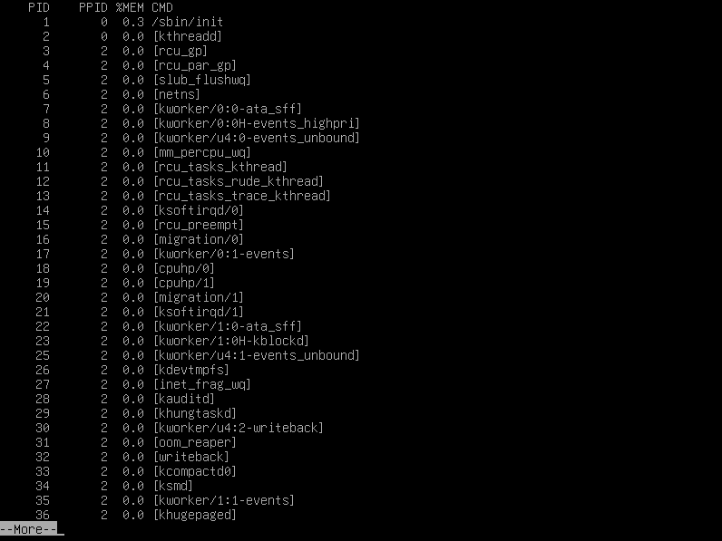

  <h1 style="text-align: center;font-weight: bold">Praktikum 5 Sistem Operasi</h1>
  <h4 style="text-align: center;">Dosen Pengampu : Dr. Ferry Astika Saputra, S.T., M.Sc.</h4>

 

  
  <h3 style="text-align: center;">Disusun Oleh :  Kelompok 4</h3>
  

    <strong>Muhammad Yafi Rifdah Zayyan (3123500001)</strong> 
    <strong>Muhammad Daffa Erfiansyah (3123500006)</strong> 
    <strong>Maula Shahihah Nur Sa'adah (3123500008)</strong>
  

<h3 style="text-align: center;line-height: 1.5">Politeknik Elektronika Negeri Surabaya Departemen Teknik Informatika Dan Komputer Program Studi Teknik Informatika 2023/2024</h3>
  

<h1 style="text-align: center;font-weight: bold">Proses dan Manajemen Proses</h1>

### POKOK BAHASAN

- Proses pada Sistem Operasi Linux
- Manajemen Proses pada Sistem Operasi Linux

### TUJUAN BELAJAR

Setelah mempelajari materi dalam bab ini, mahasiswa diharapkan mampu:

- Memahami konsep proses pada sis tem operasi Linux.
- Menampilkan beberapa cara menampilkan hubungan proses parent dan child.
- Menampilkan status proses dengan beberapa format berbeda.
- Melakukan pengontrolan proses pada shell.
- Memahami penjadwalan prioritas.

### DASAR TEORI

#### 1. KONSEP PROSES PADA SISTEM OPERASI LINUX

Proses adalah program yang sedang dieksekusi. Setiap kali menggunakan utilitas sistem atau program aplikasi dari shell, satu atau lebih proses ”child” akan dibuat oleh shell sesuai perintah yang diberikan. Setiap kali instruksi dibe rikan pada Linux shell, maka kernel akan menciptakan sebuah proses-id. Proses ini disebut juga dengan terminology Unix sebagai sebuah Job. Proses Id (PID) dimulai dari 0, yaitu proses INIT, kemudian diikuti oleh proses berikutnya (terdaftar pada /etc/inittab).
Beberapa tipe proses :

- Foreground  
  Proses yang diciptakan oleh pemakai langsung pada terminal (interaktif, dialog)
- Batch  
  Proses yang dikumpulkan dan dijalankan secara sekuensial (satu persatu). Prose Batch tidak diasosiasikan (berinteraksi) dengan terminal.
- Daemon  
  Proses yang menunggu permintaan (request) dari proses lainnya dan menjalankan tugas sesuai dengan permintaan tersebut. Bila tidak ada request, maka program ini akan berada dalam kondisi “idle” dan tidak menggunakan waktu hitung CPU. Umumnya nama proses daemon di UNIX berakhiran d, misalnya inetd, named, popd dll

#### 2. SINYAL

Proses dapat mengirim dan menerima sinyal dari dan ke proses lainnya. Proses mengirim sinyal melalui instruksi “kill” dengan format  

    kill [-nomor sinyal] PID

Nomor sinyal : 1 s/d maksimum nomor sinyal yang didefinisikan system Standar nomor sinyal yang terpenting adalah :

| No Sinyal | Nama    | Deskripsi                                                                             |
| --------- | ------- | ------------------------------------------------------------------------------------- |
| 1         | SIGHUP  | Hangup, sinyal dikirim bila proses terputus, misalnya melalui putusnya hubungan modem |
| 2         | SIGINT  | Sinyal interrupt, melalui ^C                                                          |
| 3         | SIGQUIT | Sinyal Quit, melalui ^\|                                                              |
| 9         | SIGKILL | Sinyal Kill, menghentikan proses                                                      |
| 15        | SIGTERM | Sinyal terminasi software                                                             |

#### 3. MENGIRIM SINYAL

Mengirim sinyal adalah satu alat komunikasi antar proses, yaitu memberitahukan proses yang sedang berjalan bahwa ada sesuatu yang harus dikendalikan. Berdasarkan sinyal yang dikirim ini maka proses dapat bereaksi dan administrator/programmer dapat menentukan reaksi tersebut. Mengirim sinyal menggunakan instruksi

    kill [-nomor sinyal] PID

Sebelum mengirim sinyal PID proses yang akan dikirim harus diketahui terlebih dahulu.

#### 4. MENGONTROL PROSES PADA SHELL

Shell menyediakan fasilitas job control yang memungkinkan mengontrol beberapa job atau proses yang sedang berjalan pada waktu yang sama. Misalnya bila melakukan pengeditan file teks dan ingin melakukan interrupt pengeditan untuk mengerjakan hal lainnya. Bila selesai, dapat kembali (switch) ke editor dan melakukan pengeditan file teks kembali. 
Job bekerja pada <strong>foreground</strong> atau <strong>background</strong>. Pada foreground hanya diper untukkan untuk satu job pada satu waktu. Job pada foreground akan mengontrol shell - menerima input dari keyboard dan mengirim output ke layar. Job pada background tidak menerima input dari terminal, biasanya berjalan tanpa memerlukan interaksi 
Job pada foreground kemungkinan dihentikan sementara (suspend), dengan menekan [Ctrl-Z]. Job yang dihentikan sementara dapat dijalankan kembali pada foreground atau background sesuai keperluan dengan menekan <strong>”fg”</strong> atau <strong>”bg”</strong>. Sebagai catatan, menghentikan job seme ntara sangat berbeda dengan melakuakan interrupt job (biasanya menggunakan [Ctrl-C]), dimana job yang diinterrup akan dimatikan secara permanen dan tidak dapat dijalankan lagi.

#### 5. MENGONTROL PROSES LAIN

Perintah ps dapat digunakan untuk menunjukkan semua proses yang sedang berjalan pada mesin (bukan hanya proses pada shell saat ini) dengan format :

    ps –fae atau
    ps -aux

Beberapa versi UNIX mempunyai utilitas sistem yang disebut top yang menyediakan cara interaktif untuk memonitor aktifitas sistem. Statistik secara detail dengan proses yang berjalan ditampilkan dan secara terus-menerus di-refresh . Proses ditampilkan secara terurut dari utilitas CPU. Kunci yang berguna pada top adalah

    s – set update frequency
    u – display proses dari satu user
    k – kill proses (dengan PID)
    q – quit

Utilitas untuk melakukan pengontrolan proses dapat ditemukan pada sistem UNIX adalah perintah killall. Perintah ini akan menghentikan proses sesuai PID atau job number proses.

### TUGAS PENDAHULUAN
Jawablah pertanyaan-pertanyaan di bawah ini :
1. Apa yang dimaksud dengan proses ?

   Proses adalah program yang sedang diekseskusi.

2. Apa yang dimaksud perintah untuk menampilkan status proses :
    `ps`, `pstree`.

   Perintah `ps` dalam sistem operasi Linux digunakan untuk menampilkan informasi tentang proses-proses yang sedang berjalan di sistem.

   Sama halnya dengan perintah `ps`, `pstree` juga mempunyai fungsi yang sama untuk melihat status proses yang berjalan pada sistem. Tetapi informasinya ditampilkan dalam bentuk pohon secara hirarkis yang menunjukkan hubungan antara proses-proses tersebut. 

3. Sebutkan opsi yang dapat diberikan pada perintah ps

    `$ps` untuk melihat kondisi proses yang ada

    `$ps -u` untuk melihat faktor/element lainnya

    `$ps -u <user>` mencari proses yang spesifik pemakai

    `$ps -a` mencari proses lainnya (all)

    `$ps -au` mencari proses lainnya (all user)

    `$ps -eH` untuk semua proses, H untuk hirarki tampilan proses

    `$ps -e f` menampilkan status proses dengan karakter grafis

4. Apa yang dimaksud dengan sinyal ? Apa perintah untuk mengirim sinyal ?

   Sinyal adalah cara yang digunakan oleh sistem operasi untuk mengirim pesan ke proses. Sinyal ini bisa digunakan untuk berbagai hal, seperti memberhentikan proses, memberi tahu proses untuk memuat kembali konfigurasi, dan lain-lain.

   Proses mengirim sinyal melalui instruksi `kill` dengan format `kill [-nomor sinyal] PID`.

5. Apa yang dimaksud dengan proses foreground dan background pada job control ?

   Pada foreground hanya diperuntukkan untuk satu job pada satu waktu. Job pada foreground akan mengontrol shell - menerima input dari keyboard dan mengirim output ke layar. Job pada background tidak menerima input dari terminal, biasanya berjalan tanpa memerlukan interaksi.

   Job pada foreground kemungkinan dihentikan sementara (suspend), dengan menekan [Ctrl-Z]. Job yang dihentikan sementara dapat dijalankan kembali pada foreground atau background sesuai keperluan dengan menekan ”fg” atau ”bg ”. Sebagai catatan, menghentikan job sementara sangat berbeda dengan melakuakan interrupt job(biasanya menggunakan [Ctrl-C]), dimana job yang diinterrup akan dimatikan secarapermanen dan tidak dapat dijalankan lagi.

6. Apa yang dimaksud perintah-perintah penjadwalan prioritas :
    `top`, `nice`, `renice`

    `top`: Memonitor / memantau aktivitas system secara real-time 
    `nice`: Mengubah prioritas eksekusi proses yang sudah berjalan 
    `renice`: mengurangi prioritas pada proses.

### PERCOBAAN
1. Login sebagai user.

    

2. Download program C++ untuk menampilkan bilangan prima yang bernama
primes.

    

3. Lakukan percobaan-percobaan di bawah ini kemudian analisa hasil percobaan.
4. Selesaikan soal-soal latihan.

#### Percobaan 1 : Status Proses

1. Pindah ke command line terminal (tty2) dengan menekan Ctrl+Alt+F2 
dan login ke terminal sebagai user

    .png)

2. Instruksi ps (process status) digunakan untuk melihat kondisi proses yang ada. PID adalah Nomor Identitas Proses, TTY adalah nama terminal dimana proses tersebut aktif, STAT berisi S (Sleepin g) dan R (Running), COMMAND merupakan instruksi yang digunakan.

    `$ ps`

    

    Analisa : 
    Instruksi `ps` digunakan untuk melihat kondisi proses yang ada 

3. Untuk melihat faktor/elemen lainnya, gunakan option –u (user). %CPU adalah presentasi CPU time yang digunakan oleh proses tersebut, %MEM adalah presentasi system memori yang digunakan proses, SIZE adalah jumlah memori yang digunakan, RSS (Real System Storage) adalah jumlah memori yang digunakan, START adalah kapan proses tersebut diaktifkan

    `$ ps -u`

    

    Analisa : 
    Instruksi `ps -u` (user), digunakan untuk melihat elemen/faktor lain dari kondisi proses yang ada serta menampilkan nama user

4. Mencari proses yang spesifik pemakai. Proses diatas hanya terbatas pada proses milik pemakai, dimana pemakai teresbut melakukan login

    `$ ps –u < user >`

    

    Analisa :
    Instruksi `ps -u < user >` digunakan untuk melihat semua proses yang dimiliki oleh pengguna atau user

5. Mencari proses lainnya gunakan opsi a (all) dan au (all user)

    `$ ps –a`

    

    Analisa :
    Perintah tersebut digunakan untuk menampilkan proses pada user sekarang

    `ps -au`

    

    Analisa :
    Perintah tersebut digunakan untuk menampilkan informasi yang lebih rinci tentang semua proses yang sedang berjalan, termasuk proses yang dimiliki oleh user (termasuk proses terminal yang sedang dijalankan) dan proses sistem.

6. Logout dan tekan Alt+F7 untuk kembali ke mode grafis

#### Percobaan 2 : Menampilkan Hubungan Proses Parent and Child

1. Pindah ke command line terminal (tty2) dengan menekan Ctrl+Alt+F2 
dan login ke terminal sebagai user

    .png)

2. Ketik ps –eH dan tekan Enter. Opsi e memilih semua proses dan opsi H menghasilkan tampilan proses secara hierarki. Proses child muncul dibawah proses parent. Proses child ditandai dengan awalan beberapa spasi.

    `$ ps -eH`

    

    Analisa : 
    Perintah diatas digunakan untuk menampilkan seluruh proses secara hierarki. Dimana opsi *e* berfungsi memilih semua proses dan opsi *H* berfungsi menghasilkan tampilan proses secara hierarki 

3. Ketik ps –e f dan tekan Enter. Tampilan serupa dengan langkah 2. Opsi –f akan menampilkan status proses dengan karakter grafis (\ dan \_)

    `$ ps –e f`

    

    Analisa : 
    Perintah diatas serupa dengan tampilan pada percobaan kedua, yang hanya berbeda pada opsi yang ditambahkan. Dimana pada perintah ini ditambahkan opsi *f* yang berfungsi untuk mengetahui STAT (keadaan) dari sebuah proses dan menampilkan status proses dengan karakter grafis ( \ dan _ ) 

4. Ketik pstree dan tekan Enter. Akan ditampilkan semua proses pada sistem dalam bentuk hirarki parent/child. Proses parent di sebelah kiri proses child. Sebagai contoh proses init sebagai parent (ancestor) dari semua proses pada sistem. Beberapa child dari init mempunyai child. Proses login mempunyai proses bash sebagai child. Proses bash mempunyai proses child startx. Proses startx mempunyai child xinit dan seterusnya.

    `$ pstree`

    

    Analisa : 
    Gambar diatas tampak seperti pohon atau diagram. Yang menyatakan system ditampilkan dalam bentuk hirarki parent/child

5. Ketik pstree | grep mingetty dan tekan Enter. Akan menampilkan semua proses mingetty yang berjalan pada system yang berupa console virtual. Selain menampikan semua proses, proses dikelompokkan dalam satu baris dengan suatu angka sebagai jumlah proses yang berjalan.

    `$ pstree | grep mingetty`

    

    Analisa : 
    Perintah diatas digunakan untuk menampilkan semua proses mingetty yang berjalan pada sistem yang berupa console virtual

6. Untuk melihat semua PID untuk proses gunakan opsi –p.

    `$ pstree –p`

    

    Analisa : 
    Perintah tersebut adalah varian dari perintah pstree yang menampilkan struktur proses dalam bentuk diagram atau pohon, yang pada proses ini ditambahkan dengan informasi mengenai PID dari proses yang digunakan dengan menambahkan Opsi –p

7. Untuk menampilkan proses dan ancestor yang tercetak tebal gunakan opsi –h.

    `$ pstree –h`

    

    Analisa : 
    Perintah `$ pstree` yang kemudian ditambahkan opsi –h berfungsi Untuk menampilkan proses dan ancestor dengan cara ditampilkan atau dicetak tebal

#### Percobaan 3 : Menampilkan Status Proses dengan Berbagai Format

1. Pindah ke command line terminal (tty2) dengan menekan Ctrl+Alt+F2 
dan login ke terminal sebagai user

    .png)

2. Ketik ps –e | more dan tekan Enter. Opsi -e menampilkan semua proses dalam bentuk 4 kolom : PID, TTY, TIME dan CMD.

    `$ ps –e | more`

    

    Jika halaman penuh terlihat prompt --More-- di bagian bawah screen, tekan q untuk kembali ke prompt perintah.

    Analisa : 
    Perintah `ps -e | more` berfungsi untuk menampilkan daftar semua proses yang sedang berjalan di sistem secara berurutan dalam bentuk 4 kolom, dan outputnya akan ditampilkan secara bertahap menggunakan perintah `more`

3.  Ketik ps ax | more dan tekan Enter. Opsi a akan menampilkan semua proses yang dihasilkan terminal (TTY). Opsi x menampilkan semua proses yang tidak dihasilkan terminal. Secara logika opsi ini sama dengan opsi –e . Terdapat 5 kolom : PID, TTY, STAT, TIME dan COMMAND.

    `$ ps ax | more`

    Jika halaman penuh terlihat prompt --More-- di bagian bawah screen, tekan q untuk kembali ke prompt perintah.

    

    Analisa : 
    Opsi *a* berfungsi menampilkan semua proses yang dihasilkan terminal, setelah itu dilanjutkan dengan membaca opsi x yang berfungsi menampilkan semua proses yang tidak dihasilkan terminal. Yang kemudian outputnya ditampilkan secara bertahap menggunakan perintah `more`

4. Ketik ps –e f | more dan tekan Enter. Opsi –e f akan menampilkan semua proses dalam format daftar penuh.

    `$ ps ef | more`

    

    Jika halaman penuh terlihat prompt --More-- di bagian bawah screen, tekan q untuk kembali ke prompt perintah.

    Analisa : 
    Ketika perintah `ps – ef | more` dieksekusi maka opsi *-ef* akan menampilkan semua proses dalam format daftar penuh. Yang kemudian outputnya ditampilkan secara bertahap menggunakan perintah `more`

5. Ketik ps –eo pid, cmd | more dan tekan Enter. Opsi –eo akan menampilkan semua proses dalam format sesuai definisi user yaitu terdiri dari kolom PID dan CMD.

    `$ ps –eo pid,cmd | more`

    

    Jika halaman penuh terlihat prompt --More-- di bagian bawah screen, tekan q untuk kembali ke prompt perintah.

    Analisa : 
    Opsi `–eo pid,cmd` berfungsi untuk menampilkan semua proses dalam format sesuai definisi user yaitu terdiri dari kolom PID dan CMD. Yang kemudian outputnya akan ditampilkan secara bertahap menggunakan perintah `more`

6. Ketik ps –eo pid,ppid,%mem,cmd | more dan tekan Enter. Akan menampilkan kolom PID, PPID dan %MEM. PPID adalah proses ID dari proses parent. %MEM menampilkan persentasi memory system yang digunakan proses. Jika proses hanya menggunakan sedikit memory system akan ditampilkan 0.

    `$ ps –eo pid,ppid,%mem,cmd | more`

    

    Analisa : 
    Opsi `-eo pid,ppid,%mem,cmd` berfungsi untuk menampilkan kolom PID, PPID dan %MEM. Dimana PPID adalah proses ID dari proses parent, sedangkan %MEM menampilkan persentasi memory system yang digunakan proses. Jika proses hanya menggunakan sedikit memory system akan ditampilkan 0

7. Logout dan tekan Alt+F7 untuk kembali ke mode grafis
    
#### Percobaan 4 : Mengontrol Proses pada Shell

1. Pindah ke command line terminal (tty2) dengan menekan Ctrl+Alt+F2 dan login ke terminal sebagai user.

    .png)

2. Gunakan perintah yes yang mengirim output y yang tidak pernah berhenti

    `$ yes`

    Untuk menghentikannya gunakan Ctrl-C.

    

    Analisa : 
    Perintah `yes` akan memberikan output huruf y yang tidak pernah berhenti. Untuk menghentikannya harus menggunakan *Ctrl + C*

3. Belokkan standart output ke /dev/null

    `$ yes > /dev/null`

    Untuk menghentikannya gunakan Ctrl-C.

    

    Analisa : 
    Perintah ini digunakan membelokkan standard output dari `yes` ke `/dev/null`. Untuk menghentikannya harus menggunakan *Ctrl + C*

4. Salah satu cara agar perintah yes tetap dijalankan tetapi shell tetap digunakan untuk hal yang lain dengan meletakkan proses pada background dengan menambahkan karakter & pada akhir perintah.

    `$ yes > /dev/null &`

    

    Analisa : 
    Perintah `yes` tetap dijalankan tetapi shell tetap digunakan untuk hal yang lain dengan meletakkan proses pada background dengan menambahkan karakter `&` pada akhir perintah.`[1]` merupakan job number PID

5. Untuk melihat status proses gunakan perintah jobs.

    `$ jobs`

    

    Analisa : 
    Perintah di atas digunakan untuk melihat status proses yang telah digunakan

6. Untuk menghentikan job, gunakan perintah kill diikuti job number atau PID proses. Untuk identifikasi job number, diikuti prefix dengan karakter ”%”. Lihat status job setelah diterminasi

    `$ kill %<nomor job> contoh : kill %1`

     `$ jobs`

    

    Analisa : 
    Perintah `kill` digunakan untuk menghentikan job diikuti oleh *job number* atau PID Proses. Untuk identifikasi job number, penulisan perintah diikuti prefix dengan karakter `%`. Sedangkan perintah `jobs` untuk melihat status job setelah diterminasi.

### KESIMPULAN

Proses dan manajemen proses dalam Debian Linux sangat penting untuk memastikan sistem berjalan dengan efisien dan stabil. Mengelola proses dengan benar akan mempengaruhi performa sistem, penggunaan sumber daya, dan kestabilan sistem secara keseluruhan. Konsep proses dalam sistem operasi Linux mencakup pengelompokan program yang sedang berjalan ke dalam unit-unit yang dapat dikelola, dengan masing-masing memiliki identitas unik yang disebut PID (Process ID). Ini memungkinkan sistem untuk melacak dan mengontrol proses secara efisien.