

  <h1 style="text-align: center;font-weight: bold">Praktikum 6 Sistem Operasi</h1>
  <h4 style="text-align: center;">Dosen Pengampu : Dr. Ferry Astika Saputra, S.T., M.Sc.</h4>

 

  
  <h3 style="text-align: center;">Disusun Oleh :  Kelompok 4</h3>
  

    <strong>Muhammad Yafi Rifdah Zayyan (3123500001)</strong> 
    <strong>Muhammad Daffa Erfiansyah (3123500006)</strong> 
    <strong>Maula Shahihah Nur Sa'adah (3123500008)</strong>
  

<h3 style="text-align: center;line-height: 1.5">Politeknik Elektronika Negeri Surabaya Departemen Teknik Informatika Dan Komputer Program Studi Teknik Informatika 2023/2024</h3>
  

### POKOK BAHASAN

- Proses pada Sistem Operasi Linux
- Manajemen Proses pada Sistem Operasi Linux

### TUJUAN BELAJAR

Setelah mempelajari materi dalam bab ini, mahasiswa diharapkan mampu:

- Memahami konsep proses pada sis tem operasi Linux.
- Menampilkan beberapa cara menampilkan hubungan proses parent dan child.
- Menampilkan status proses dengan beberapa format berbeda.
- Melakukan pengontrolan proses pada shell.
- Memahami penjadwalan prioritas.

### DASAR TEORI

#### 1. KONSEP PROSES PADA SISTEM OPERASI LINUX

Proses adalah program yang sedang dieksekusi. Setiap kali menggunakan utilitas sistem atau program aplikasi dari shell, satu atau lebih proses ”child” akan dibuat oleh shell sesuai perintah yang diberikan. Setiap kali instruksi dibe rikan pada Linux shell, maka kernel akan menciptakan sebuah proses-id. Proses ini disebut juga dengan terminology Unix sebagai sebuah Job. Proses Id (PID) dimulai dari 0, yaitu proses INIT, kemudian diikuti oleh proses berikutnya (terdaftar pada /etc/inittab).
Beberapa tipe proses :

- Foreground  
  Proses yang diciptakan oleh pemakai langsung pada terminal (interaktif, dialog)
- Batch  
  Proses yang dikumpulkan dan dijalankan secara sekuensial (satu persatu). Prose Batch tidak diasosiasikan (berinteraksi) dengan terminal.
- Daemon  
  Proses yang menunggu permintaan (request) dari proses lainnya dan menjalankan tugas sesuai dengan permintaan tersebut. Bila tidak ada request, maka program ini akan berada dalam kondisi “idle” dan tidak menggunakan waktu hitung CPU. Umumnya nama proses daemon di UNIX berakhiran d, misalnya inetd, named, popd dll

#### 2. SINYAL

Proses dapat mengirim dan menerima sinyal dari dan ke proses lainnya. Proses mengirim sinyal melalui instruksi “kill” dengan format  

    kill [-nomor sinyal] PID

Nomor sinyal : 1 s/d maksimum nomor sinyal yang didefinisikan system Standar nomor sinyal yang terpenting adalah :

| No Sinyal | Nama    | Deskripsi                                                                             |
| --------- | ------- | ------------------------------------------------------------------------------------- |
| 1         | SIGHUP  | Hangup, sinyal dikirim bila proses terputus, misalnya melalui putusnya hubungan modem |
| 2         | SIGINT  | Sinyal interrupt, melalui ^C                                                          |
| 3         | SIGQUIT | Sinyal Quit, melalui ^\|                                                              |
| 9         | SIGKILL | Sinyal Kill, menghentikan proses                                                      |
| 15        | SIGTERM | Sinyal terminasi software                                                             |

#### 3. MENGIRIM SINYAL

Mengirim sinyal adalah satu alat komunikasi antar proses, yaitu memberitahukan proses yang sedang berjalan bahwa ada sesuatu yang harus dikendalikan. Berdasarkan sinyal yang dikirim ini maka proses dapat bereaksi dan administrator/programmer dapat menentukan reaksi tersebut. Mengirim sinyal menggunakan instruksi

    kill [-nomor sinyal] PID

Sebelum mengirim sinyal PID proses yang akan dikirim harus diketahui terlebih dahulu.

#### 4. MENGONTROL PROSES PADA SHELL

Shell menyediakan fasilitas job control yang memungkinkan mengontrol beberapa job atau proses yang sedang berjalan pada waktu yang sama. Misalnya bila melakukan pengeditan file teks dan ingin melakukan interrupt pengeditan untuk mengerjakan hal lainnya. Bila selesai, dapat kembali (switch) ke editor dan melakukan pengeditan file teks kembali. 
Job bekerja pada <strong>foreground</strong> atau <strong>background</strong>. Pada foreground hanya diper untukkan untuk satu job pada satu waktu. Job pada foreground akan mengontrol shell - menerima input dari keyboard dan mengirim output ke layar. Job pada background tidak menerima input dari terminal, biasanya berjalan tanpa memerlukan interaksi 
Job pada foreground kemungkinan dihentikan sementara (suspend), dengan menekan [Ctrl-Z]. Job yang dihentikan sementara dapat dijalankan kembali pada foreground atau background sesuai keperluan dengan menekan <strong>”fg”</strong> atau <strong>”bg”</strong>. Sebagai catatan, menghentikan job seme ntara sangat berbeda dengan melakuakan interrupt job (biasanya menggunakan [Ctrl-C]), dimana job yang diinterrup akan dimatikan secara permanen dan tidak dapat dijalankan lagi.

#### 5. MENGONTROL PROSES LAIN

Perintah ps dapat digunakan untuk menunjukkan semua proses yang sedang berjalan pada mesin (bukan hanya proses pada shell saat ini) dengan format :

    ps –fae atau
    ps -aux

Beberapa versi UNIX mempunyai utilitas sistem yang disebut top yang menyediakan cara interaktif untuk memonitor aktifitas sistem. Statistik secara detail dengan proses yang berjalan ditampilkan dan secara terus-menerus di-refresh . Proses ditampilkan secara terurut dari utilitas CPU. Kunci yang berguna pada top adalah

    s – set update frequency
    u – display proses dari satu user
    k – kill proses (dengan PID)
    q – quit

Utilitas untuk melakukan pengontrolan proses dapat ditemukan pada sistem UNIX adalah perintah killall. Perintah ini akan menghentikan proses sesuai PID atau job number proses.

### Percobaan 5 : Menghentikan dan Memulai Kembali Job

1. Perintah `yes > /dev/null`

   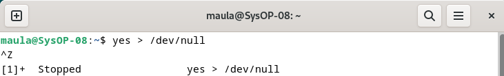

   Analisa : Cara lain meletakkan job pada background dengan memulai job secara normal (pada foreground), stop job dan memulai lagi pada background. Gunakan perintah yes > /dev/null untuk memulai job baru. Hentikan sementara job (suspend), bukan menghentikannya (terminate), tetapi menghentikan sementara job sampai di restart. Untuk menghentikan sementara job gunakan Ctrl + Z

2. Perintah `fg`

   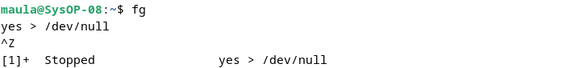

   Analisa: Perintah `fg` disini digunakan untuk me-restart job pada foreground.

3. Perintah `bg`

   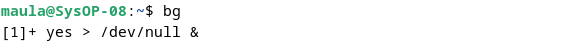

   Analisa : Setelah instruksi fg, Shell akan menampilkan nama perintah yang diletakkan di foreground. Stop job lagi dengan Ctrl + Z. Kemudian gunakan perintah bg untuk meletakkan job pada background.

   Perintah `fg`

   .png)

   Analisa : Job tidak bisa dihentikan dengan Ctrl + Z karena job berada pada background. Untuk menghentikannya, letakkan job pada foreground dengan fg dan kemudian hentikan sementara dengan Ctrl + Z.

4. Perintah `yes &`

   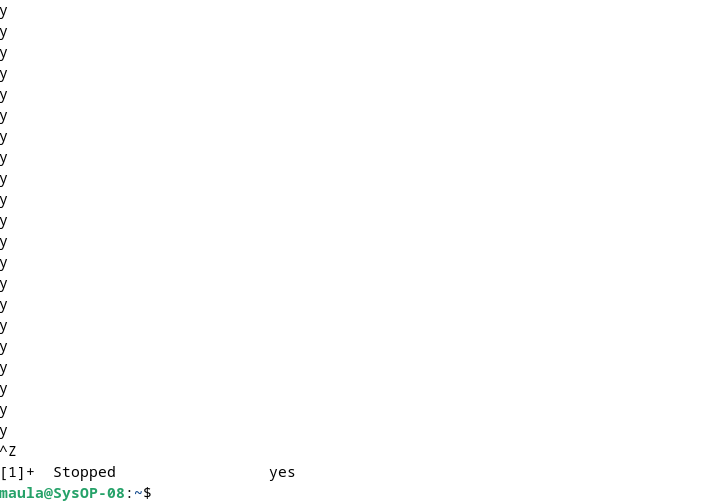

   Analisa : Job pada background dapat digunakan untuk menampilkan teks pada terminal, dimana dapat diabaikan jika mencoba mengerjakan job lain seperti perintah di atas. Untuk menghentikannya tidak dapat menggunakan Ctrl + C. Job harus dipindah ke foreground baru diberhentikan dengan cara tekan fg dan tekan enter, Kemudian lanjutkan dengan Ctrl + Z untuk menghentikan sementara

5. Perintah `fg %2`, `bg %2`, atau `%2`

   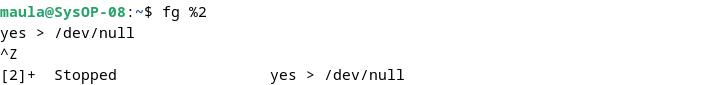

   .png)

   Analisa : Perintah di atas digumakan apabila ingin menjalankan banyak job dalam satu waktu, letakkan job pada foreground atau background dengan memberikan job ID.

6. Perintah `fg`

   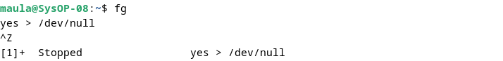

   Analisa : tekan fg dan tekan Enter, kemudian dilanjutkan dengan Ctrl-Z untuk menghentikan sementara

7. Perintah `ps -fae`

   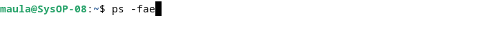

   .png)

   .png)

   .png)

   Analisa : Lihat job dengan perintah ps -fae dan tekan Enter. Kemudian hentikan proses dengan perintah kill. Pada proses di atas proses yang dihentikan adalah proses dengan PID 3245, yaitu proses yes > /dev/null

8. Logout dan tekan Alt+F7 untuk kembali ke mode grafis

### Percobaan 6 : Percobaan dengan Penjadwalan Prioritas

1. Login sebagai root.
2. Buka 3 terminal, tampilkan pada screen yang sama.

   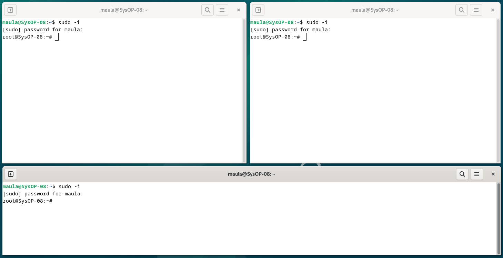

3. Pada setiap terminal, ketik `PS1="\w;"` diikuti Enter. `\w` menampilkan path pada direktori home.

   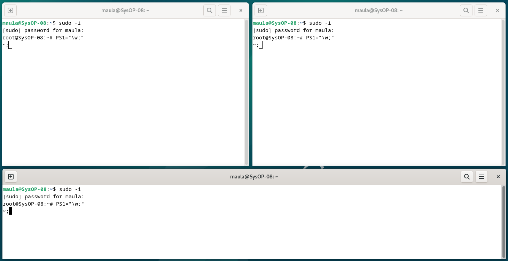

4. Karena login sebagai root, maka akan ditampilkan `~;` pada setiap terminal. Untuk setiap terminal ketik `pwd` dan tekan Enter untuk melihat bahwa Anda sedang berada pada direktori /root.

   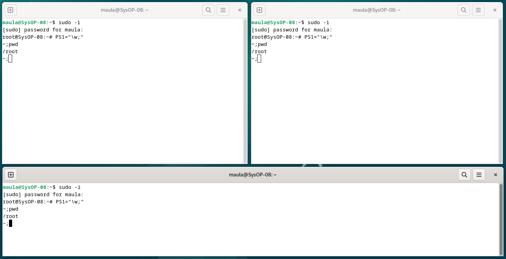

5. Buka terminal lagi (keempat), atur posisi sehingga keempat terminal terlihat pada screen.

   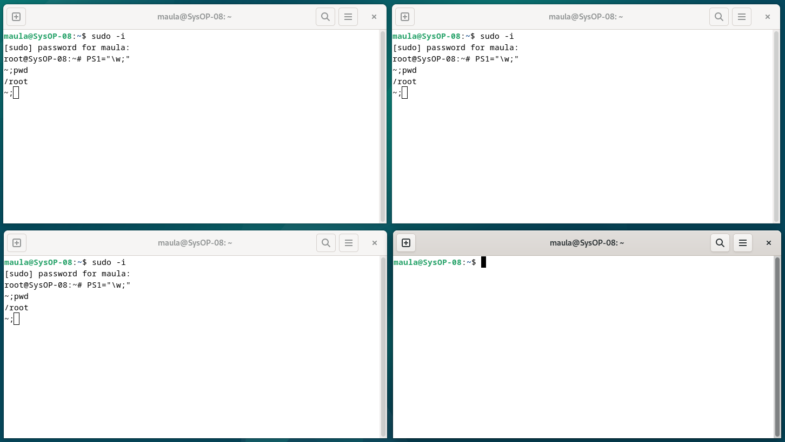

6. Pada terminal keempat, ketik `top` dan tekan Enter. Maka program `top` akan muncul. Ketik i. `Top` akan menampilkan proses yang aktif. Ketik `lmt`. `Top` tidak lagi menampilkan informasi pada bagian atas dari screen. Pada percobaan ini, terminal ke empat sebagai jendela `Top`.

   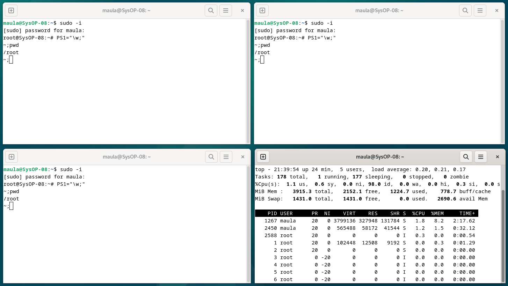

   Ketik `lmt`

   .png)

7. Pada terminal 1, bukalah program executable C++ dengan mengeti program `yes` dan tekan Enter.
8. Ulangi langkah 7 untuk terminal 2.

   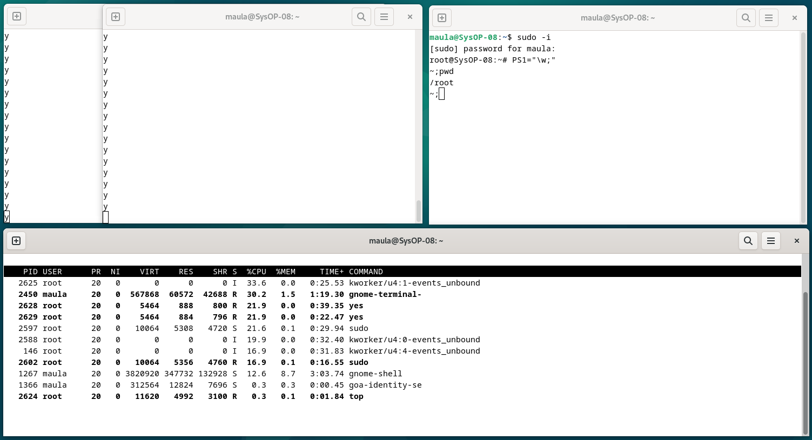

9. Jendela Top akan menampilkan dua program `yes` sebagai proses yang berjalan. Nilai %CPU sama pada keduanya. Hal ini berarti kedua proses mengkonsumsi waktu proses yang sama dan berjalan sama cepat. PID dari kedua proses akan berbeda, misalnya 2628 dan 2629. Kemudiani gunakan terminal 3 (yang tidak menjalankan primes maupun Jendela Top) dan ketik `renice 19 <PID terminal 1>` (contoh: `renice 19 2628`) dan diikuti Enter. Hal ini berarti mengganti penjadwalan prioritas dari proses ke 19.

   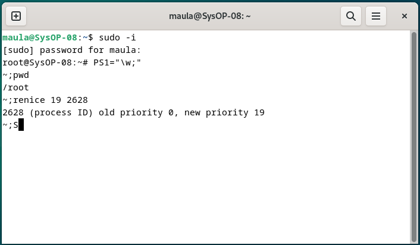

10. Tunggu beberapa saat sampai program top berubah dan terlihat pada jendela Top. Pada kolom STAT memperlihatkan N untuk proses 2628. Hal ini berarti bahwa penjadwalan prioritas untuk proses 2628 lebih besar (lebih lambat) dari 0. Proses 2629 berjalan lebih cepat.

    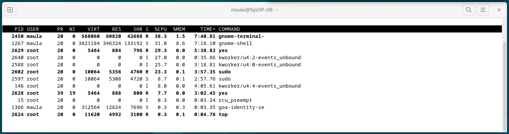

11. Program top juga mempunyai fungsi yang sama dengan program `renice`. Pilih jendela Top dan tekan `r`. Program top terdapat prompt PID to renice: tekan 2628 (ingat bahwa Anda harus mengganti 2628 dengan PID Anda sendiri) dan tekan Enter. Program top memberikan prompt `Renice` PID 2713 to value: tekan -19 dan tekan Enter.

    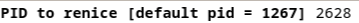

    .png)

12. Tunggu beberapa saat sampai top berubah dan lihat nilai %CPU pada kedua proses. Sekarang proses 2628 lebih cepat dari proses 2629. Kolom status menunjukkan penjadwalan prioritas lebih rendah (lebih cepat) dari nilai 0.

    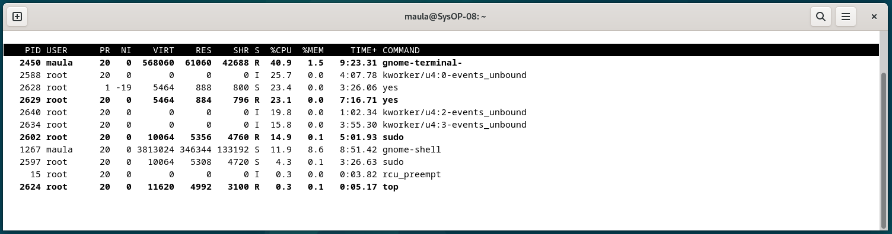

13. Pilih terminal 3 (yang sedang tidak menjalankan `yes` atau program top) dan ketik `nice -n -10 yes` dan Tekan Enter. Tunggu beberapa saat agar program top berubah dan akan terlihat proses primes ketiga. Misalnya PID nya 2628. Opsi -10 berada pada kolom NI (penjadwalan prioritas).

    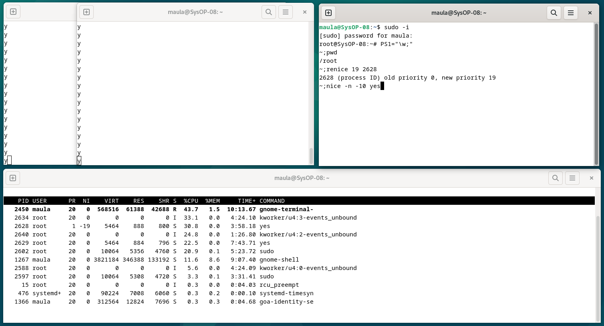

    .png)

14. Jangan menggunakan mouse dan keyboard selama 10 detik. Program top menampilkan proses yang aktif selain program yes. Maka akan terlihat proses top terdaftar tetapi %CPU kecil (dibawah 1.0) dan konsisten. Juga terlihat proses berhubungan dengan dekstop grafis seperti X, panel dll.

    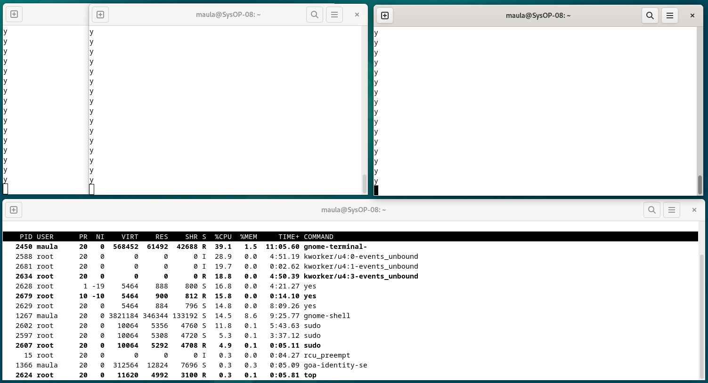

15. Pindahkan mouse sehingga kursor berubah pada screen dan lihat apa yang terjadi dengan tampilan top. Proses tambahan akan muncul dan nilai %CPU berubah sebagai bagian grafis yang bekerja. Satu alasan adalah bahwa proses 2628 berjalan pada penjadwalan prioritas tinggi. Pilih jendela Top ketik `r`. PID to reniceL muncul prompt. Ketik 2628 (ubahlah 2628 dengan PID Anda) dan tekan Enter. Renice PID 2628 to value: muncul prompt. Ketik 0 dan tekan Enter. Sekarang pindahkan mouse ke sekeliling screen. Lihat perubahannya.

    

    .png)

    .png)

    .png)

16. Tutup semua terminal window.
17. Logout dan login kembali sebagai user.

### Latihan 

1. Masuk ke tty2 dengan *Ctrl+Alt+F2*. Ketik `ps –au` dan tekan Enter. Kemudian perhatikan keluaran sebagai berikut :

    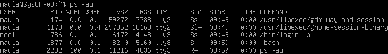

    - Sebutkan nama-nama proses yang bukan root
        - Semua proses kecuali `/bin/login -p--` adalah bukan root 

    - Tulis PID dan COMMAND dari proses yang paling banyak menggunakan CPU time
        - PID : 2282
        - COMMAND : ps -au

    - Sebutkan buyut proses dan PID dari proses tersebut
        - `/usr/libexec/gdm-wayland-session` dengan PID 1174

    - Sebutkan beberapa proses daemon
        - Pada beberapa proses yang tampil pada gambar di atas, tidak ada proses daemon.

    - Pada prompt login lakukan hal- hal sebagai berikut :
        `$ csh`
        `$ who`
        `$ bash`
        `$ ls`
        `$ sh`
        `$ ps`

        .png)

        perintah `$ csh` adalah sebuah shell interaktif yang menawarkan lebih banyak sintaks dibandingkan dengan Bourne Shell. 

        perintah `$ bash` digunakan untuk mengkonversi instruksi yang dimasukkan ke dalam bahasa biner yang dapat dimengerti oleh kernel Linux. 

        perintah `$ ls` digunakan untuk menunjukkan semua file yang terletak dalam direktori aktif.

        perintah `$ sh` adalah singkatan dari Bourne Shell, yang bertindak sebagai interpreter perintah atau shell standar di unix.

        perintah `$ ps` digunakan untuk menampilkan daftar proses yang sedang berlangsung dalam sistem. Tampilan dari perintah ps mencakup empat kolom utama: PID, TTY, TIME, dan CMD.

        Perintah `$ who`digunakan untuk menampilkan daftar pengguna yang saat ini login ke sistem. Ini menampilkan informasi seperti nama pengguna, terminal yang mereka gunakan, waktu login, dan sebagainya. Perintah ini sering digunakan untuk memeriksa siapa yang sedang menggunakan sistem atau untuk melihat apakah ada pengguna yang login secara tidak sah.

    - Sebutkan PID yang paling besar dan kemudian buat urut-urutan proses sampai ke PPID = 1.

        .png)

        - PID = 2561 -> ps
        - PID = 2560 -> sh
        - PID = 2557 -> bash
        - PID = 2534 -> csh
        - PID = 2451 -> bash

2. Cobalah format tampilan ps dengan opsi berikut dan perhatikan hasil tampilannya :
    - `-f` daftar penuh

        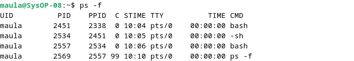  

    - `-j` format job

        .png)  

    - `j` format job control

        .png)  

    - `l` daftar memanjang

        .png) 

    - `s` format sinyal

        .png)

    - `v` format virtual memory

        .png)

    - `X` format register i386

        .png)

3. Lakukan urutan pekerjaan berikut :

    - Gunakan perintah `find` ke seluruh direktory pada sistem, belokkan output sehingga daftar direktori dialihkan ke file `directories.txt` dan daftar pesan error dialihkan ke file `errors.txt`

        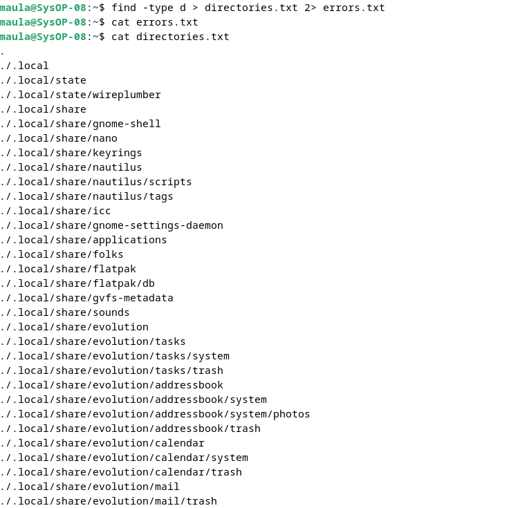

    - Gunakan perintah `sleep 5`. Apa yang terjadi dengan perintah ini ?

        .png)

    - Jalankan perintah pada background menggunakan `&`

        .png)

    - Jalankan `sleep 15` pada foreground, hentikan sementara dengan Ctrl-Z dan kemudian letakkan pada background dengan `bg`. Ketikkan `jobs`. Ketikkan `ps`. Kembalikan job ke foreground dengan perintah `fg`.

        .png)

    - Jalankan `sleep 15` pada background menggunakan `&` dan kemudian gunakan perintah `kill` untuk menghentikan proses diikuti job number.

        .png)

    - Jalankan `sleep 15` pada background menggunakan `&` dan kemudian gunakan `kill` untuk menghentikan sementara proses. Gunakan `bg` untuk melanjutkan menjalankan proses.

        .png)

    - Jalankan `sleep 60` pada background 5 kali dan terminasi semua pada dengan menggunakan perintah `killall`.

        .png)

    - Gunakan perintah `ps`, `w` dan `top` untuk menunjukkan semua proses yang sedang dieksekusi.

        .png)

        .png)

    - Gunakan perintah `ps –aeH` untuk menampilkan hierarki proses. Carilah init proses. Apakah Anda bisa identifikasi sistem daemon yang penting ? Dapatkan Anda identifikasi shell dan subproses ?

        .png)

        .png)

        .png)

    - Kombinasikan `ps –fae` dan grep, apa yang Anda lihat ?

        .png)

    - Jalankan proses `sleep 300` pada background. Log off komputer dan log in kembali. Lihat daftar semua proses yang berjalan. Apa yang terjadi pada proses sleep ?

        .png)

### KESIMPULAN

Proses dan manajemen proses dalam Debian Linux sangat penting untuk memastikan sistem berjalan dengan efisien dan stabil. Mengelola proses dengan benar akan mempengaruhi performa sistem, penggunaan sumber daya, dan kestabilan sistem secara keseluruhan. Konsep proses dalam sistem operasi Linux mencakup pengelompokan program yang sedang berjalan ke dalam unit-unit yang dapat dikelola, dengan masing-masing memiliki identitas unik yang disebut PID (Process ID). Ini memungkinkan sistem untuk melacak dan mengontrol proses secara efisien.