<div align="center">
  <h1 style="text-align: center;font-weight: bold">UTS<br>Praktek Sistem Operasi</h1>
  <h4 style="text-align: center;">Dosen Pengampu : Dr. Ferry Astika Saputra, S.T., M.Sc.</h4>
</div>
<br />
<div align="center">
  
  <h3 style="text-align: center;">Disusun Oleh : <br>Kelompok 4</h3>
  <p style="text-align: center;">
    <strong>Muhammad Yafi Rifdah Zayyan (3123500001)</strong><br>
    <strong>Muhammad Daffa Erfiansyah (3123500006)</strong><br>
    <strong>Maula Shahihah Nur Sa'adah (3123500008)</strong>
  </p>
<h3 style="text-align: center;line-height: 1.5">Politeknik Elektronika Negeri Surabaya<br>Departemen Teknik Informatika Dan Komputer<br>Program Studi Teknik Informatika<br>2023/2024</h3>
  <hr><hr>
</div>

## Dasar Teori

### Process - Fork - Multithread

Setiap program atau bagian dari program yang sedang dieksekusi oleh CPU disebut dengan proses. Proses dapat berjalan secara _foreground_ atau _background_.

Untuk melihat seluruh proses yang sedang berjalan gunakan perintah `$ ps -e` .
Bisa juga menggunakan perintah `$pstree | more` untuk melihat secara detil proses yang sefan berjalan dengan format **tree**.

Setiap proses akan memilik **PID** Process ID). Apabila dibutuhkan Sebuah proses bisa memiliki proses anakan. Dalam hubungan tersebut proses dapat diibaratkan seperti orang tua (_parent_) dengan anak (_child_) yang turun temurun.

- Setiap proses memiliki parent dan child.
- Setiap proses memiliki ID (_pid_) dan parent ID (_ppid_), kecuali proses `init` atau `systemd`.
- _ppid_ dari sebuah proses adalah ID dari parent proses tersebut.

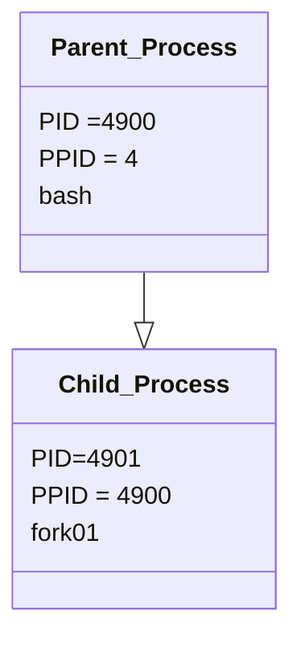

Perhatikan, ppid dari proses `fork01` adalah pid dari proses `bash`.

**fork** digunakan untuk menduplikasi proses. Proses yang baru disebut dengan child proses, sedangkan proses pemanggil disebut dengan parent proses. Spesifikasi fork bisa dilihat dengan `$ man 2 fork`.

```
int main() {
                            pid: 2308, ppid: 10
                             [Main process]
                                 |
  fork();              > Child process created <
                                 +
                               /   \
                             /       \
               pid: 2308, ppid: 10    pid: 30, ppid: 2308
                [Parent Process]    [Child Process]

  return 0;
}
```

perhatikan bahwa :

- `pid` Parent Process == `ppid` Child
- `child_id` Parent Process == `pid` Child Process

**Exec** adalah function yang digunakan untuk menjalankan program baru dan mengganti program yang sedang berlangsung. `exec` adalah program family yang memiliki berbagai fungsi variasi, yaitu `execvp`, `execlp`, `execv`, dan lain lain.

**wait** adalah function yang digunakan untuk mendapatkan informasi ketika child proses berganti _state_-nya. Pergantian state dapat berupa _termination_, _resume_, atau _stop_.

Manual: `$ man 3 exec`


## Soal

1. - Buat tulisan tentang konsep fork dan implementasinya dengan menggunakan bahasa pemrograman C! (minimal 2 paragraf disertai dengan gambar)

   - Deskripsikan dan visualisasikan pohon proses hasil eksekusi dari kode program `fork01.c`, `fork02.c`, `fork03.c`, `fork04.c`, `fork05.c` dan `fork06.c`.

2. Buatlah program perkalian 2 matriks [4 x 4] dalam bahasa C yang memanfaatkan `fork()`.

## Jawaban

<strong>1. Konsep fork dan implementasinya</strong>

Konsep fork adalah proses di mana program utama menciptakan salinan dirinya sendiri untuk menjalankan tugas-tugas tertentu secara paralel. Dalam bahasa pemrograman C, konsep fork dapat diimplementasikan dengan menggunakan fungsi fork() yang akan menciptakan sebuah salinan dari proses yang sedang berjalan.

Setelah pemanggilan fork(), dua proses akan berjalan secara paralel: proses induk (parent process) dan anak (child process). Proses anak akan memiliki ruang alamat memori yang terpisah namun akan memiliki salinan kode program dari proses induk.

Untuk membedakan tindakan antara proses induk dan anak, hasil kembalian dari fork() adalah nilai pid (process id), di mana nilai pid > 0 menunjukkan bahwa kode ini sedang berjalan pada proses induk, sementara nilai pid = 0 menunjukkan bahwa kode ini sedang berjalan pada proses anak.

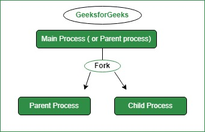

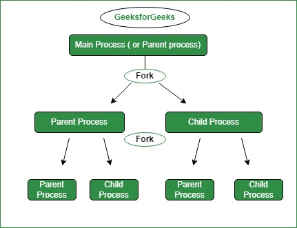

```

#include <sys/types.h>

#include <unistd.h>
#include <stdio.h>

int main()
{
pid_t child_id;
printf("This is the main program, with PID = %d, Child's ID = %d, Parent ID = %d\n",
(int) getpid(), (int) child_id, (int) getppid());

    child_id = fork();
    if(child_id != 0){
      printf("This is the parent process, with PID = %d, Child's ID = %d, Parent ID = %d\n",
      (int) getpid(), (int) child_id, (int) getppid());
    } else {
      printf("This is the child process, with PID = %d, Child's ID = %d, Parent ID = %d\n",
      (int) getpid(), (int) child_id, (int) getppid());
    }

} 

```

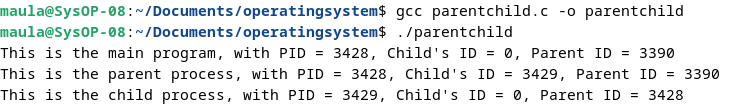

<br>

`fork01.cpp`

```
using namespace std;

#include <iostream>
#include <sys/types.h>
#include <unistd.h>


/* getpid() adalah system call yg dideklarasikan pada unistd.h.
Menghasilkan suatu nilai dengan type pid_t.
pid_t adalah type khusus untuk process id yg ekuivalen dg int
*/
int main(void) {
	pid_t mypid;
	uid_t myuid;
	for (int i = 0; i < 3; i++) {
		mypid = getpid();
		cout << "I am process " << mypid << endl;
		cout << "My parent process ID is " << getppid() << endl;
		cout << "The owner of this process has uid " << getuid()
	<< endl;
/* sleep adalah system call atau fungsi library
yang menghentikan proses ini dalam detik
*/
	sleep(3);
	}
return 0;
}

```

Output Program

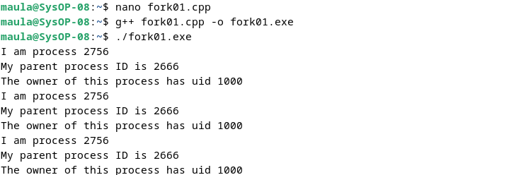

Visualisasi

```
int main() { 
    for(int i = 0; i < 3; i++) {

                    pid: 2756, ppid: 2666, uid: 1000
                            [Main Process]
                                  |
                               sleep(3)
                                  |
                    pid: 2756, ppid: 2666, uid: 1000
                            [Main Process]
                                  |
                                sleep(3)
                                  |
                    pid: 2756, ppid: 2666, uid: 1000
                            [Main Process]
                                  |
                                sleep(3)

    }
  return 0;
}
```

Analisa

Output program ini menampilkan ID proses (PID), ID proses parent (PPID), dan ID pengguna (UID). Setelah mencetak informasi tersebut, program akan berhenti selama tiga detik sebelum mencetak informasi lagi. Program ini looping sebanyak tiga kali.

<br>

`fork02.cpp`

```
#include <iostream>
#include <sys/types.h>
#include <unistd.h>
using namespace std;


/* getpid() dan fork() adalah system call yg dideklarasikan
pada unistd.h.
Menghasilkan suatu nilai dengan type pid_t.
pid_t adalah type khusus untuk process id yg ekuivalen dg int
*/
int main(void) {
	pid_t childpid;
	int x = 5;
	childpid = fork();

	while (1) {
		cout << "This is process ID" << getpid() << endl;
		cout << "In this process the value of x becomes " << x << endl;	
		sleep(2);
		x++;
	}
	return 0;
}

```

Output Program

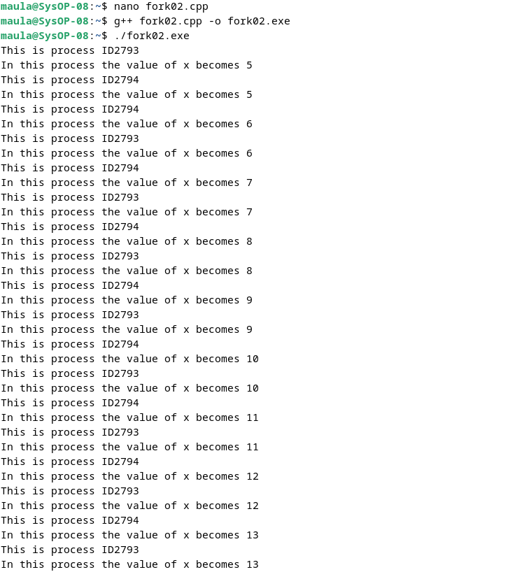

Visualisasi

```
int main() {
  fork();         > Child process created <
                              +
                            /   \
                          /       \
                        /           \
  while(1){           /               \
          PID: 2793, PPID: -       PID: 2794, PPID: 2793
          [Parent Process]          [Child Process]
                      \               /
                        \           /
                          \       /
                            \   /
                              |
                          sleep(2)
                              |
                             x++
  }
  return 0;
}
```

Analisa

Output program menampilkan ID proses (PID) mereka sendiri dan nilai variabel x dalam loop tak terbatas.
Program menggunakan system call fork() untuk membuat proses saat ini, dan menciptakan child process.

<br>

`fork03.cpp`

```
#include <iostream>
using namespace std;
#include <sys/types.h>
#include <unistd.h>


/* getpid() dan fork() adalah system call yg dideklarasikan
pada unistd.h.
Menghasilkan suatu nilai dengan type pid_t.
pid_t adalah type khusus untuk process id yg ekuivalen dg int
*/
int main(void) {
	pid_t childpid;
	childpid = fork();
	for (int i = 0; i < 5; i++) {
		cout << "This is process " << getpid() << endl;
		sleep(2);
	}
	return 0;
}

```

Output Program

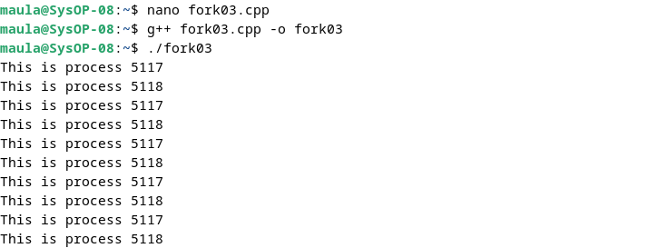

Visualisasi

```
int main() { 
  fork();              > Child process created <
                                 +
                               /   \
    loop 0 to 5 {             /     \
               pid: 5117, ppid: -    pid: 5118, ppid: 5117
               [Parent Process]     [Child Process]
                              \     /
                               \   /
                                 |
                              sleep(2)
                                 |
                                x++
    }
  return 0;
}
```

Analisa

Output program diatas melakukan proses forking secara looping (berulang) sebanyak 5 kali, yang menghasilkan proses-proses baru dengan pesan yang mencatat ID proses (PID) masing-masing. Adanya beberapa PID yang berulang menandakan bahwa parent process melakukan fork beberapa kali, menghasilkan proses-proses child dengan PID yang sama.

<br>

`fork04.cpp`

```
#include <iostream>
using namespace std;
#include <sys/types.h>
#include <unistd.h>
#include <sys/wait.h>
/* pid_t fork() dideklarasikan pada unistd.h.
pid_t adalah type khusus untuk process id yg ekuivalen dg int
*/

int main(void) {
	pid_t child_pid;
	int status;
	pid_t wait_result;
	child_pid = fork();
	if (child_pid == 0) {
		/* kode ini hanya dieksekusi proses child */
		cout << "I am a child and my pid = " << getpid() << endl;
		cout << "My parent is " << getppid() << endl;
		/* keluar if akan menghentikan hanya proses child */
	}
	else if (child_pid > 0) {
		/* kode ini hanya mengeksekusi proses parent */
		cout << "I am the parent and my pid = " << getpid() << endl;
		cout << "My child has pid = " << child_pid << endl;
	}
	else {
		cout << "The fork system call failed to create a new process" << endl;
		exit(1);
	}
		/* kode ini dieksekusi baik oleh proses parent dan child */
		cout << "I am a happy, healthy process and my pid = " << getpid() << endl;
		if (child_pid == 0) {
		/* kode ini hanya dieksekusi oleh proses child */
		cout << "I am a child and I am quitting work now!"<< endl;
	}
	else {
		/* kode ini hanya dieksekusi oleh proses parent */
		cout << "I am a parent and I am going to wait for my child" << endl;
	do {
		/* parent menunggu sinyal SIGCHLD mengirim tanda bahwa proses child diterminasi */
		wait_result = wait(&status);
	} while (wait_result != child_pid);
		cout << "I am a parent and I am quitting." << endl;
	}
	return 0;
}

```

Output Program 

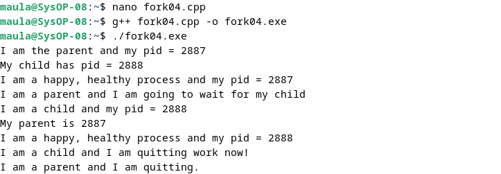

Visualisasi

```
int main() { 
  fork();              > Child process created <
                                 +
                               /   \
                              /     \
               pid: 2887, ppid: -    \
                [Parent Process]      \  
                        |              \
                        |               \
                       wait          pid: 2888, ppid: 2887
                           \             [Child Process]
                            \         /
                             \       /
                              \     /
                               \   /
                                 |
                                exit
    
  return 0;
}
```

Analisa

Output program diatas adalah implementasi dari fork() dimana ada 2 proses yang memiliki hubungan parent dan child. Proses pertama memiliki PID: 2887 dan PPID yang tidak diketahui yang merupakan proses utama (parent process). Setelah program menjalankan fungsi fork() maka akan muncul child process dengan PID: 2888 dan PPID: 2887 (PID dari parent process). 

Setelah parent program memberikan output yang menyebutkan nomor PID nya dan nomor PID dari child, parent program akan melakukan tahap menunggu (wait) untuk menunggu child program berjalan. Child program berjalan dan memberikan output nomor PID nya dan nomor PPID nya, kemudian akan langsung exit the process. Setelah child program exit, maka parent program akan ikut exit juga.

<br>

`fork05.cpp`

```
#include <iostream>
using namespace std;
#include <sys/types.h>
#include <unistd.h>
#include <sys/wait.h>
/* pid_t fork() dideklarasikan pada unistd.h.
pid_t adalah type khusus untuk process id yg ekuivalen dg int
*/

int main(void) {
  pid_t child_pid;
  int status; 
  pid_t wait_result;
  child_pid = fork();
  if (child_pid == 0) {
    /* kode ini hanya dieksekusi proses child */
    cout << "I am a child and my pid = " << getpid() << endl;
    execl("/bin/ls", "ls", "-l", "/home", NULL);
    /* jika execl berhasil kode ini tidak pernah digunakan */
    cout << "Could not execl file /bin/ls" << endl;
    exit(1);
    /* exit menghentikan hanya proses child */
   }
  else if (child_pid > 0) {
    /* kode ini hanya mengeksekusi proses parent */
   cout << "I am the parent and my pid = " << getpid() << endl;
   cout << "My child has pid = " << child_pid << endl;
  }
  else {
   cout << "The fork system call failed to create a new process" << endl;
   exit(1);
  }
  /* kode ini hanya dieksekusi oleh proses parent karena
  child mengeksekusi dari “/bin/ls” atau keluar */
   cout << "I am a happy, healthy process and my pid = " << getpid() << endl;
   if (child_pid == 0) {
  /* kode ini tidak pernah dieksekusi */
   printf("This code will never be executed!\n");
  }
  else {
   /* kode ini hanya dieksekusi oleh proses parent */
    cout << "I am a parent and I am going to wait for my child" << endl;
    do {
      /* parent menunggu sinyal SIGCHLD mengirim tanda bila proses child diterminasi */
      wait_result = wait(&status);
    } while (wait_result != child_pid);
    cout << "I am a parent and I am quitting." << endl;
  }
  return 0;
}

```

Output Program

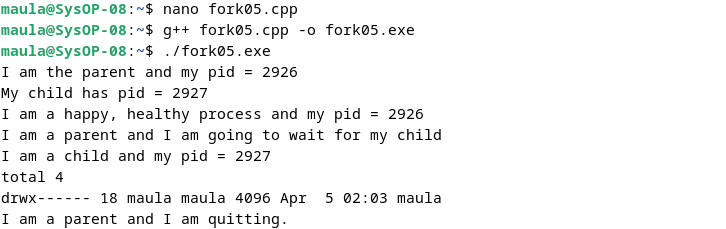

Visualisasi

```
int main() {
  fork();                > Child process created <
                                    +
                                  /   \
                                /       \
                PID : 2926 PPID : -       \
                 [Parent Process]           \
                        |                     \
                        |                       \
                        |               PID : 2927 PPID : 2926
                      wait                    execl(/bin/ls)
                        \                     [Child Process]
                          \                       /
                            \                   /
                              \               /
                                \           /
                                  \       /
                                    \   /
                                      |
                                    exit
}
```

Analisa

Output program diatas adalah implementasi dari fork() dimana ada 2 proses yang memiliki hubungan parent dan child. Proses pertama memiliki PID: 2926 dan PPID yang tidak diketahui yang merupakan proses utama (parent process). Setelah program menjalankan fungsi fork() maka akan muncul child process dengan PID: 2927 dan PPID: 2926 (PID dari parent process). 

Setelah parent program memberikan output yang menunjukkan nomor PID dan PID child, parent program akan menunggu (wait) child program berjalan. Child program akan berjalan dan memberikan output nomor PID nya dan nomor PPID nya dan menjalankan program `execl("/bin/ls", "ls", "-l", "/home", NULL)`, `total 4` adalah jika proses child berhasil menjalankan sistem panggilan `execl()`. Setelah output dari program child diberikan, program child akan langsung exit the process. Setelah child program exit. maka parent program akan ikut juga.

<br>

`fork06.cpp`

```
#include <iostream>
using namespace std;
#include <sys/types.h>
#include <unistd.h>
#include <sys/wait.h>
/* pid_t fork() dideklarasikan pada unistd.h.
pid_t adalah type khusus untuk process id yg ekuivalen dg int
*/

int main(void) {
	pid_t child_pid;
	int status;
	pid_t wait_result;
	child_pid = fork();


	if (child_pid == 0) {
		/* kode ini hanya dieksekusi proses child */
		cout << "I am a child and my pid = " << getpid() << endl;
		execl("fork03", "goose", NULL);
		/* jika execl berhasil kode ini tidak pernah digunakan */
		cout << "Could not execl file fork3" << endl;
		exit(1);
		/* exit menghentikan hanya proses child */
	}
	else if (child_pid > 0) {
		/* kode ini hanya mengeksekusi proses parent */
		cout << "I am the parent and my pid = " << getpid()<< endl;
		cout << "My child has pid = " << child_pid << endl;
	}
	else {
		cout << "The fork system call failed to create a new process" << endl;
		exit(1);
	}
	/* kode ini hanya dieksekusi oleh proses parent karena
	child mengeksekusi dari “fork3” atau keluar */
		cout << "I am a happy, healthy process and my pid = " << getpid() << endl;
		if (child_pid == 0) {
	/* kode ini tidak pernah dieksekusi */
		printf("This code will never be executed!\n");
	}
	else {
	/* kode ini hanya dieksekusi oleh proses parent */
		cout << "I am a parent and I am going to wait for my child" << endl;
		do {
		/* parent menunggu sinyal SIGCHLD mengirim tanda
		bila proses child diterminasi */
			wait_result = wait(&status);
		} while (wait_result != child_pid);
		cout << "I am a parent and I am quitting." << endl;
	}
	return 0;
}

```

Output Program

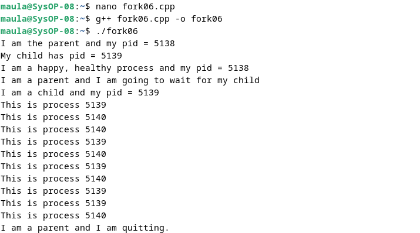

Visualisasi

```
int main() { 
  fork();              > Child process created <
                                 +
                               /   \
                              /     \
               pid: 5138, ppid: -    \
                [Parent Process]      \  
                        |              \
                        |               \
                        |          pid: 5139, ppid: 5138
                       wait           execl(fork3) 
                          \           [Child Process]
                           \           /
                            \         /
                             \       /
                              \     /
                               \   /
                                 |
                                exit
    
  return 0;
}
```

Analisa

Output program diatas adalah implementasi dari fork() dimana ada 2 proses yang memiliki hubungan parent dan child. Proses pertama memiliki PID: 2981 dan PPID yang tidak diketahui yang merupakan proses utama (parent process). Setelah program menjalankan fungsi fork() maka akan muncul child process dengan PID: 2982 dan PPID: 2981 (PID dari parent process). 

Setelah parent program memberikan output yang menyebutkan nomor PID nya dan nomor PID dari child, parent program akan menunggu (wait) child program berjalan. Child program akan berjalan dan memberikan output nomor PID nya dan nomor PPID nya dan menjalankan program `execl(fork3)`, pada program ini sistem `execl()` menjalankan program fork3 yang ada di file fork3.cpp. Setelah output dari program child diberikan, program child akan langsung exit the process. Setelah child program exit the process maka parent program akan mengikuti untuk exit the process juga. Dan ini adalah end of program.

<br>

<strong>2. Buatlah program perkalian 2 matriks [4 x 4] dalam bahasa C yang memanfaatkan `fork()`</strong>

Source code

```
#include <stdio.h>
#include <stdlib.h>
#include <unistd.h>
#include <sys/wait.h>

#define ROWS 4
#define COLS 4

void printMatrix(int matrix[ROWS][COLS]) {
    for (int i = 0; i < ROWS; i++) {
        for (int j = 0; j < COLS; j++) {
            printf("%d ", matrix[i][j]);
        }
        printf("\n");
    }
}

int main() {
    int matrix[ROWS][COLS];
    int skalar = 2;

    for (int i = 0; i < ROWS; i++) {
        for (int j = 0; j < COLS; j++) {
            matrix[i][j] = i * j;
        }
    }

    printf("Matriks Awal:\n");
    printMatrix(matrix);

    pid_t pid = fork();

    if (pid == 0) {
        printf("\nProses Anak - Matriks Hasil:\n");
        for (int i = 0; i < ROWS; i++) {
            for (int j = 0; j < COLS; j++) {
                matrix[i][j] *= skalar;
                printf("%d ", matrix[i][j]);
            }
            printf("\n");
        }
    } else if (pid > 0) {
        wait(NULL);
        printf("\nProses Induk Selesai.\n");
    } else {
        fprintf(stderr, "Fork gagal.\n");
        return 1;
    }

    return 0;
}
```

Output Program

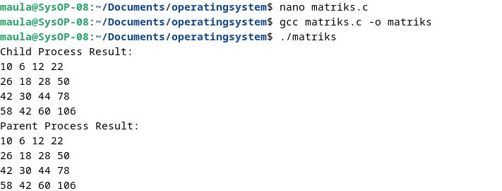

Analisa

Program di atas adalah sebuah program C yang menggambarkan proses fork() dalam melakukan operasi perkalian skalar pada sebuah matriks dan menggunakan proses anak untuk melakukan operasi tersebut.

Fungsi `printMatrix` digunakan untuk mencetak matriks ke layar. Fungsi ini menerima sebuah matriks integer sebagai parameter dan mencetak setiap elemen matriks ke layar.

Fungsi `main`
- Matriks `matrix` diinisialisasi dengan nilai berdasarkan indeks baris dan kolomnya.
- Matriks awal dicetak menggunakan fungsi `printMatrix`.
- Program menggunakan `fork()` untuk membuat proses anak.
  - Jika `pid == 0`, maka ini adalah proses anak. Proses anak akan melakukan perkalian skalar pada matriks.
  - Jika `pid > 0`, maka ini adalah proses induk. Proses induk akan menunggu proses anak selesai.
  - Jika `pid < 0`, maka fork() gagal dan program akan mencetak pesan kesalahan.

Kesimpulan

Program ini mengilustrasikan cara kerja `fork()` untuk membuat proses baru. Proses anak dan proses induk membagi memori dan menjalankan kode yang sama. Proses anak melakukan operasi perkalian skalar pada matriks, sedangkan proses induk menunggu proses anak selesai dan mencetak pesan "Proses Induk Selesai".