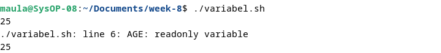
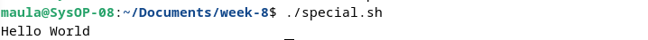
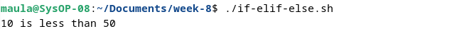
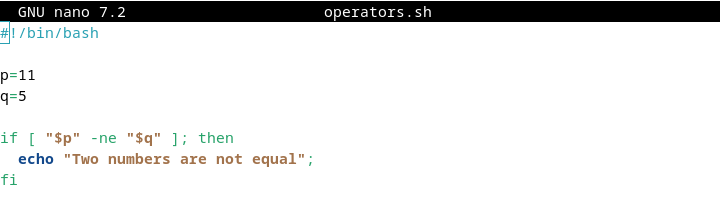
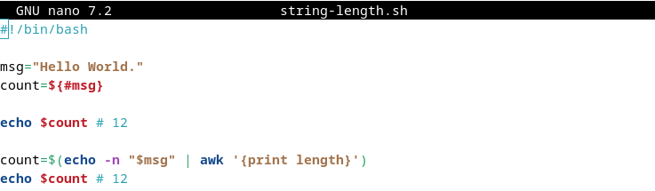
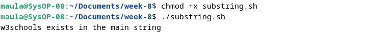
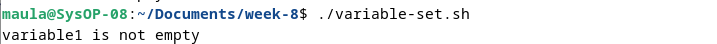

<div align="center">
  <h1 class="text-align: center;font-weight: bold">Praktikum 8<br>Sistem Operasi</h1>
  <h3 class="text-align: center;">Dosen Pengampu : Dr. Ferry Astika Saputra, S.T., M.Sc.</h3>
</div>
<br />
<div align="center">
  
  <h3 style="text-align: center;">Disusun Oleh : <br>Kelompok 4</h3>
  <p style="text-align: center;">
    <strong>Muhammad Yafi Rifdah Zayyan (3123500001)</strong><br>
    <strong>Muhammad Daffa Erfiansyah (3123500006)</strong><br>
    <strong>Maula Shahihah Nur Sa'adah (3123500008)</strong>
  </p>

<h3 style="text-align: center;line-height: 1.5">Politeknik Elektronika Negeri Surabaya<br>Departemen Teknik Informatika Dan Komputer<br>Program Studi Teknik Informatika<br>2023/2024</h3>
  <hr><hr>
</div>

## Bash Programming 

### Pengertian Bash
Bash kependekan dari Bourne Again Shell, adalah open source command line interpreter dan scripting language. Ini menafsirkan perintah yang dimasukkan pengguna, baik secara interaktif atau dari file skrip.
Ini berfungsi sebagai interface untuk memanggil perintah, memungkinkan system function calls.
Ada 2 tipe dari mode bash
- **Interactive Mode**
    Juga disebut sebagai command intepreter, memungkinkan eksekusi perintah di terminal. Ini mengeksekusi perintah secara berurutan jika ada beberapa perintah.
- **Non-interactive Mode**
    Ini merujuk pada scrpts, memungkinkan Anda menulis Bash syntax yang berisi rangkaian beberapa perintah untuk eksekusi skrip.

### Perbedaan Bash dan Shell
Shell, alias Bourne Shell, adalah command-line interpreter untuk OS Unix dan Linux. Bash, alias Bourne Again Shell, adalah versi yang disempurnakan.

### Kegunaan Skrip Bash 

Skrip Bash memiliki banyak kasus penggunaan, termasuk:
- Menulis skrip untuk mengotomatiskan tugas pemrograman
- Menyinkronkan tugas untuk menyalin file
- Menjalankan tugas cron untuk penjadwalan

### Cara menulis kode di Bash
Untuk menulis kode dalam skrip Bash, ikuti langkah-langkah berikut:
- Di terminal, buat file menggunakan `vi test.sh`.
- Tambahkan `#!/bin/bash` di bagian atas file.
- Tambahkan beberapa cuplikan kode shell.
- Simpan file shell dengan `.sh` ekstensi.
- Jalankan skrip shell menggunakan `./test.sh` perintah di terminal.

### Apakah bash termasuk bahasa pengkodean?
Bash menjalankan perintah dari terminal atau file. Ini adalah bahasa pemrograman yang beroperasi pada sistem operasi kernel Unix/Linux, berisi semua fitur untuk menulis kode lengkap.
Bash adalah tipe shell khusus yang menerima masukan dari perintah, menjalankan kode, dan memproses masukan, serta mengembalikan hasilnya.
### Jenis Shell
Ada berbagai jenis shell di OS Unix.
<table>
<thead>
<tr>
  <th style="background-color: blue; color: white">Tipe Cangkang</th>
  <th style="background-color: blue; color: white">Alias</th>
  <th style="background-color: blue; color: white">Garis Pertama</th>
<tr>
</thead>
<tbody>
  <tr>
  <td>SH</td>
  <td>Bourne Shell</td>
  <td>#!/bin/sh</td>
  </tr>
   <tr>
  <td>bash</td>
  <td>Bourne Again Shell</td>
  <td>#!/bin/bash</td>
  </tr>
   <tr>
  <td>cshell</td>
  <td>C shel</td>
  <td>#!/bin/csh</td>
  </tr>
</tbody>
</table>
| tcsh | TENEX C shell | #!/bin/tcsh | | | | ksh | Korn shell | #!/bin/ksh |

### Perbedaan Command Line dan Script di Bash
Perbedaan antara baris perintah dan skrip
Opsi baris perintah
- Baris perintah memiliki prompt yang menerima masukan dari pengguna
- Perintah tidak disimpan ke file.
- Ini hanya mendukung satu perintah pada satu waktu.
File skrip
- Mendukung banyak perintah dalam satu file
- Prompt masih dapat ditulis dalam file skrip
- Hanya satu baris dalam sebuah file yang dijalankan secara berurutan

## Bash - Variables

### Bash Shell Variable
**Deklarasi Variable**: Untuk membuat variable, maka harus memberikan nilai padanya
``` 
variableName=VariableValue
```
Keterangan: 
- variableName: dapat berisi kombinasi huruf apa saja, angka, dan garis bawah
- variableValue: adalah nilai yang disimpan dalam variabel, dan dapat berupa angka, string atau boolean. Simbol `=` digunakan untuk memberikan nilai pada suatu variabel.
Misalnya
```
AGE=25
```
### How to Access Variables in Bash


Pertama adalah mendeklarasikan variable *AGE* dengan memberikan nilai 25. Kemudian menggunakan `echo` untuk menampilkan outputnya. Simbol dollar `$` sebelum nama variable sangat penting untuk mengakses nilainya.


### Bash Shell Readonly Variables


Setelah variabel diberi nilai, kita dapat mengubahnya ke nilai baru menggunakan operator penugasan =


**Membuat Variable tidak dapat diperbarui**


keyword `readonly` mencegah variable untuk diperbarui, secara efektif mengubahnya menjadi `constant`



#### Bash unset variable

Keyword `unset` membantu menghilangkan nilai dari variable yang ditentukan. Variable tetap dapat diakses tetapi mencetak nilai kosong.


Output:


### Bash Global Variables


Output:


### Bash Local variables


Output:


## Bash - Loop File

### Perulangan while


Output:


Output diatas merupakan isi dari file `filename.txt` 


## Bash - Comments

### Single line Comment in bash shell


Output:


### Multi-Line comments in a shell script


Output:


## Bash - Arrays

### How to declare and create an array?

- Declare an array

  

  

  

- Assign the values without declaring an array
  

### Access the array values


### Declare an Array of numbers and loop through


Output:


### Declare an Array of strings and loop through


Output:


### Access the first elements of an array


Output:


### Get the last element of an array
Dalam skrip bash, dapat menggunakan indeks=-1 untuk mendapatkan elemen array terakhir.


Dengan versi bash 4.0 terbaru, dapat menggunakan sintaks di bawah ini untuk membaca elemen terakhir.


Output:


### Iterate or loop array elements
For loop digunakan untuk mengulangi elemen.

Berikut adalah contoh contoh loop array untuk mencetak semua elemen


Output:


Cara lain untuk mencetak indeks dan elemen array menggunakan for loop.


Output:


### Print all array elements
Gunakan [@] atau [*] untuk mencetak semua elemen array.


Output:


### Remove an element from an array
Menghapus elemen dari array menggunakan `unset` indeks tertentu.


Output:


### Adding an element to an array
Contoh penambahan elemen awal dan akhir serta tengah


Output:


### Length of an array


Output:


## Bash - Expansion


Output:


## Bash - Conditional Expression
Ekspresi kondisional dievaluasi pada waktu eksekusi skrip, berdasarkan hasil, Ia mengeksekusi blok perintah tertentu.

Ada berbagai jenis ekspresi kondisional di Bash

- Operator Perbandingan String
- Operator Perbandingan Numerik
- Operator File
- Operator Logis

### Operator File
Bash menyediakan operator logika pada FIle dan direktori untuk menguji ekspresi kondisional. Ini memungkinkan Anda untuk memeriksa berbagai operasi seperti keberadaan, dan izin, ukuran. Ini digunakan ekspresi kondisional dalam pernyataan kondisional seperti if else dan case.

Syntax:


## Bash - Case Statements
Pernyataan case mirip dengan switch case dalam bahasa pemrograman lain.
Ini digunakan untuk membandingkan masukan yang diberikan dengan beberapa pola, dan perintah di dalam pola yang cocok dijalankan.

Syntax:


- expression adalah variabel atau expression yang valid untuk dievaluasi
- Ini berisi pola defiend di dalam case yang dievaluasi dengan membandingkan expression, mencocokkan case fuound, mengeksekusi perintah di dalamnya.
- case default ( `*)`) untuk dijalankan jika tidak ada pola yang cocok
- Setiap blok pola diakhiri dengan `;;`
`case` adalah kata awal dan `esac` merupakan kata yang mengakhiri pernyataan kasus

Contohnya sebagai berikut:


Output:


## Bash - Special Characters
### Blankspace(" “):


Output:



### Expansion($)
### Ambersand (&)
### Pipe (|)
### Semicolon(;)
### Single quotes


Output:


Jika kutipan tunggal berisi quoe tunggal bersarang, Anda harus menghindarinya menggunakan ```.


Output:


Contoh berisi ``` adalah karakter kutipan tunggal di dalam kutipan tunggal

### Double quotes


Output:


### Backslash Character (\\)


Output:


### Comment (#)


Output:


## Bash - if elif else

### Bash Shell Conditional Statements

- Pernyataan tersebut `if` digunakan untuk mengeksekusi blok kode jika suatu kondisi benar, dengan sintaksis `if then fi`.
- Pernyataan `else` digunakan untuk mengeksekusi kode jika suatu kondisi salah, mengikuti sintaksis `if then else fi`.
- Pernyataan `if..elif..else` berguna ketika Anda perlu mengeksekusi kode jika tidak ada kondisi sebelumnya yang benar.

### If Conditional Statements
Pernyataan `if` di Bash digunakan untuk mengeksekusi blok kode ketika kondisi tertentu adalah `true`.


Contoh:


Output:



### If-Else Conditional Statements
Pernyataan `if-else` kondisional di Bash memungkinkan Anda untuk mengeksekusi blok kode yang berbeda tergantung pada apakah suatu kondisi `true`` atau `false`.


Contoh:


Output:


### If..Elif..Else Statements
Gunakan `if..elif..else` pernyataan kondisional di Bash untuk mengeksekusi blok kode berbeda berdasarkan beberapa kondisi.


Contoh:


Output:


## Bash - Loops

### For loop
For loop digunakan untuk mengeksekusi kode beberapa kali.


Contoh:


Output:


### For index loop
Untuk loop indeks mirip dengan bahasa C. Ini mengeksekusi kode beberapa kali berdasarkan kondisi benar, dimulai dengan nilai awal dan iterasi berisi nilai yang akan bertambah 1.


Contoh:


Output:


Ini mencetak angka dari 0 hingga 5

### While loop in bash
Perulangan `while` di Bash memungkinkan eksekusi kode berulang selama kondisi yang ditentukan adalah `true`. Jika kondisinya menjadi `false`, perulangan akan keluar.


Contoh:


Output:


while loop mengeksekusi kode selama kondisi yang ditentukan ( `[[ i -lt 100 ]]`) benar. Blok kode menambah nilai sebesar 1 dan mencetak nilainya. Jika kondisi salah, loop keluar.

### Until loop in bash
Kata `until` kunci di Bash digunakan untuk mengeksekusi kode berulang kali hingga kondisi tertentu menjadi `true`, di mana loop keluar.


Contoh:


Output:


Dalam contoh ini, blok kode dijalankan selama `[[ i -eq 100 ]]` bernilai salah. Ini menambah nilai sebesar 1 dan mencetak nilainya. Output mencetak angka dari 0 hingga 99 angka.

## Bash - Append String

### Bash Athematic expressions


Output:


Ekspresi artema dibuat menggunakan operator di bawah ini

- Operator Artmatik
- Operator Perbandingan

Operator perbandingan digunakan untuk mengecek satu sama lain dengan membandingkan nilai Operator ( `<, <=, >, >=, ==, !=` )


Output:


### Bash Athematic Expansion
`Expansion` sama dengan ekspresi, menghitung nilai ekspresi dan hasilnya diganti dengan nilai. Dan selalu diawali dengan tanda dolar.


Output:


### Bash - Functions

### How to declare a Function and call it
Definisi fungsi berisi beberapa baris kode yang akan dieksekusi.
Fungsi berisi nama fungsi yang diapit `{}`.


### How to pass a parameters to an function


Parameter dapat diakses menggunakan $1 $2 $3.. $n


## Bash - Append String

### Simple variable append
Mendeklarasikan dua variabel string dalam skrip bash, yang dapat dicetak ke konsol menggunakan echo dengan mengapit variabel dalam tanda kutip ganda.


Dapat juga menambahkan tanpa tanda kutip ganda.


Output:


Contoh lain melibatkan penggabungan string ke variabel yang sama dan mencetaknya ke konsol:


Output:


### Use Shorthand Arithmetic Operator
Operator aritmatika singkat ( `+=` ) biasanya digunakan dalam aritmatika untuk menambahkan nilai ke suatu variabel. Ini juga dapat digunakan untuk menambahkan string ke variabel.

Misalnya.

`a+=1` setara dengan `a=a+1` dalam hal angka.
`str+="test"` akan menjadi `str=str+"test"` dalam kasus string.


Output:


### Use printf command
`printf` digunakan untuk memformat string dengan berbagai opsi pemformatan yang kompleks. Kita dapat menggunakan `printf` perintah untuk menggabungkan string. Formatnya adalah `%s%s` , menambahkan dua variabel string.


Output:


### Using here string
`Here strings` adalah sintaks khusus untuk meneruskan string ke perintah dalam skrip bash. Digunakan untuk meneruskan string input tanpa menggunakan sumber lain, seperti file. Ini memungkinkan meneruskan string ke perintah bash apapun dari file atau baris perintah.

command: valid command `<<<` : is a `here string operator`


Output:


## Bash - Operators

### Bash Arithmetic Operators

Operator aritmatika di Bash menyediakan operasi aritmatika seperti operator penjumlahan, pembagian, pengurangan, dan perkalian pembagian.

| Operator | Judul        | Keterangan                                 | Contoh               |
|----------|--------------|--------------------------------------------|----------------------|
| +        | Tambahan     | penambahan dua atau lebih operan          | p + q = 50           |
| -        | Pengurangan  | pengurangan dua atau lebih operan         | q - p = 10           |
| *        | Perkalian    | perkalian dua atau lebih operan           | p * q = 600          |
| /        | Membagi      | hasil bagi setelah pembagian nilai         | q / p = 1.5          |
| %        | Modulus      | kembalikan sisanya setelah pembagian nilai| q % p = 10           |
| -expr    | Minus Unary  | kebalikan dari suatu ekspresi             | -(10 - 7) adalah -3  |
| ~/       | Divisi Int   | mengembalikan nilai int pembagian         | (10 ~/ 7) adalah 1   |
| ++       | Kenaikan     | Tambahkan nilainya sebesar 1              | ++p = 21             |
| --       | Pengurangan  | Kurangi nilainya sebesar 1                | --q = 29             |

### Assignment Operators

Operator penugasan digunakan untuk menetapkan nilai ke suatu variabel. Operasi dasarnya sama dengan (=)

Selain itu, Ada operator penugasan lainnya.

misalnya, p adalah 20

| Operasi          | Simbol | Keterangan                                 | Hasil                         |
|------------------|--------|--------------------------------------------|-------------------------------|
| Tambahkan Tugas  | +=     | Penambahan dan penugasan ke variabel       | ((p += 3)) adalah 23          |
| Kurangi Tugas    | -=     | Kurangi dan tugaskan ke variabel           | ((p -= 3)) adalah 17          |
| Perkalian Tugas  | *=     | Perkalian dan penugasan ke variabel        | ((p *= 2)) adalah 40          |
| Penugasan Divisi| /=     | Penambahan dan penugasan ke variabel       | ((p /= 5)) adalah 4           |

### Bitwise Operators

| Operasi               | Simbol | Keterangan                                          | Hasil                            |
|-----------------------|--------|-----------------------------------------------------|----------------------------------|
| DAN                   | &      | Bitwise AND dari dua operan                        | $op1 & $op2 adalah 0             |
| DAN Setara            | &=     | Bitwise DAN Sama dengan dua operan                | $op1 & $op2 adalah 0             |
| ATAU                  | \|     | Bitwise OR dari dua operan                         | $op1 \| $op2 adalah 7            |
| XOR                   | ^      | XOR bitwise dari dua operan                        | $op1 ^ $op2 adalah 7             |
| Pergeseran Kiri       | <<     | Pergeseran Kiri Bitwise dari dua operan           | $op1 & $op2 adalah 0             |
| Persamaan Pergeseran Kiri | <<=  | Pergeseran Kiri Bitwise Sama dengan dua operan    | $op1 \| $op2 adalah 7            |
| XOR                   | ^      | XOR bitwise dari dua operan                        | $op1 ^ $op2 adalah 7             |
| XOR Setara            | ^=     | Bitwise XOR Sama dengan dua operan                | $op1 ^ $op2 adalah 7             |

### Numerical Comparision Operator

Berikut ini adalah operator Perbandingan.

menggunakan operator `-eq` dalam `if fi` pernyataan kondisional


Output:


| Operation  | Nama              | Deskripsi                                                  |
|------------|-------------------|------------------------------------------------------------|
| -eq        | Equal             | Memeriksa apakah dua variabel sama                         |
| -ne        | Not Equal         | Memeriksa apakah dua variabel tidak sama                   |
| -lt        | Less Than         | Memeriksa apakah variabel pertama lebih kecil dari variabel kedua |
| -le        | Less Than or Equal| Memeriksa apakah variabel pertama kurang dari sama dengan variabel kedua |
| -gt        | Greater Than      | Memeriksa apakah variabel pertama lebih besar dari variabel kedua |
| -ge        | Greater Than or Equal | Memeriksa apakah variabel pertama lebih besar dari sama dengan variabel kedua |

Berikut Contohnya:



Output


## Bash - Number Comparison

### How to Check if two numbers are equal or not in Bash


Output:


Beberapa skrip shell tidak mendukung (()), gunakan [[]] dengan operator Perbandingan

Berikut ini adalah operator Perbandingan.

- `-eq`: setara
    - Periksa apakah dua variabel sama

- `-ne`: Tidak sama
    - Periksa apakah dua variabel tidak sama

- `-lt`: Kurang dari
    - Periksa apakah variabel pertama lebih kecil dari variabel kedua

- `-le`: Kurang dari sama
    - Periksa apakah variabel pertama kurang dari sama dengan variabel kedua

- `-gt`: Lebih besar dari
    - Periksa apakah variabel pertama lebih besar dari variabel kedua

- `-ge`: Lebih besar dari atau sama dengan
    - Bandingkan Periksa apakah variabel pertama lebih besar dari sama dengan variabel kedua

menggunakan operator `-eq` dalam `if fi` pernyataan kondisional


Output :


Dapat juga dilakukan dengan operator ternary


Output :


## Bash - Check Directory

### Bash scripting Check if the directory exists

**Check if a Directory Exists and Print a Message**


Output:


- **How to mkdir only if a directory does not already exist?**

Dalam contoh ini, menggunakan blok kondisional if-else.

- Diperiksa apakah direktori tersebut ada menggunakan `-d`.
- else blok akan memiliki kode untuk tidak ada dan membuat direktori menggunakan jalur direktori


Output


**Check directory exists using ternary syntax**

Alternatifnya, ekspresi kondisional ternary digunakan sebagai pengganti ekspresi kondisional if.

Berikut adalah contoh ekspresi kondisional


 
Output:


- **Check if multiple directories exist**

  Kita harus menggunakan pernyataan kondisional if dengan operator logika AND(&&).

  

  

  Output:

  

**Check directory exists and is writable and executable**

- foldernya ada atau tidak
- jika ada, Folder tersebut memiliki izin untuk menulis dan dieksekusi.
- Terakhir, Cetak pesan string


Output:


**Check files or directory exists**

Opsi -e memeriksa file atau direktori untuk jalur yang diberikan ada atau tidak.


Output:


## Bash - File Name

### Extract file name with extension


Output:


### Extract filename without extension


Output:


### Extract extension for a file path


Output:


Berikut adalah contoh komprehensif yang menunjukkan cara mendapatkan nama file dengan atau tanpa ekstensi file. 

- file dengan ekstensi,
- hanya nama file tanpa ekstensi,
- dan ekstensinya saja.


Output


## Bash - Split String

### Split a string using the awk command in a bash shell script

Perintah `awk` , sebuah utilitas Linux yang kompatibel dengan semua distribusi bash dan shell, digunakan untuk membagi string berdasarkan `delimiter` .

Input diberikan menggunakan simbol pipa (|), dan contoh di bawah ini menunjukkan pemisahan string yang mengandung titik dua ( `:` )


Output:


### Split using IFS variable


Output:


### Use Parameter expansion and loop

Perluasan parameter digunakan untuk mengubah nilai variabel berdasarkan opsi yang ditentukan. Dalam hal ini, variabel string diubah menjadi array. Array kemudian diiterasi menggunakan sintaks for loop, mencetak setiap elemen ke konsol:


Output:


## Bash - String Length

Panjang string ditentukan oleh jumlah karakter yang dikandungnya, dan umumnya mudah untuk memastikan panjangnya untuk teks normal.

Postingan kali ini akan membahas berbagai metode untuk menghitung jumlah karakter dalam sebuah string dengan pengkodean UTF.

Menggunakan Sintaks ${#variable}

Metode pertama melibatkan penggunaan `${#variable}` sintaksis untuk mendapatkan panjang variabel string.

Dalam hal ini, jumlah karakter dalam variabel string.


Output:


Perintah wc -m

Metode kedua melibatkan penggunaan perintah wc -m, baik secara langsung dengan string atau melalui variabel.


Dalam contoh ini, `echo -n "string"` digunakan untuk mencetak string tanpa baris baru ( `-n option`). Operator `|` pipa mengarahkan output dari perintah sisi kiri ke perintah sisi kanan, dan `wc -m` menghitung jumlah karakter dalam sebuah string.

Output:


Menggunakan `expr` Perintah Metode lain melibatkan penggunaan `expr` perintah untuk mencari panjang string.


Output:


`${}` mewakili substitusi ekspresi, mensubstitusi nilai ekspresi ke dalam string. `expr` mengeksekusi `expressions`, dan `length` merupakan argumen yang diteruskan `expr` untuk menemukan panjang string.

`$(expr length "$msg")` mengembalikan jumlah karakter dalam string, ditetapkan ke variabel, nilai variabel dicetak ke konsol

- menggunakan perintah awk `Awk` menyediakan cara lain untuk menghitung panjang string menggunakan ekspresi.

  

  Output:

  

Dalam hal ini, `echo -n "$variable"` keluaran string tanpa baris baru, dan keluaran disalurkan `awk` menggunakan simbol pipa( `|`). Perintah `awk '{print length}'` menghitung dan mencetak panjang baris input.

## Bash - bashrc

File .bashrc adalah file skrip bash yang dijalankan dalam kasus berikut

- menggunakan eksekusi skrip bash
- bash shell dibuka dan dimulai secara interaktif

File ini disembunyikan secara default karena file dimulai dengan . disembunyikan.


File .bashrc adalah skrip yang dijalankan saat pengguna login. File ini terletak di direktori home pengguna. Berisi environment variables dan user preferences untuk dikonfigurasi di dalam file ini

Untuk membaca / melihat file bashrc, kita bisa menggunakan Vi atau nano editor dengan command `nano ~/.bashrc`

file bashrc terletak di dua tempat

- direktori home pengguna
- Direktori sistem

Dalam kasus direktori home pengguna, file ini disembunyikan secara default. Lokasinya adalah `~/.bashrc` tempat ~ pengguna saat ini login di direktori home.

Dalam hal direktori Sistem, file ini terletak di `/etc/bash.bashrc`.

### How to reload .bashrc settings without logging out and back in again?

jika Anda membuat perubahan apa pun pada file .bashrc, Perubahan tidak akan langsung terlihat. Anda harus menutup dan memulai kembali sesi bash untuk melakukan perubahan.

Bagaimana cara memuat ulang konfigurasi .bashrc tanpa login lagi? Jalankan perintah berikut di command prompt.


## Bash - Ternary Operator

### How to use ternary Operator in Bash

Cara pertama, gunakan if-else dengan expression syntax.


Output:


Cara kedua, gunakan arithmetic expression menggunakan && dan || Syntaxnya adalah


Output:


Ada cara lain untuk menetapkan variabel, bukan ekspresi.

dengan menggunakan mari kita dapat menetapkan variabel berdasarkan hasil ekspresi kondisi


Output


## Bash - Lowercase

**Using the tr command**

Perintah tr, kependekan dari translator, adalah perintah Unix yang digunakan untuk mengonversi karakter dari satu format ke format lainnya.

Contoh:


Output:


bisa juga menggunakan:


Output:


Catatan: `tr` berfungsi dengan `ASCII` dan tidak mendukung UTF karakter.

**Using the awk command**

Untuk mengubah string menjadi huruf kecil menggunakan perintah `awk`, `tolower` fungsinya digabungkan dengan `awk`.

Hasilnya kemudian diteruskan ke perintah echo menggunakan operator pipa:


Output:


**Use Perl in Bash Script Printing lc with Perl converts a string to lowercase**


Output:


**Use Parameter expansion Bash 4.0**


Output:


Atau


Output:


Di sini, `${msg,,}` menggunakan `,,` opsi untuk mengonversi variabel menjadi huruf kecil.

## Bash - Uppercase

**Using the tr command**

Perintah tr, kependekan dari translator, adalah perintah Unix yang digunakan untuk mengonversi karakter dari satu format ke format lainnya.

Contoh:


Output:


bisa juga menggunakan:


Output:


**Using the awk command**

Untuk mengubah string menjadi huruf besar menggunakan perintah `awk`, `toupper` fungsinya digabungkan dengan awk. Hasilnya kemudian diteruskan ke perintah echo menggunakan operator pipa:


Output:


**In bash 4.0 version bash 4.0 provides string inbuilt in manipulation utilities. Adding two circumflexes (^) to a string makes a string in the upper case string**


Output:


**Using Perl in the bash script**

`print uc` perintah di Perl mengubah string menjadi huruf besar


Output:


**Use parameter expansion syntax Bash 4.0 provides built-in string manipulation utilities. Adding two circumflexes (^) to a string makes it an uppercase string, also called parameter expansion syntax**


Output:


## Bash - Substring

### Using the Comparison Operator to Check for Substring exists or not

- Tentukan variabel string yang berisi teks.
- Gunakan pernyataan if untuk membandingkan string dengan substring yang diinginkan menggunakan operator kesetaraan ( ==) dan wildcard (*).
- Terakhir, cetak string jika substring ditemukan.


Output:



### Use Regular Expressions to Find a Substring

Operator `=~` memfasilitasi pencarian substring dalam string tertentu, digunakan dalam blok if.


Output:


### Use the grep command

Perintah grep digunakan untuk mencari string tertentu, disalurkan ke string utama untuk perbandingan.


Output:


## Bash - Variable Set

### How to check if a variable is set in a bash script?


Output:


Cara lain untuk memeriksa suatu variabel adalah dengan menyetel menggunakan -v opsi


Output:


### How to check if the variable is unset in the bash script?  

Misalnya variabelnya tidak disetel artinya

- Itu tidak ada dan tidak diumumkan.

Dalam contoh di bawah ini,

- variable1 dideklarasikan tetapi kosong
- variable2 tidak dideklarasikan dan tidak disetel.


Output:


### How to check variable is empty or non-empty

Tutorial ini memeriksa pemeriksaan variabel dibandingkan dengan spasi dan membungkus ekspresi ini di dalam [[]].


Output:


Hal yang sama juga dapat ditulis menggunakan variabel dalam tanda kutip ganda yang dibungkus dalam tanda kurung tunggal [].


Output:


Berikut adalah kode untuk `example checks if a variable is non-empty`.


Output:



Cara lain:


Output


Opsi penggunaan -z lainnya untuk memeriksa variabel disetel dan kosong atau tidak kosong menggunakan kode di bawah ini


Output:


## Bash - Iterate Nos

### Generate a range of numbers in the bash script

**using seq seq tool generates a sequence of numbers**


Output:


**using for loop**


Output:


**while loop**


Output:

  
