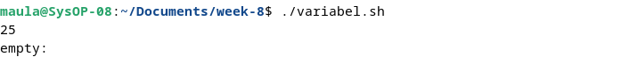
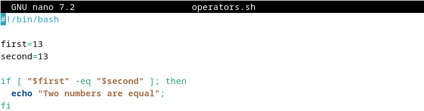

<div align="center">
  <h1 class="text-align: center;font-weight: bold">Praktikum 8<br>Sistem Operasi</h1>
  <h3 class="text-align: center;">Dosen Pengampu : Dr. Ferry Astika Saputra, S.T., M.Sc.</h3>
</div>
<br />
<div align="center">
  
  <h3 style="text-align: center;">Disusun Oleh : <br>Kelompok 4</h3>
  <p style="text-align: center;">
    <strong>Muhammad Yafi Rifdah Zayyan (3123500001)</strong><br>
    <strong>Muhammad Daffa Erfiansyah (3123500006)</strong><br>
    <strong>Maula Shahihah Nur Sa'adah (3123500008)</strong>
  </p>

<h3 style="text-align: center;line-height: 1.5">Politeknik Elektronika Negeri Surabaya<br>Departemen Teknik Informatika Dan Komputer<br>Program Studi Teknik Informatika<br>2023/2024</h3>
  <hr><hr>
</div>

## Bash Programming 

### Pengertian Bash
Bash kependekan dari Bourne Again Shell, adalah open source command line interpreter dan scripting language. Ini menafsirkan perintah yang dimasukkan pengguna, baik secara interaktif atau dari file skrip.
Ini berfungsi sebagai interface untuk memanggil perintah, memungkinkan system function calls.
Ada 2 tipe dari mode bash
- **Interactive Mode**
    Juga disebut sebagai command intepreter, memungkinkan eksekusi perintah di terminal. Ini mengeksekusi perintah secara berurutan jika ada beberapa perintah.
- **Non-interactive Mode**
    Ini merujuk pada scrpts, memungkinkan Anda menulis Bash syntax yang berisi rangkaian beberapa perintah untuk eksekusi skrip.

### Perbedaan Bash dan Shell
Shell, alias Bourne Shell, adalah command-line interpreter untuk OS Unix dan Linux. Bash, alias Bourne Again Shell, adalah versi yang disempurnakan.

### Kegunaan Skrip Bash 
Skrip Bash memiliki banyak kasus penggunaan, termasuk:
- Menulis skrip untuk mengotomatiskan tugas pemrograman
- Menyinkronkan tugas untuk menyalin file
- Menjalankan tugas cron untuk penjadwalan

### Cara menulis kode di Bash
Untuk menulis kode dalam skrip Bash, ikuti langkah-langkah berikut:
- Di terminal, buat file menggunakan `vi test.sh`.
- Tambahkan `#!/bin/bash` di bagian atas file.
- Tambahkan beberapa cuplikan kode shell.
- Simpan file shell dengan `.sh` ekstensi.
- Jalankan skrip shell menggunakan `./test.sh` perintah di terminal.

### Apakah bash termasuk bahasa pengkodean?
Bash menjalankan perintah dari terminal atau file. Ini adalah bahasa pemrograman yang beroperasi pada sistem operasi kernel Unix/Linux, berisi semua fitur untuk menulis kode lengkap.
Bash adalah tipe shell khusus yang menerima masukan dari perintah, menjalankan kode, dan memproses masukan, serta mengembalikan hasilnya.

### Jenis Shell
Ada berbagai jenis shell di OS Unix.
<table>
<thead>
<tr>
  <th style="background-color: blue; color: white">Shell Type</th>
  <th style="background-color: blue; color: white">Alias</th>
  <th style="background-color: blue; color: white">First Line</th>
<tr>
</thead>
<tbody>
  <tr>
  <td>SH</td>
  <td>Bourne Shell</td>
  <td>#!/bin/sh</td>
  </tr>
   <tr>
  <td>bash</td>
  <td>Bourne Again Shell</td>
  <td>#!/bin/bash</td>
  </tr>
   <tr>
  <td>cshell</td>
  <td>C shel</td>
  <td>#!/bin/csh</td>
  </tr>
</tbody>
</table>
| tcsh | TENEX C shell | #!/bin/tcsh | | | | ksh | Korn shell | #!/bin/ksh |

### Perbedaan Command Line dan Script di Bash
Perbedaan antara baris perintah dan skrip
Opsi baris perintah
- Baris perintah memiliki prompt yang menerima masukan dari pengguna
- Perintah tidak disimpan ke file.
- Ini hanya mendukung satu perintah pada satu waktu.
File skrip
- Mendukung banyak perintah dalam satu file
- Prompt masih dapat ditulis dalam file skrip
- Hanya satu baris dalam sebuah file yang dijalankan secara berurutan

## Bash - Variables

### Bash Shell Variable
**Deklarasi Variable**: Untuk membuat variable, maka harus memberikan nilai padanya
``` 
variableName=VariableValue
```
Keterangan: 
- variableName: dapat berisi kombinasi huruf apa saja, angka, dan garis bawah
- variableValue: adalah nilai yang disimpan dalam variabel, dan dapat berupa angka, string atau boolean. Simbol `=` digunakan untuk memberikan nilai pada suatu variabel.
Misalnya
```
AGE=25
```
### How to Access Variables in Bash


Pertama adalah mendeklarasikan variable *AGE* dengan memberikan nilai 25. Kemudian menggunakan `echo` untuk menampilkan outputnya. Simbol dollar `$` sebelum nama variable sangat penting untuk mengakses nilainya.


### Bash Shell Readonly Variables


Setelah variabel diberi nilai, kita dapat mengubahnya ke nilai baru menggunakan operator penugasan =


**Membuat Variable tidak dapat diperbarui**


keyword `readonly` mencegah variable untuk diperbarui, secara efektif mengubahnya menjadi `constant`


### Bash Unset Variable

Keyword `unset` membantu menghilangkan nilai dari variable yang ditentukan. Variable tetap dapat diakses tetapi mencetak nilai kosong.


Output:



### Variables Scope

Setiap variabel yang dideklarasikan harus memiliki ruang lingkup, yang menentukan di mana variabel tersebut dapat digunakan dalam program.

Misalnya, jika suatu variabel dideklarasikan di dalam suatu fungsi, maka variabel tersebut hanya tersedia di dalam fungsi tersebut dan tidak dapat diakses di luar fungsi tersebut.

Cakupan variabel di Bash dapat didefinisikan dengan dua cara

- Variabel global
- Variabel lokal


### Bash Global Variables


Output:


### Bash Local variables

Variabel lokal dideklarasikan di dalam blok kode atau fungsi. Cakupan variabel-variabel ini hanya terlihat di dalam blok tempat variabel-variabel tersebut dideklarasikan.


Dalam sintaks ini, variabel dideklarasikan dan ditetapkan dengan kata kunci `local` .


Output:


### Variables Typing

Skrip Bash bukan bahasa yang diketik, namun Anda dapat mendeklarasikan variabel dengan tipe data menggunakan perintah mendeklarasikan Berdasarkan tipe variabel, ini memungkinkan tipe data.
variabel dideklarasikan dan diberi nilai.

Opsi berisi opsi untuk membuat tipe variabel

Array: Untuk membuat variabel array

mendeklarasikan -a variabel=

| Variable Type    | Syntax                | Description                                                      |
| ---------------- | --------------------- | ---------------------------------------------------------------- |
| Array            | `declare -a variable` | Declare an indexed array variable that stores strings            |
| Associated Array | `declare -A variable` | Declare an Associated Array                                      |
| Integer          | `declare -i variable` | Declare a numeric value to store in the variable                 |
| Readonly         | `declare -r variable` | Declare a readonly variable, cannot be changed or unset          |
| Export           | `declare -x variable` | Export the variable and make it available to all child processes |

### Display Environment Variables in Bash

Di Bash, ada dua jenis perintah untuk mencetak variabel lingkungan.

- Perintah `printenv`​
- Perintah `env`​

Kedua perintah ini mencantumkan semua variabel lingkungan terminal.

### Variable nameing convention

- Variabel dibaca dengan mengawali simbol $.
- Nama variabel terdiri dari huruf, angka, atau garis bawah.
- Variabel peka huruf besar-kecil; misalnya, test dan Test dianggap sebagai dua variabel berbeda dalam skrip.
- Meskipun nama variabel biasanya ditulis dalam HURUF BESAR, Anda dapat membuatnya menggunakan huruf UPPER atau LOWER jika diperlukan. Dan variabel Lingkungan dan Shell keduanya dalam huruf besar.
- Nama variabel tidak boleh mengandung spasi
- Nama-nama biasanya harus camelCase. Contoh `firstName`

### Shell Variables

Variabel shell adalah variabel yang diatur oleh shell, bukan oleh pengguna. Ini diperlukan oleh shell agar dapat bekerja dengan lancar

| Variable     | Description                                                                        |
| ------------ | ---------------------------------------------------------------------------------- |
| PWD          | Current working directory                                                          |
| Set-Location | Change the working directory to new directory                                      |
| Rename-Item  | Rename a file                                                                      |
| IFS          | Internal Field Separator, by default is space, set by Shell, Used for string split |
| PATH         | Contains semicolon separated path of commands, Configured to lookup for commands   |
| UID          | Prints the User Identification number                                              |
| Home         | Home directory of the current user                                                 |


## Bash - Loop File

### Using while loop


Output:


Output diatas merupakan isi dari file `filename.txt` 


## Bash - Comments

`Comments` adalah pernyataan kode yang berisi teks yang dapat dibaca pengguna yang dilewati shell selama eksekusi. Setiap bahasa pemrograman menyertakan fitur komentar, yang memberikan deskripsi baris kode atau pernyataan.

Komentar sebaris dalam kode membantu pengembang dalam mengedit dan memahami kode dengan lebih baik.

Bahasa script bash memungkinkan untuk menggunakan jenis komentar berikut.

- **Single comments**
- **Multi-line comments**

### Single line Comment in bash shell

Komentar satu baris dalam skrip shell dilambangkan dengan `#` simbol di awal setiap baris.

Komentar ini mencakup string yang memberikan informasi tentang baris kode terkait dalam skrip shell.

Penting untuk menempatkan komentar satu baris pada baris terpisah untuk kejelasan.

Untuk komentar sebaris, gunakan simbol `#` di awal komentar. Komentar satu baris selalu dimulai dengan simbol `#` .

**Syntax:**

```
# Single-line comments
```

Spasi kosong setelah simbol `#`  tidak diperlukan. Berikut ini adalah contoh komentar satu baris dalam skrip shell.


Output:


### Multi-Line comments in a shell script

Komentar multi-baris melibatkan penggunaan lebih dari satu baris untuk komentar.

Cara pertama untuk membuat komentar multi-baris adalah dengan memanfaatkan komentar satu baris yang setiap barisnya dimulai dengan simbol komentar satu baris.

**Syntax:** 

```
# Line1 comments
# Line1 comments
# Line1 comments
```

Cara kedua untuk membuat komentar multi-baris adalah dengan mengapit beberapa baris di dalam (`:`) dan (`'`).

Sintaks ini melibatkan:

- Komentar dimulai dengan titik dua (`:`) diikuti dengan `'`.
- Ini diikuti oleh beberapa baris komentar.
- Komentar diakhiri dengan `'`. Berikut sintaksnya:


Output:


## Bash - Arrays

Array di shells adalah variable untuk menyimpan lebih dari satu nilai/data.
Misal ketika memiliki data daftar bilangan integer 1-100, dan ingin menyimpan bilangan-bilangan ini di shell script, tanpa array kita harus mendeklarasikannya satu persatu / baris per baris menggunakan `let number1=1` dst. Jadi, anda bisa menggunakan array yang merujuk ke satu variabel dan menyimpannya.

### How to declare and create an array?

- Declare an array

  Untuk membuat array, kita perlu mendeklarasikan array.

  

  Sebuah array dideklarasikan dengan kata kunci declare dengan opsi `-a` atau `A` .

  **contoh array yang diindeks** Dalam hal ini, nilai Array disimpan dengan indeks=0 dan seterusnya. ini dibuat dengan opsi `declare` dan `-a`.

  Array ini adalah penyimpanan dengan indeks=0, ditambah 1 sebagai berikut.

  

  **contoh array asosiatif** Dalam hal ini, nilai Array disimpan dengan kunci. ini dibuat dengan opsi `declare` dan `-A` .

  Dalam array ini terdapat penyimpanan dengan indeks=0, ditambah 1 sebagai berikut.

  

- Assign the values without declaring an array

  

  Artinya, `arrayvariable` indeks array dideklarasikan dan diberi nilai.

Array diindeks nol berdasarkan nol pada panjang array -1 indeks=0 - mengembalikan elemen pertama indeks=-1 mengembalikan elemen terakhir.

### Access the array values

Array berisi indeks untuk mendapatkan elemen. Elemen array dapat diakses menggunakan sintaks di bawah ini.


### Declare an Array of numbers and loop through

Array dapat berisi angka. Contoh ini berisi array angka dan loop for untuk dicetak.


Output:


### Declare an Array of strings and loop through

Array dapat berisi teks. Contoh ini berisi array angka dan loop for untuk dicetak.


Output:


### Access the first elements of an array

Dalam elemen Array, indeks elemen Pertama adalah nol, dan array[0] mengembalikan elemen pertama.


Output:


### Get the last element of an array

Dalam skrip bash, dapat menggunakan indeks=-1 untuk mendapatkan elemen array terakhir.


Dengan versi bash 4.0 terbaru, dapat menggunakan sintaks di bawah ini untuk membaca elemen terakhir.


Output:


### Iterate or loop array elements

For loop digunakan untuk mengulangi elemen.

Berikut adalah contoh contoh loop array untuk mencetak semua elemen


Output:


Cara lain untuk mencetak indeks dan elemen array menggunakan for loop.


Output:


### Print all array elements

Gunakan [@] atau [*] untuk mencetak semua elemen array.


Output:


### Remove an element from an array

Menghapus elemen dari array menggunakan `unset` indeks tertentu.


Output:


### Adding an element to an array

Menambahkan elemen di posisi indeks mana pun menggunakan sintaks di bawah ini.

```
array[index]=value
```

Contoh penambahan elemen awal dan akhir serta tengah


Output:


### Length of an array

Dalam hal ini, bisa digunakan untuk menemukan jumlah semua elemen dalam array.

Skrip shell menyediakan `#`


Output:


### Array cheat sheet examples

<table>
<thead>
<tr>
  <th style="background-color: blue; color: white">Example</th>
  <th style="background-color: blue; color: white">Description</th>
<tr>
</thead>
<tbody>
    <tr>
        <td>Sdeclare -a array	</td>
        <td>Declare an Indexed array</td>
    </tr>
    <tr>
        <td>declare -A array	</td>
        <td>Declare an Associative array</td>
    </tr>
    <tr>
        <td>declare -a array=()	</td>
        <td>Declare an indexed array with empty array</td>
    </tr>
    <tr>
        <td>array=()</td>
        <td>create an empty array with declaring is valid</td>
    </tr>
    <tr>
        <td>array=(1 6 3)</td>
        <td>Initialize array with numbers</td>
    </tr>
    <tr>
        <td>array=(one two three)</td>
        <td>Initialize the array with string</td>
    </tr>
    <tr>
        <td>array=(one two 1)</td>
        <td>Initialize the array with mixed data</td>
    </tr>
    <tr>
        <td>${array[0]}</td>
        <td>Get first element</td>
    </tr>
    <tr>
        <td>${array[1]}</td>
        <td>Get second element</td>
    </tr>
    <tr>
        <td>${array[-1]}</td>
        <td>Get last element</td>
    </tr>
    <tr>
        <td>${array[@]}</td>
        <td>Get All element</td>
    </tr>
    <tr>
        <td>${array[*]}</td>
        <td>Get All element</td>
    </tr>
    <tr>
        <td>${!array[!]}</td>
        <td>Get All indexes</td>
    </tr>
    <tr>
        <td>${#array[!]}</td>
        <td>Array length</td>
    </tr>
    <tr>
        <td>array[0]=12</td>
        <td>Add element to array at first position.i.e index=0</td>
    </tr>
    <tr>
        <td>array[-1]=22</td>
        <td>Add element to array at last position.</td>
    </tr>
    <tr>
        <td>array+=(11)</td>
        <td>Append value to an array</td>
    </tr>
    <tr>
        <td>${array[@]:k:i}</td>
        <td>Get index=1 element starting from index=k</td>
    </tr>
</tbody>
</table>

## Bash - Expansion

Menjelaskan cara menulis skrip batch dalam skrip shell dan menjalankannya.

Perintah dimasukkan ke OS untuk membuat panggilan sistem dan melakukan tindakan. perintah masukan user di terminal untuk melakukan operasi seperti ls, cd, mkdir dll.

Cara menulis skrip shell di bash

- Pilih Editor atau editor teks
- Buat file dengan ekstensi .sh atau .bash
- Tulis perintah dalam file
- Simpan file sebagai `expansion.sh`


Output:


## Bash - Conditional Expression

Ekspresi kondisional dievaluasi pada waktu eksekusi script, berdasarkan hasil, mengeksekusi blok perintah tertentu.

Ada berbagai jenis ekspresi kondisional di Bash

- Operator Perbandingan String
- Operator Perbandingan Numerik
- Operator File
- Operator Logis

### Operator File
Bash menyediakan operator logika pada File dan direktori untuk menguji ekspresi kondisional. Ini memungkinkan untuk memeriksa berbagai operasi seperti keberadaan, izin dan ukuran. Ini digunakan ekspresi kondisional dalam pernyataan kondisional seperti if else dan case.

**Syntax:**


conditional_expressions berisi options dan filepath, yang selalu mengembalikan nilai benar atau salah.

berikut adalah opsi yang disediakan

<table>
<thead>
<tr>
  <th style="background-color: blue; color: white">Example</th>
  <th style="background-color: blue; color: white">Description</th>
<tr>
</thead>
<tbody>
    <tr>
        <td>-e file</td>
        <td>Returns true if given file exists, file can be normal file or directory</td>
    </tr>
    <tr>
        <td>-f file</td>
        <td>Returns true if given file exists and a file(not directory)<td>
    </tr>
    <tr>
        <td>-d file</td>
        <td>Returns true if file is an directory</td>
    </tr>
    <tr>
        <td>-r file</td>
        <td>Returns true if file exists and has readable permission</td>
    </tr>
    <tr>
        <td>-w file</td>
        <td>Returns true if given file exists, file can be normal file or directory</td>
    </tr>
    <tr>
        <td>-x file</td>
        <td>Returns true if file exists and has writable permission</td>
    </tr>
    <tr>
        <td>-s file</td>
        <td>Returns true if file exists and size is not empty</td>
    </tr>
    <tr>
        <td>-G file</td>
        <td>Returns true if file exists and isowned by a Group ID that matches</td>
    </tr>
    <tr>
        <td>-O file</td>
        <td>Returns true if file exists and owned by a user ID that matches</td>
    </tr>
    <tr>
        <td>-N file</td>
        <td>Returns true if file exists and modified by last read date</td>
    </tr>
    <tr>
        <td>-L file</td>
        <td>Returns true if file exists and and is an symbolic Link</td>
    </tr>
    <tr>
        <td>file1 -ot file2</td>
        <td>Returns true if file1 is older than file2 or file2 exists, file1 does not exist</td>
    </tr>
    <tr>
        <td>file1 -ne file2</td>
        <td>Returns true if file1 is newer than file2,file1 exists, file2 does not exists</td>
    </tr>
    <tr>
        <td>file1 -ef file2</td>
        <td>Returns true if file1 and file2 pointed to same device and inode</td>
    </tr>
</tbody>
</table>

## Bash - Case Statements
Pernyataan case mirip dengan switch case dalam bahasa pemrograman lain.
Ini digunakan untuk membandingkan masukan yang diberikan dengan beberapa pola, dan perintah di dalam pola yang cocok dijalankan.

**Syntax:**


- expression adalah variabel atau expression yang valid untuk dievaluasi
- Ini berisi pola defiend di dalam case yang dievaluasi dengan membandingkan expression, mencocokkan case fuound, mengeksekusi perintah di dalamnya.
- case default ( `*)`) untuk dijalankan jika tidak ada pola yang cocok
- Setiap blok pola diakhiri dengan `;;`
`case` adalah kata awal dan `esac` merupakan kata yang mengakhiri pernyataan kasus

Contohnya sebagai berikut:


Output:


## Bash - Special Characters

### Blankspace(" “):


Output:


### Expansion($)

Simbol tanda dolar digunakan untuk berbagai jenis perluasan parameter perluasan, ( `$variable, ${variable}` ) Substitusi ( `$(expression)`) expressions ( `$((expression))` )

### Ambersand (&)

Menambahkan `&` di akhir perintah memungkinkan untuk menjalankan perintah di background.


Misalnya, Untuk menjalankan server redis di latar belakang, gunakan perintah di bawah ini


### Pipe ( `|` )

Ini digunakan untuk meneruskan keluaran dari satu perintah ke masukan ke perintah lain dari kiri ke kanan. Hal ini memungkinkan untuk membentuk rantai perintah

Sintaksnya adalah `command1 | command2`

Contoh : `echo "hello" | wc` mengembalikan jumlah karakter.

### Semicolon(;)

Ini digunakan untuk memisahkan beberapa perintah menggunakan `;` satu baris. `;` adalah pemisah perintah untuk mendefinisikan beberapa perintah dalam satu baris Sintaks: `command1; command2;command3`

Contoh: `cd /app/;ls;`

### Single quotes

Tanda kutip tunggal ( ') digunakan untuk mendefinisikan suatu string tanpa arti khusus. Artinya semua variabel dan ekspansi tidak diinterpretasikan dan mencetak string literal yang sama.


Output:


Jika kutipan tunggal berisi quoe tunggal bersarang, Anda harus menghindarinya menggunakan ```.


Output:


Contoh berisi ``` adalah karakter kutipan tunggal di dalam kutipan tunggal

### Double quotes

Tanda kutip ganda ( `"` ) digunakan untuk mendefinisikan string literal dengan arti khusus.


Output:


### Backslash Character (\\)

Karakter garis miring terbalik digunakan untuk keluar dari karakter dalam string. ini digunakan dalam string yang dikutip ganda.


Output:


### Comment (#)

Simbol komentar digunakan untuk mengomentari sebaris kode. Baris komentar selalu dimulai dengan `#` .


Output:


## Bash - if elif else

### Bash Shell Conditional Statements


- Pernyataan tersebut `if` digunakan untuk mengeksekusi blok kode jika suatu kondisi benar, dengan sintaksis `if then fi`.
- Pernyataan `else` digunakan untuk mengeksekusi kode jika suatu kondisi salah, mengikuti sintaksis `if then else fi`.
- Pernyataan `if..elif..else` berguna ketika Anda perlu mengeksekusi kode jika tidak ada kondisi sebelumnya yang benar.

Catatan:

- Kondisi adalah ekspresi yang mengevaluasi `true` atau `false` dalam skrip shell.
- Spasi diperlukan sebelum dan sesudah [ dan ].
- Diperlukan titik koma sebelum itu.
- `if`, `else`, `then`, `elif`, `fi` adalah kata-kata khusus di Bash.
- Kondisi adalah ekspresi dengan perintah.
    - Perintah yang berisi sintaks tanda kurung tunggal, contoh sintaksis `[expression]` dan digunakan untuk operasi string file.
    - Sintaks tanda kurung ganda, contohnya adalah `[[expression]]`, yang digunakan untuk menggabungkan beberapa kondisi dan menangani pola regex.
    - Tanda kurung ganda, contoh sintaksnya adalah `((expression))`, digunakan untuk operasi aritmatika

### If Conditional Statements

Pernyataan `if` di Bash digunakan untuk mengeksekusi blok kode ketika kondisi tertentu adalah `true`.


Dalam sintaks di atas:

- Ganti `[ condition ]` dengan ekspresi kondisional.
- Blok kode dalam pernyataan `if` dieksekusi hanya jika kondisi yang ditentukan bernilai benar.
- Setiap pernyataan `if` harus diakhiri dengan `fi`.

Contoh:


Output:


### If-Else Conditional Statements

Pernyataan `if-else` kondisional di Bash memungkinkan Anda untuk mengeksekusi blok kode yang berbeda tergantung pada apakah suatu kondisi `true`` atau `false`.


Dalam sintaks di atas:

- Ganti `[ condition ]` dengan ekspresi yang akan diuji.
- Blok kode dalam pernyataan `if` dijalankan jika kondisi yang ditentukan adalah `true`.
- Blok kode dalam pernyataan `else` dijalankan jika kondisinya adalah `false`.
- Setiap pernyataan `if-else` harus diakhiri dengan `fi`.

Contoh:


Output:


### If..Elif..Else Statements

Gunakan `if..elif..else` pernyataan kondisional di Bash untuk mengeksekusi blok kode berbeda berdasarkan beberapa kondisi.


- Blok kode dalam  pernyataan `if` pertama dijalankan jika `condition1` adalah `true`.
- Blok kode dalam pernyataan `elif` pertama dijalankan jika `condition1` adalah `false` dan `condition2` adalah `benar`.
- Blok `else` dijalankan jika keduanya `condition1` dan `condition2` salah.
- Setiap `if..elif..else` pernyataan harus diakhiri dengan `fi`.

Contoh:


Output:


## Bash - Loops

Loop digunakan untuk mengeksekusi blok kode beberapa kali.

Bash Script menyediakan berbagai jenis loop

- for loop
- for index loop
- while loop
- until loop

### For loop
For loop digunakan untuk mengeksekusi kode beberapa kali.


Contoh:


Output:


### For index loop
Untuk loop indeks mirip dengan bahasa C. Ini mengeksekusi kode beberapa kali berdasarkan kondisi benar, dimulai dengan nilai awal dan iterasi berisi nilai yang akan bertambah 1.


Contoh:


Output:


Ini mencetak angka dari 0 hingga 5

### While loop in bash
Perulangan `while` di Bash memungkinkan eksekusi kode berulang selama kondisi yang ditentukan adalah `true`. Jika kondisinya menjadi `false`, perulangan akan keluar.


Contoh:


Output:


while loop mengeksekusi kode selama kondisi yang ditentukan ( `[[ i -lt 100 ]]`) benar. Blok kode menambah nilai sebesar 1 dan mencetak nilainya. Jika kondisi salah, loop keluar.

### Until loop in bash
Kata `until` kunci di Bash digunakan untuk mengeksekusi kode berulang kali hingga kondisi tertentu menjadi `true`, di mana loop keluar.


Contoh:


Output:


Dalam contoh ini, blok kode dijalankan selama `[[ i -eq 100 ]]` bernilai salah. Ini menambah nilai sebesar 1 dan mencetak nilainya. Output mencetak angka dari 0 hingga 99 angka.

## Bash - Append String

### Bash Athematic expressions

Di bash, Expressions dibuat menggunakan `(())` tanda kurung dengan operan dan operator sebagai argumen. `((a ))` adalah ekspresi bash. Expressions adalah operasi matematika, dapat berisi sub ekspresi yang dipisahkan dengan koma.


Output:


Ekspresi artema dibuat menggunakan operator di bawah ini

- Operator Artmatik
- Operator Logis 
- Operator Bersyarat
- Operator Perbandingan

Operator perbandingan digunakan untuk mengecek satu sama lain dengan membandingkan nilai Operator ( `<, <=, >, >=, ==, !=` )


Output:


### Bash Athematic Expansion
`Expansion` sama dengan ekspresi, menghitung nilai ekspresi dan hasilnya diganti dengan nilai. Dan selalu diawali dengan tanda dolar.

```
$((expression))
``` 


Output:


### When to Use arthematic expressions and expansions

[[]] digunakan untuk menguji ekspresi, mengembalikan nilai boolean (1 atau 0). Ini akan digunakan dalam kasus berikut

- Gunakan ekspresi artetik
    - Untuk melakukan operasi matematika dan perbandingan
- Gunakan ekspresi artetik [[]]
    - Perbandingan string dan angka
    - Periksa file atau direktori ada

### Bash - Functions

Fungsi adalah kode yang dapat digunakan kembali dan dikelompokkan dalam satu nama.

### How to declare a Function and call it

Definisi fungsi berisi beberapa baris kode yang akan dieksekusi.
Fungsi berisi nama fungsi yang diapit `{}`.

```
function function_name {
# Commands or valid bash code
# multiple lines
}
```

```
function function_name() {
  # Commands or valid bash code
  # multiple lines
}
```

### How to pass a parameters to an function


Parameter dapat diakses menggunakan $1 $2 $3.. $n


## Bash - Append String

### Simple variable append
Mendeklarasikan dua variabel string dalam skrip bash, yang dapat dicetak ke konsol menggunakan echo dengan mengapit variabel dalam tanda kutip ganda.


Dapat juga menambahkan tanpa tanda kutip ganda.


Output:


Contoh lain melibatkan penggabungan string ke variabel yang sama:


Output:


### Use Shorthand Arithmetic Operator
Operator aritmatika singkat ( `+=` ) biasanya digunakan dalam aritmatika untuk menambahkan nilai ke suatu variabel. Ini juga dapat digunakan untuk menambahkan string ke variabel.

Misalnya.

`a+=1` setara dengan `a=a+1` dalam hal angka.
`str+="test"` akan menjadi `str=str+"test"` dalam kasus string.


Output:


### Use printf command
`printf` digunakan untuk memformat string dengan berbagai opsi pemformatan yang kompleks. Dapat menggunakan `printf` perintah untuk menggabungkan string. Formatnya adalah `%s%s` , menambahkan dua variabel string.


Output:


### Using here string
`Here strings` adalah sintaks khusus untuk meneruskan string ke perintah dalam skrip bash. Digunakan untuk meneruskan string input tanpa menggunakan sumber lain, seperti file. Ini memungkinkan meneruskan string ke perintah bash apapun dari file atau baris perintah.

**Syntax:**

```
command <<< string
```
command: valid command `<<<` : is a `here string operator`


Output:


## Bash - Operators

Operator adalah simbol dalam pemrograman yang melakukan operasi pada operan

**Syntax:**

```
operand1 operator operand2
```

Ada dua jenis operator.

- Operator Biner: Beroperasi pada dua operan seperti penjumlahan, pengurangan, perkalian, pembagian, dan modulus
- Operator Unary: Beroperasi pada operan tunggal seperti increment and decrement


### Bash Arithmetic Operators

Operator aritmatika di Bash menyediakan operasi aritmatika seperti operator penjumlahan, pembagian, pengurangan, dan perkalian pembagian.

| Operator | Judul        | Keterangan                                 | Contoh               |
|----------|--------------|--------------------------------------------|----------------------|
| +        | Tambahan     | penambahan dua atau lebih operan          | p + q = 50           |
| -        | Pengurangan  | pengurangan dua atau lebih operan         | q - p = 10           |
| *        | Perkalian    | perkalian dua atau lebih operan           | p * q = 600          |
| /        | Membagi      | hasil bagi setelah pembagian nilai         | q / p = 1.5          |
| %        | Modulus      | kembalikan sisanya setelah pembagian nilai| q % p = 10           |
| -expr    | Minus Unary  | kebalikan dari suatu ekspresi             | -(10 - 7) adalah -3  |
| ~/       | Divisi Int   | mengembalikan nilai int pembagian         | (10 ~/ 7) adalah 1   |
| ++       | Kenaikan     | Tambahkan nilainya sebesar 1              | ++p = 21             |
| --       | Pengurangan  | Kurangi nilainya sebesar 1                | --q = 29             |

### Assignment Operators

Operator penugasan digunakan untuk menetapkan nilai ke suatu variabel. Operasi dasarnya sama dengan (=)

Selain itu, Ada operator penugasan lainnya.

misalnya, p adalah 20

| Operasi          | Simbol | Keterangan                                 | Hasil                         |
|------------------|--------|--------------------------------------------|-------------------------------|
| Tambahkan Tugas  | +=     | Penambahan dan penugasan ke variabel       | ((p += 3)) adalah 23          |
| Kurangi Tugas    | -=     | Kurangi dan tugaskan ke variabel           | ((p -= 3)) adalah 17          |
| Perkalian Tugas  | *=     | Perkalian dan penugasan ke variabel        | ((p *= 2)) adalah 40          |
| Penugasan Divisi| /=     | Penambahan dan penugasan ke variabel       | ((p /= 5)) adalah 4           |

### Bitwise Operators

| Operasi               | Simbol | Keterangan                                          | Hasil                            |
|-----------------------|--------|-----------------------------------------------------|----------------------------------|
| DAN                   | &      | Bitwise AND dari dua operan                        | $op1 & $op2 adalah 0             |
| DAN Setara            | &=     | Bitwise DAN Sama dengan dua operan                | $op1 & $op2 adalah 0             |
| ATAU                  | \|     | Bitwise OR dari dua operan                         | $op1 \| $op2 adalah 7            |
| XOR                   | ^      | XOR bitwise dari dua operan                        | $op1 ^ $op2 adalah 7             |
| Pergeseran Kiri       | <<     | Pergeseran Kiri Bitwise dari dua operan           | $op1 & $op2 adalah 0             |
| Persamaan Pergeseran Kiri | <<=  | Pergeseran Kiri Bitwise Sama dengan dua operan    | $op1 \| $op2 adalah 7            |
| XOR                   | ^      | XOR bitwise dari dua operan                        | $op1 ^ $op2 adalah 7             |
| XOR Setara            | ^=     | Bitwise XOR Sama dengan dua operan                | $op1 ^ $op2 adalah 7             |

### Logical Operators

Operator ini digunakan untuk melakukan operasi logika pada variabel/ekspresi/data.

| Operasi       | Simbol | Keterangan                                                           | Hasil                         |
|---------------|--------|----------------------------------------------------------------------|-------------------------------|
| Logis DAN     | &&     | Kembalikan nilai benar (status keluar = 0) jika kedua operan benar, jika tidak, kembalikan salah (status keluar bukan nol) | $op1 &&& $op2 adalah 0        |
| Logis ATAU    | \|\|   | Logis OR dari dua operan                                            | $op1 & $op2 adalah 0          |
| Logis TIDAK   | \!     | Balikkan nilai bersyarat.                                           | $op1 s 7                      |

### String Comparision Operator

| Operasi    | Keterangan                                                         |
|------------|--------------------------------------------------------------------|
| -z Tali    | Kembalikan nilai benar jika string kosong, jika tidak salah.       |
| -n Tali    | KEMBALI benar, Jika string tidak kosong.                          |
| str1=str2  | kembalikan nilai true, jika str1 dan str2 sama.                    |
| str1!=str2 | mengembalikan nilai true, jika str1 dan str2 tidak sama.           |
| str1>str2  | kembali benar, jika str1 mengurutkan sebelum str2.                |
| str1<str2  | kembali benar, jika str1 mengurutkan setelah str2.                |

### Numerical Comparision Operator

Berikut ini adalah operator Perbandingan.

menggunakan operator `-eq` dalam `if fi` pernyataan kondisional



Output:


| Operation  | Nama              | Deskripsi                                                  |
|------------|-------------------|------------------------------------------------------------|
| -eq        | Equal             | Memeriksa apakah dua variabel sama                         |
| -ne        | Not Equal         | Memeriksa apakah dua variabel tidak sama                   |
| -lt        | Less Than         | Memeriksa apakah variabel pertama lebih kecil dari variabel kedua |
| -le        | Less Than or Equal| Memeriksa apakah variabel pertama kurang dari sama dengan variabel kedua |
| -gt        | Greater Than      | Memeriksa apakah variabel pertama lebih besar dari variabel kedua |
| -ge        | Greater Than or Equal | Memeriksa apakah variabel pertama lebih besar dari sama dengan variabel kedua |

Berikut Contohnya:


Output


### Other Operators

| Operasi | Deskripsi                                                         |
|---------|-------------------------------------------------------------------|
| -v      | Mengembalikan nilai benar jika sebuah variabel ditetapkan nilai, artinya nilai telah diassign |
| -o      | Mengembalikan nilai benar jika sebuah opsi shell (optname) diaktifkan |
| -R      | Mengembalikan nilai benar jika sebuah variabel ditetapkan nilai, dan itu adalah referensi bernama |

## Bash - Number Comparison

### How to Check if two numbers are equal or not in Bash


Output:


Beberapa skrip shell tidak mendukung (()), gunakan [[]] dengan operator Perbandingan

Berikut ini adalah operator Perbandingan.

- `-eq`: sama
    - Periksa apakah dua variabel sama

- `-ne`: Tidak sama
    - Periksa apakah dua variabel tidak sama

- `-lt`: Kurang dari
    - Periksa apakah variabel pertama lebih kecil dari variabel kedua

- `-le`: Kurang dari sama
    - Periksa apakah variabel pertama kurang dari sama dengan variabel kedua

- `-gt`: Lebih besar dari
    - Periksa apakah variabel pertama lebih besar dari variabel kedua

- `-ge`: Lebih besar dari atau sama dengan
    - Bandingkan Periksa apakah variabel pertama lebih besar dari sama dengan variabel kedua

menggunakan operator `-eq` dalam `if fi` pernyataan kondisional


Output :


Dapat juga dilakukan dengan operator ternary


Output :


## Bash - Check Directory

### Bash scripting Check if the directory exists

**Check if a Directory Exists and Print a Message**


Output:


- **How to mkdir only if a directory does not already exist ?**

  Dalam contoh ini, menggunakan blok kondisional if-else.

- Diperiksa apakah direktori tersebut ada menggunakan `-d`.
- else blok akan memiliki kode untuk tidak ada dan membuat direktori menggunakan jalur direktori

  

  Output

  

**Check directory exists using ternary syntax**

Alternatifnya, ekspresi kondisional ternary digunakan sebagai pengganti ekspresi kondisional if.

Berikut adalah contoh ekspresi kondisional


 
Output:


- **Check if multiple directories exist**

  Kita harus menggunakan pernyataan kondisional if dengan operator logika AND(&&).

  

  

  Output:

  

**Check directory exists and is writable and executable**

- foldernya ada atau tidak
- jika ada, Folder tersebut memiliki izin untuk menulis dan dieksekusi
- Terakhir, Cetak pesan string


Output:


**Check files or directory exists**

Opsi -e memeriksa file atau direktori untuk jalur yang diberikan ada atau tidak.


Output:


## Bash - File Name

### Extract file name with extension

Untuk mendapatkan nama file beserta ekstensinya, perintah `basename` dapat digunakan untuk menghapus direktori dan hanya mengembalikan nama `filename` untuk path tertentu, baik itu `variable` atau string.

Misalnya, jika pathnya adalah `/home/john/run.sh`, filename yang dikembalikan adalah `run.sh` . Proses ini melibatkan pengambilan full path dan mengekstraksi hanya menghapus `filename` dengan path. Hasilnya `filename` kemudian disimpan dalam variabel dan dicetak ke konsol.
 
basename digunakan untuk menghapus direktori dan mengembalikan filename untuk jalur yang diberikan. Path adalah variabel atau string. Misalnya, pathnya adalah `/home/john/run.sh`, dan filename yang dikembalikan adalah `run.sh` Dalam hal ini, path lengkap diberikan dan mengembalikan filename dengan menghapus pathnya.


Output:


### Extract filename without extension


Output:


### Extract extension for a file path


Output:


Berikut adalah contoh komprehensif yang menunjukkan cara mendapatkan nama file dengan atau tanpa ekstensi file. 

- file dengan ekstensi,
- hanya nama file tanpa ekstensi,
- dan ekstensinya saja.


Output


## Bash - Split String

Ini membahas tiga metode

- Pisahkan string menggunakan perintah awk
- Gunakan variabel IFS
- Ekspansi Parameter dengan for loop

### Split a string using the awk command in a bash shell script

Perintah `awk` , sebuah utilitas Linux yang kompatibel dengan semua distribusi bash dan shell, digunakan untuk membagi string berdasarkan `delimiter` .

Input diberikan menggunakan simbol pipa (|), dan contoh di bawah ini menunjukkan pemisahan string yang mengandung titik dua ( `:` )


Output:


### Split using IFS variable

String masukan terdiri dari elemen yang dipisahkan oleh `hyphens` . Variabel shell `IFS` (Pemisah Bidang Internal) diatur ke tanda hubung, dan string diiterasi menggunakan perulangan for.

Setiap elemen dicetak setelah tanda hubung dihilangkan.


Output:


### Use Parameter expansion and loop

Parameter expansion digunakan untuk mengubah nilai variabel berdasarkan opsi yang ditentukan. Dalam hal ini, variabel string diubah menjadi array. Array kemudian diiterasi menggunakan sintaks for loop, mencetak setiap elemen ke konsol:


Output:


## Bash - String Length

Panjang string ditentukan oleh jumlah karakter yang dikandungnya, dan umumnya mudah untuk memastikan panjangnya untuk teks normal.

Postingan kali ini akan membahas berbagai metode untuk menghitung jumlah karakter dalam sebuah string dengan pengkodean UTF.

Menggunakan Sintaks ${#variable}

Metode pertama melibatkan penggunaan `${#variable}` sintaksis untuk mendapatkan panjang variabel string.

Dalam hal ini, jumlah karakter dalam variabel string.


Output:


Perintah wc -m

Metode kedua melibatkan penggunaan perintah wc -m, baik secara langsung dengan string atau melalui variabel.


Dalam contoh ini, `echo -n "string"` digunakan untuk mencetak string tanpa baris baru ( `-n option`). Operator `|` pipa mengarahkan output dari perintah sisi kiri ke perintah sisi kanan, dan `wc -m` menghitung jumlah karakter dalam sebuah string.

Output:


Menggunakan `expr` Perintah Metode lain melibatkan penggunaan `expr` perintah untuk mencari panjang string.


Output:


`${}` mewakili substitusi ekspresi, mensubstitusi nilai ekspresi ke dalam string. `expr` mengeksekusi `expressions`, dan `length` merupakan argumen yang diteruskan `expr` untuk menemukan panjang string.

`$(expr length "$msg")` mengembalikan jumlah karakter dalam string, ditetapkan ke variabel, nilai variabel dicetak ke konsol

- menggunakan perintah awk `Awk` menyediakan cara lain untuk menghitung panjang string menggunakan ekspresi.

  

  Output:

  

Dalam hal ini, `echo -n "$variable"` keluaran string tanpa baris baru, dan keluaran disalurkan `awk` menggunakan simbol pipa( `|`). Perintah `awk '{print length}'` menghitung dan mencetak panjang baris input.

## Bash - Bashrc

File .bashrc adalah file skrip bash yang dijalankan dalam kasus berikut

- menggunakan eksekusi skrip bash
- bash shell dibuka dan dimulai secara interaktif

File ini disembunyikan secara default karena file dimulai dengan . disembunyikan.


File .bashrc adalah skrip yang dijalankan saat pengguna login. File ini terletak di direktori home pengguna. Berisi environment variables dan user preferences untuk dikonfigurasi di dalam file ini

Untuk membaca / melihat file bashrc, kita bisa menggunakan Vi atau nano editor dengan command `nano ~/.bashrc`

file bashrc terletak di dua tempat

- direktori home pengguna
- Direktori sistem

Dalam kasus direktori home pengguna, file ini disembunyikan secara default. Lokasinya adalah `~/.bashrc` tempat ~ pengguna saat ini login di direktori home.

Dalam hal direktori Sistem, file ini terletak di `/etc/bash.bashrc`.

### How to reload .bashrc settings without logging out and back in again?

jika Anda membuat perubahan apa pun pada file .bashrc, Perubahan tidak akan langsung terlihat. Anda harus menutup dan memulai kembali sesi bash untuk melakukan perubahan.

Bagaimana cara memuat ulang konfigurasi .bashrc tanpa login lagi? Jalankan perintah berikut di command prompt.


## Bash - Ternary Operator

Pemrograman Bash tidak memiliki dukungan untuk sintaks operator ternary.

Operator ternary ditulis dalam bahasa Java

```
expression?value1:value2
```

Sintaksnya mirip dengan ekspresi kondisional if dan else. jika ekspresi benar, nilai1 dikembalikan, jika tidak, nilai2 dikembalikan.

### How to use ternary Operator in Bash

Cara pertama, menggunakan if-else dengan expression syntax.


Output:


Cara kedua, menggunakan arithmetic expression menggunakan && dan ||

jika ekspresi1 benar, Ekspresi2 dievaluasi, jika tidak, Ekspresi3 dievaluasi


Output:


Ada cara lain untuk menetapkan variabel, bukan ekspresi.


Output


## Bash - Lowercase

**Using the tr command**

Perintah tr, kependekan dari translator, adalah perintah Unix yang digunakan untuk mengonversi karakter dari satu format ke format lainnya.

**Syntax:**

```
tr input_format output_format
```

Berikut skrip bash shell yang digunakan `tr` untuk mengonversi string menjadi huruf kecil:


Output:


bisa juga menggunakan:


Output:


Catatan: `tr` berfungsi dengan `ASCII` dan tidak mendukung UTF karakter.

**Using the awk command**

Untuk mengubah string menjadi huruf kecil menggunakan perintah `awk`, `tolower` fungsinya digabungkan dengan `awk`.

Hasilnya kemudian diteruskan ke perintah echo menggunakan operator pipa:


Output:


Metode ini paling baik untuk karakter ASCII dan UTF.

**Use Perl in Bash Script Printing lc with Perl converts a string to lowercase**

lc adalah alias untuk huruf kecil.


Output:


**Use Parameter expansion Bash 4.0**

Sintaksnya adalah `${variable[options]}` .


Output:


Atau


Output:


Di sini, `${msg,,}` menggunakan `,,` opsi untuk mengonversi variabel menjadi huruf kecil.

## Bash - Uppercase

**Using the tr command**

Perintah tr, kependekan dari translator, adalah perintah Unix yang digunakan untuk mengonversi karakter dari satu format ke format lainnya.

**Syntax:**

```
tr input_format output_format
```

Berikut skrip shell untuk mengonversi ke huruf besar.


Output:


Cara lain untuk mengganti kode di atas


Output:


Catatan: `tr` berfungsi dengan `ASCII` dan tidak mendukung `UTF` karakter.

**Using the awk command**

Untuk mengubah string menjadi huruf besar menggunakan perintah `awk`, `toupper` fungsinya digabungkan dengan awk. Hasilnya kemudian diteruskan ke perintah echo menggunakan operator pipa:


Output:


**In bash 4.0 version bash 4.0 provides string inbuilt in manipulation utilities. Adding two circumflexes (^) to a string makes a string in the upper case string**


Output:


**Using Perl in the bash script**

`print uc` perintah di Perl mengubah string menjadi huruf besar


Output:


**Use parameter expansion syntax Bash 4.0 provides built-in string manipulation utilities. Adding two circumflexes (^) to a string makes it an uppercase string, also called parameter expansion syntax**

Sintaksnya adalah `${variable[options]}`


Output:


## Bash - Substring

### Using the Comparison Operator to Check for Substring exists or not

- Tentukan variabel string yang berisi teks.
- Gunakan pernyataan if untuk membandingkan string dengan substring yang diinginkan menggunakan operator kesetaraan ( `==` ) dan wildcard ( `*` ).
- Terakhir, cetak string jika substring ditemukan.


Output:


### Use Regular Expressions to Find a Substring

Operator `=~` memfasilitasi pencarian substring dalam string tertentu, digunakan dalam blok if.


Output:


### Use the grep command

Perintah grep digunakan untuk mencari string tertentu, disalurkan ke string utama untuk perbandingan.


Output:


## Bash - Variable Set

Tutorial ini tentang memeriksa variabel dalam pemrograman skrip bash shell

- Periksa variabel disetel atau tidak
- variabel kosong atau tidak kosong
- Periksa variabel apakah string kosong atau tidak

Berikut beberapa contoh penggunaan variabel untuk variabel `price`

Berikut adalah tabel untuk deklarasi variabel beserta keterangannya:

| Deklarasi variabel  | Keterangan                                                            |
|----------------------|-----------------------------------------------------------------------|
| price;               | Variabel tidak dideklarasikan dan tidak disetel                        |
| price=;              | Variabel dideklarasikan dan tidak disetel                              |
| price=3000;          | Variabel dideklarasikan, ditetapkan, dan tidak disetel                 |
| price=(3000);        | Variabel dideklarasikan, ditetapkan, dan tidak disetel                 |
| price tidak ditetapkan; | Variabel tidak dideklarasikan dan tidak disetel                       |

### How to check if a variable is set in a bash script?

Misalnya variabelnya diset artinya,

- Itu dideklarasikan dan ditetapkan dengan kosong atau tidak kosong.

  Dalam contoh di bawah ini,

- `variable1` dideklarasikan tetapi kosong
- `variable2` tidak dideklarasikan dan tidak disetel.


Output:


Cara lain untuk memeriksa suatu variabel adalah dengan menyetel menggunakan `-v` opsi


Output:


### How to check if the variable is unset in the bash script?  

Misalnya variabelnya tidak disetel artinya

- Itu tidak ada dan tidak diumumkan.

  Dalam contoh di bawah ini,

- `variable1` dideklarasikan tetapi kosong
- `variable2` tidak dideklarasikan dan tidak disetel.


Output:


### How to check variable is empty or non-empty

Tutorial ini memeriksa pemeriksaan variabel dibandingkan dengan spasi dan membungkus ekspresi ini di dalam `[[]]` .


Output:


Hal yang sama juga dapat ditulis menggunakan variabel dalam tanda kutip ganda yang dibungkus dalam tanda kurung tunggal `[]` .


Output:


Berikut adalah kode untuk `example checks if a variable is non-empty`.


Output:


Cara lain:


Output


Opsi penggunaan -z lainnya untuk memeriksa variabel disetel dan kosong atau tidak kosong menggunakan kode di bawah ini


Output:


## Bash - Iterate Nos

### Generate a range of numbers in the bash script

**using seq seq tool generates a sequence of numbers**


Output:


**using for loop**


Output:


**while loop**


Output:

  

### Kesimpulan

`seq` lebih baik dibandingkan dengan loop for dan while
